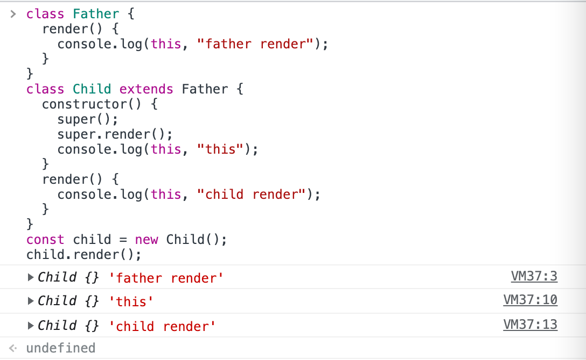

在 JS 里是通过构造函数来模拟类这一概念，通过原型来实现继承。

> ES6 的 class 本质上就是构造函数+原型。

## ES6 class 的基本内容

### constructor

使用 constructor 构造函数传递参数，该函数会在 new 时自动执行，作为初始化操作。

也就是说， **ES5 的构造函数 Person，对应 ES6 的 Person 类的 constructor 方法。**

ES6 中：

```js
class Person {
  constructor(name) {
    this.name = name;
  }

  sayHello() {
    return "hello, I am " + this.name;
  }
}

var kevin = new Person("Kevin");
kevin.sayHello(); // hello, I am Kevin
```

ES5 中：

```js
function Person(name) {
  this.name = name;
}

Person.prototype.sayHello = function () {
  return "hello, I am " + this.name;
};

var kevin = new Person("Kevin");
kevin.sayHello(); // hello, I am Kevin
```

### 实例属性

通常我们说的实例属性是指：定义在实例上，可以在构造函数的内部的 this 上进行定义，也可以在构造函数实例化以后的实例上进行定义。

es6 中：

```js
class Person {
  constructor() {
    this.state = {
      count: 0,
    };
  }
}
```

es5 中：

```js
function Person() {
  this.state = {
    count: 0,
  };
}
```

:::tip
实例属性，定义在实例上，可以在构造函数的内部的 this 上进行定义，也可以在构造函数实例化以后的实例上进行定义。

静态属性，定义在构造函数之上的属性。可通过构造函数直接访问。

原型属性，定义在构造函数原型对象之上的属性。
:::

### 静态属性、静态方法

所有在类中定义的方法，都会被实例继承。在方法或者属性前面加上 static 关键字，就表示该方法或者属性不会被实例继承，而是直接通过类来调用，这就称为“静态方法”或者“静态属性“。
es6 中：

```js
class Person {
  static username = "静态属性"; // 如果不加 static 会变成实例属性
  static sayHello() {
    return "hello";
  }
}

Person.sayHello(); // 'hello'
console.log(Person.username); // 静态属性

var kevin = new Person();
console.log(kevin.username); // undefined
kevin.sayHello(); // TypeError: kevin.sayHello is not a function
```

对应 ES5：

```js
function Person() {}

Person.username = "静态属性";
Person.sayHello = function () {
  return "hello";
};

Person.sayHello(); // 'hello'
console.log(Person.username); // 静态属性

var kevin = new Person();
console.log(kevin.username); // undefined
kevin.sayHello(); // TypeError: kevin.sayHello is not a function
```

### 访问器

访问器就是在函数前加上 get/set 修饰，操作属性时不需要加函数的扩号，直接用函数名。

访问器属性包含一对 getter 和 setter 函数。在读取访问器属性时，会调用 getter 函数，这个函数负责返回有效的值；在写入访问器属性时，会调用 setter 函数并传入新值，这个函数负责决定如何处理数据。

```js
class Person {
  get name() {
    return "kevin";
  }
  set name(newName) {
    console.log("new name 为：" + newName);
  }
}

let person = new Person();

person.name = "daisy";
// new name 为：daisy

console.log(person.name);
// kevin
```

对应到 ES5 中：

```js
function Person(name) {}

Person.prototype = {
  get name() {
    return "kevin";
  },
  set name(newName) {
    console.log("new name 为：" + newName);
  },
};

let person = new Person();

person.name = "daisy";
// new name 为：daisy

console.log(person.name);
// kevin
```

## 继承

### 原型链继承

原型链继承的核心在于**子类的原型指向父类的实例**

```js
Child.prototype = new Parent();
```

1. 引用类型的属性会被所有的实例共享
2. 在创建 Child 的实例时，不能向 Parent 传参

### 构造函数继承

在子类的构造函数中调用父类的构造函数

优点：

1. 避免了引用类型的属性被所有实例共享
2. 可以向父类的构造函数传参

缺点：

1. 方法都在构造函数中定义，每次创建实例都会创建一遍方法

### 组合继承

原型链继承+构造函数继承

```js
function Parent(name) {
  this.name = name;
  this.colors = ["red", "blue", "green"];
}

function Child(name, age) {
  Parent.call(this, name);

  this.age = age;
}

Child.prototype = new Parent();
Child.prototype.constructor = Child;
```

组合继承最大的缺点是会调用两次父构造函数。

### 原型式继承

原型式继承就是利用 Object.create

`const child = Object.create(parent)` 就是 `child.__proto__ === parent`

```js
function createObj(obj) {
  function F() {}
  F.prototype = obj;
  return new F();
}
```

ES5 的 Object.create 的模拟实现， 将传入的对象作为创建的对象的原型

缺点：包含引用类型的属性值始终都会共享相应的值，这点跟原型链继承一样

### 寄生式继承

创建一个仅用于封装继承过程的函数，该函数在内部以某种形式来做增强对象，最后返回对象。

```js
function createObj(o) {
  var clone = Object.create(o);
  clone.sayName = function () {
    console.log("hi");
  };
  return clone;
}
```

缺点：跟借用构造函数模式一样，每次创建对象都会创建一遍方法。

### 寄生组合式继承

构造函数继承属性，寄生继承方法；

主要是避免组合继承调用两次构造函数，不使用 Child.prototype = new Parent() ，而是间接的让 Child.prototype 访问到 Parent.prototype。

```js
Child.prototyep = new Person();
Child.prototype.constructor = Child;
```

可以避免:

```js
function clone(child, parent) {
  var prototype = Object.create(parent.prototype);
  prototyep.constructor = child;
  child.prototype = prototype;
}

clone(Child, Parent);
```

```js
// 完整代码

function Parent(name) {
  this.name = name;
  this.colors = ["red", "blue", "green"];
}

Parent.prototype.getName = function () {
  console.log(this.name);
};

function Child(name, age) {
  Parent.call(this, name);

  this.age = age;
}

function object(o) {
  function F() {}
  F.prototype = o;
  return new F();
}

function prototype(child, parent) {
  var prototype = object(parent.prototype);
  prototype.constructor = child;
  child.prototype = prototype;
}

// 当我们使用的时候：
prototype(Child, Parent);
```

### ES6 extends

Class 通过 extends 关键字实现继承，这比 ES5 的通过修改原型链实现继承，要清晰和方便很多。

以上 ES5 的代码对应到 ES6 就是：

```js
class Parent {
  constructor(name) {
    this.name = name;
  }
}

class Child extends Parent {
  constructor(name, age) {
    super(name); // 调用父类的 constructor(name)
    this.age = age;
  }
}

var child1 = new Child("kevin", "18");

console.log(child1);
```

值得注意的是：

super 关键字表示父类的构造函数，相当于 ES5 的 Parent.call(this)。

子类必须在 constructor 方法中调用 super 方法，才能使用 this，否则新建实例时会报错。这是因为子类没有自己的 this 对象，而是继承父类的 this 对象，然后对其进行加工。如果不调用 super 方法，初始化时子类就得不到 this 对象。

也正是因为这个原因，在子类的构造函数中，只有调用 super 之后，才可以使用 this 关键字，否则会报错。

```js
class Father {
  render() {
    console.log(this, "father render");
  }
}
class Child extends Father {
  constructor() {
    super();
    super.render();
    console.log(this, "this");
  }
  render() {
    console.log(this, "child render");
  }
}
const child = new Child();
child.render();
```



#### super 语法

```js
super([arguments]);
// 调用 父对象/父类 的构造函数

super.functionOnParent([arguments]);
// 调用 父对象/父类 上的方法
```

## react 类组件

在类组件中我们通常会写这样的代码：

```jsx
import React, { Component } from "react";

// 1.类子组件
class ChildCpn1 extends Component {
  constructor(props) {
    super(props);
  }

  render() {
    const { name, age, height } = this.props;

    return (
      <div>
        <h2>我是class的组件</h2>
        <p>展示父组件传递过来的数据: {name + " " + age + " " + height}</p>
      </div>
    );
  }
}

export default class App extends Component {
  render() {
    return (
      <div>
        <ChildCpn1 name="www" age="18" height="1.88" />
      </div>
    );
  }
}
```

打开 Component 源码：

```js
function Component(props, context, updater) {
  this.props = props;
  this.context = context;
  // If a component has string refs, we will assign a different object later.
  this.refs = emptyObject;
  // We initialize the default updater but the real one gets injected by the
  // renderer.
  this.updater = updater || ReactNoopUpdateQueue;
}
```

React 在初始化 Class 后，会将 props 自动设置到 this 中，但是在 constructor 中就不能使用 this 对象：

- 你想在 constructor 中使用 this，就必须用 super(props)，这是 JS 的要求
- React 会在组件实例化的时候设置一遍 props，传入的 props 会被 Component 设置到 this 中（父类的对象），所以子类就可以继承过来，这是 React 做的事情
