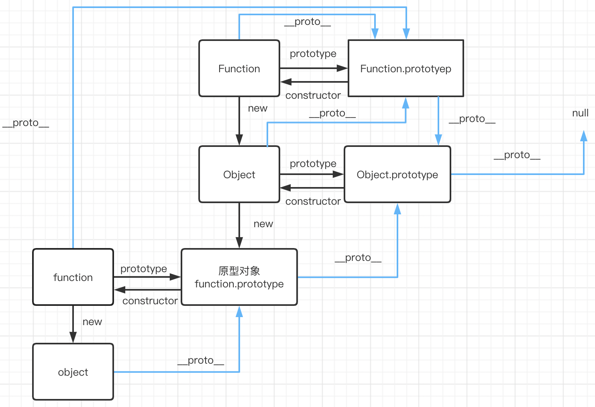

## 基本概念

每一个函数都有一个`prototype`属性，指向这个构造函数的原型对象，这个原型对象有一个`constructor`属性指回构造函数；同时，每个实例对象都有一个`__proto__`属性，指向构造函数的原型对象；同时该原型对象作为一个对象也有`__proto__`属性，指向自己的原型。直到最后指向null。

:::tip 注意
所有对象都有`__proto__`属性，函数也是对象，函数都具有`prototype`属性（所以对于函数对象既有`__proto__`属性又有`prototype`属性）。 

`xx.prototype`是一个对象，所有的对象都来自`Object`这个构造函数，所以`xx.prototype.__proto__`最终会指向`Object.prototype`。 

Object又是由Function创建的，所以`Object.__proto__===Function.prototype`。 

所有的构造函数都来自Function，对于Function来讲，先有的Function，然后实现上把原型指向了`Function.prototype`：`Function.__proto__===Function.prototype`
:::

## 继承