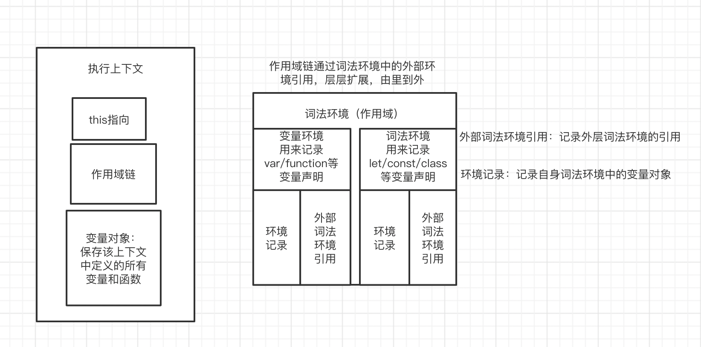

## 执行上下文

执行上下文可以理解为`JS`函数的运行环境，第一次载入`JS`代码，首先会创建一个全局环境（就是`main`函数对应的帧），直到程序退出才会被销毁（比如关闭浏览器）；随着函数一层层被调用，栈会一层层扩展；调用结束，栈又会一层层回溯，把内存释放回去。

> 不同的函数运行环境不一样，即使是同一个函数，在被多次调用时也会创建多个不同的函数环境。

执行上下文有三个重要的属性：

- 作用域链（`scope chain`）
  
- 变量对象（`Variable Object`，简称 `VO`）
  
- `this`指向



### 变量对象

变量对象会保存这个上下文中定义的所有变量和函数。

> 在浏览器中，全局环境的变量对象是`window`对象，因此所有的全局变量和函数都是作为`window`对象的属性和方法创建的。相应的，在 `Node` 中全局环境的变量对象则是`global`对象。

创建变量对象将会创建`arguments`对象（仅函数环境下），同时会检查当前上下文的函数声明和变量声明：

- 对于变量声明：此时会给变量分配内存，并将其初始化为`undefined`（该过程只进行定义声明，执行阶段才执行赋值语句）。
  
- 对于函数声明：此时会在内存里创建函数对象，并且直接初始化为该函数对象。

### 作用域链

#### 作用域

词法作用域中的变量，在定义时（写代码时）就会产生一个确定的作用域，这个作用域即当前的执行上下文，在 `ES5` 后我们使用词法环境（`Lexical Environment`）替代作用域来描述该执行上下文。因此，**词法环境可理解为我们常说的作用域，同样也指当前的执行上下文。**

在 `JavaScript` 中，词法环境又分为词法环境（`Lexical Environment`）和变量环境（`Variable Environment`）两种，其中：

- 变量环境用来记录`var/function`等变量声明；（这部分会有变量提升）
  
- 词法环境用来记录`let/const/class`等变量声明。
  

**`JavaScript` 实现了支持块级作用域的同时，不影响原有的变量声明和函数声明：**

> 用两个词法环境一个支持`es6`后的块级作用域；一个支持`es5`的`var`和`function`声明

创建变量过程中会进行函数提升和变量提升，`JavaScript` 会通过词法环境来记录函数和变量声明。通过使用两个词法环境（而不是一个）分别记录不同的变量声明内容。

#### 作用域链

作用域就是词法环境，而词法环境由两个成员组成：

- 环境记录（`Environment Record`）：用于记录自身词法环境中的变量对象。
  
- 外部词法环境引用（`Outer Lexical Environment`）：记录外层词法环境的引用。
  

通过外部词法环境的引用，作用域可以层层拓展，建立起从里到外延伸的一条作用域链。当某个变量无法在自身词法环境记录中找到时，可以根据外部词法环境引用向外层进行寻找，直到最外层的词法环境中外部词法环境引用为`null`，这便是作用域链的变量查询。

### this指向

`this`是调用时确定的，绑定到执行时的上下文环境。

`this`是执行上下文的一个属性，指向函数被调用时函数的上下文环境。**`this` 是在运行时基于函数的执行环境绑定的**。

> `this` 不指向函数自身也不指向函数的词法作用域，**完全取决于函数在哪里被调用**。

需要注意一下`this`的优先级：

:::tip 优先级
**箭头函数继承外层函数调用的 this 绑定**>**new绑定**> **bind**>**由 call 或者 apply 调用** >**由上下文对象调用绑定到那个上下文对象**>**默认的window**
<br/>
对于默认绑定：在严格模式下绑定到undefined，否则绑定到全局对象。
:::

有一个小技巧（？）：

```js
func.call(context, p1, p2)
```
所以形如：
```js
function func(){
  console.log(this)
}

func()
```
就是：

```js
function func(){
  console.log(this)
}

func.call(undefined) // 可以简写为 func.call() 非严格模式下就是window
```

或者：
```js
var obj = {
  foo: function(){
    console.log(this)
  }
}

obj.foo() 
```
可以写作：

```js
var obj = {
  foo: function(){
    console.log(this)
  }
}

var bar = obj.foo
obj.foo() // 转换为 obj.foo.call(obj)，this 就是 obj
bar() 
// 转换为 bar.call()
// 由于没有传 context
// 所以 this 就是 undefined
// 最后浏览器给你一个默认的 this —— window 对象
```