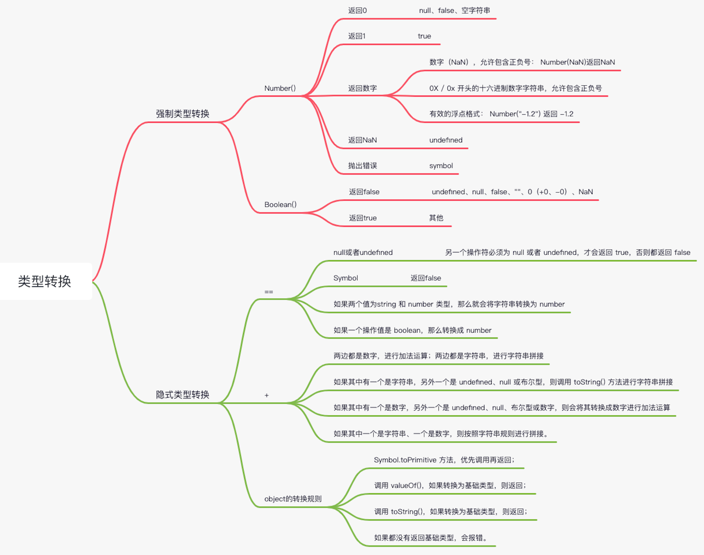

JavaScrept 是一门弱类型的动态语言：

- 弱类型意味着运行时才可以知道变量的数据类型
- 动态意味着使用同一个变量保存不同类型的数据

JS 的数据类型一共有 8 种：

1. undefined
2. null
3. Boolean
4. String
5. Number
6. Symbol
7. BigInt
8. Object
   - Array
   - RegExp
   - Date
   - Math
   - Function

> Number：根据 ECMAScript 标准，JavaScript 中只有一种数字类型，基于 IEEE754 标准的双精度 64 位二进制格式的值，-(2^53-1)到 2^53-1。<br/>
>
> Undefined：一个没有被赋值的变量会有一个默认值 undefined，变量提升时的默认值也是 undefined；<br/>
>
> BigInt：JavaScript 中一个全新的数字类型，可以用任意精度表示整数。使用 BigInt，即使超出 Number 的安全整数范围限制，也可以安全的存储和操作。<br/>
>
> Symbol：符号类型是唯一的，并且是不可修改的，通常用来作为 Object 的 key。`var sym1 = Symbol()`

:::caution 注意
Symbol 不可以作为构造器使用，即`new Symbol()`是不被允许的
:::

其中，前 7 种类型为基础类型，最后 1 种（Object）为引用类型，也是需要重点关注的，因为它在日常工作中是使用得最频繁，也是需要关注最多技术细节的数据类型。

而引用数据类型（Object）又分为几种常见的类型：

- Array - 数组对象
- RegExp - 正则对象
- Date - 日期对象
- Math - 数学函数
- Function - 函数对象

因为各种 JavaScript 的数据类型最后都会在初始化之后放在不同的内存中，因此上面的数据类型大致可以分成两类来进行存储：

- 基础类型存储在栈内存，被引用或拷贝时，会创建一个完全相等的变量；
- 引用类型存储在堆内存，存储的是地址，多个引用指向同一个地址——堆内存中的同一个对象。

## 类型检测

类型检测通常有三种手段：

- `typeof`
- `instanceof`
- `Object.prototype.toString.call()`

:::tip

- `typeof`主要是用来判断基础数据类型（返回一个字符串），当他判断引用数据类型时，只有`function`会返回一个`"function"`字符串，对于其他的一律返回`"object"`
- `instaceof`返回的是一个布尔值，判断是否是构造函数的实例
- `Object.prototype.toString.call()`会返回一个字符串：`'[object Function]'`注意第二个字母是一个大写。

:::

## 类型转换

> 注意 `[].toString()`返回`""`

关于对象转换，这里有几个题：

```js
// [].valueOf()不是基本类型，所以调用[].toString()返回""，两个空字符串拼接还是空字符串
[]+[] // ""

// {}.valueOf()是非基础类型，{}.toString()返回"[object Object]"
[]+{} // "[object Object]"


{}+{} // "[object Object][object Object]"

// 第一个被当成空代码块，所以变成+[]，Number([])=Number([].toString())=Number("")=0
{}+[] // 0

// {}.toString()是"[object Object]"，数字加字符串，按字符串拼接
10+{} // "10[object Object]"

// 第一个被当成空代码块，所以变成+10
{}+10 // 10
```



```js
"123" == 123; //true
""==null // false
"" == 0 // true
[] == 0 // true
[] == "" // true
[] == ![] // true
null == undefined // true
Number("") // 0
Number(null) // 0
parseInt("") // NaN
{}+10 // 10

let obj = {
    [Symbol.toPrimitive]() {
        return 200;
    },
    valueOf() {
        return 300;
    },
    toString() {
        return 'Hello';
    }
}
console.log(obj + 200); // 400

Number(true);        // 1
Number(false);       // 0
Number('0111');      //111
Number(null);        //0
Number('');          //0
Number('1a');        //NaN
Number(-0X11);       //-17
Number('0X11')       //17

// 除了 undefined、 null、 false、 ''、 0（包括 +0，-0）、 NaN 转换出来是 false，其他都是 true
Boolean(0)          //false
Boolean(null)       //false
Boolean(undefined)  //false
Boolean(NaN)        //false
Boolean(1)          //true
Boolean(13)         //true
Boolean('12')       //true

1 + 2        // 3
'1' + '2'    // '12'
// 下面看一下特殊情况
'1' + undefined   // "1undefined" undefined转换字符串
'1' + null        // "1null" null转换字符串
'1' + true        // "1true" true转换字符串
'1' + 1n          // '11' 比较特殊字符串和BigInt相加，BigInt转换为字符串
1 + undefined     // NaN  undefined转换数字相加NaN
1 + null          // 1    null转换为0
1 + true          // 2    true转换为1，二者相加为2
1 + 1n            // 错误  不能把BigInt和Number类型直接混合相加
'1' + 3           // '13' 字符串拼接

var obj = {
  value: 1,
  valueOf() {
    return 2;
  },
  toString() {
    return '3'
  },
  [Symbol.toPrimitive]() {
    return 4
  }
}
console.log(obj + 1); // 输出5
// 因为有Symbol.toPrimitive，就优先执行这个；如果Symbol.toPrimitive这段代码删掉，则执行valueOf打印结果为3；如果valueOf也去掉，则调用toString返回'31'(字符串拼接)
// 再看两个特殊的case：
10 + {}
// "10[object Object]"，注意：{}会默认调用valueOf是{}，不是基础类型继续转换，调用toString，返回结果"[object Object]"，于是和10进行'+'运算，按照字符串拼接规则来，参考'+'的规则C
[1,2,undefined,4,5] + 10
// "1,2,,4,510"，注意[1,2,undefined,4,5]会默认先调用valueOf结果还是这个数组，不是基础数据类型继续转换，也还是调用toString，返回"1,2,,4,5"，然后再和10进行运算，还是按照字符串拼接规则，参考'+'的第3条规则
```

## 数组 API

基于 ES6，改变原始数组的方法是 9 个：

:::tip
分别为 pop、push、reverse、shift、sort、splice、unshift，以及两个 ES6 新增的方法 copyWithin 和 fill。
:::

基于 ES7，不会改变原始数组的方法也有 9 个：
:::tip
分别为 concat、join、slice、toString、toLocaleString、indexOf、lastIndexOf、未形成标准的 toSource，以及 ES7 新增的方法 includes。
:::

遍历数组，js 中遍历数组并且不会改变原始数组的方法总共有 12 个：
:::tip
ES5：
forEach、every 、some、 filter、map、reduce、reduceRight

ES6：
find、findIndex、keys、values、entries

:::

### Array.from

Array.from 的设计初衷是快速便捷地基于其他对象创建新数组，准确来说就是从一个类数组对象（实现了 length 属性）或者是可迭代对象中创建一个新的数组实例。其实就是，只要一个对象有迭代器，Array.from 就能把它变成一个数组（注意：是返回新的数组，不改变原对象）。

从语法上看，Array.from 拥有 3 个参数：

- 类似数组的对象，必选；

- 加工函数，新生成的数组会经过该函数的加工再返回；

- this 作用域，表示加工函数执行时 this 的值。

这三个参数里面第一个参数是必选的，后两个参数都是可选的。我们通过一段代码来看看它的用法。

```js
var obj = { 0: "a", 1: "b", 2: "c", length: 3 };
Array.from(
  obj,
  function (value, index) {
    console.log(value, index, this, arguments.length);
    return value.repeat(3); //必须指定返回值，否则返回 undefined
  },
  obj
);
```

结果中可以看出 console.log(value, index, this, arguments.length) 对应的四个值，并且看到 return 的 value 重复了三遍，最后返回的数组为 ["aaa","bbb","ccc"]。

这表明了通过 Array.from 这个方法可以自己定义加工函数的处理方式，从而返回想要得到的值；如果不确定返回值，则会返回 undefined，最终生成的也是一个包含若干个 undefined 元素的空数组。

### 改变原始数组 -- 9 个

```js
// pop方法：删除一个数组中的最后的一个元素，并且返回这个元素。
var array = ["cat", "dog", "cow", "chicken", "mouse"];
var item = array.pop();
console.log(array); // ["cat", "dog", "cow", "chicken"]
console.log(item); // mouse

// push方法：向数组的末尾添加一个或多个元素，并返回新的长度。
var array = ["football", "basketball", "badminton"];
var i = array.push("golfball", "ball");
console.log(array);
// ["football", "basketball", "badminton", "golfball", "ball"]
console.log(i); // 5

// reverse方法：颠倒数组中元素的顺序
var array = [1, 2, 3, 4, 5];
var array2 = array.reverse();
console.log(array); // [5,4,3,2,1]
console.log(array2 === array); // true 意味是同一个引用

// shift方法： shift()方法删除数组的第一个元素，并返回这个元素
var array = [1, 2, 3, 4, 5];
var item = array.shift();
console.log(array); // [2,3,4,5]
console.log(item); // 1

// unshift方法：向数组的开头添加一个或更多元素，并返回新的长度。
var array = ["red", "green", "blue"];
var length = array.unshift("yellow", "black");
console.log(array); // ["yellow", "black", "red", "green", "blue"]
console.log(length); // 5

// sort方法：对数组元素进行排序，并返回这个数组
var array = ["apple", "Boy", "Cat", "dog"];
var array2 = array.sort();
console.log(array); // ["Boy", "Cat", "apple", "dog"]
console.log(array2 == array); // true

// splice方法：向数组中添加/删除项目，然后返回被删除的项目
// array.splice(index,howmany,item1,.....,itemX) 如果有元素被删除，返回包含被删除项目的新数组
var array = ["apple", "boy"];
var splices = array.splice(1, 1);
console.log(array); // ["apple"]
console.log(splices); // ["boy"]

// copyWithin方法：在当前数组内部，将指定位置的成员复制到其他位置，并返回这个数组
// 第一个参数是开始被替换的元素位置
// 要替换数据的位置范围：从第二个参数是开始读取的元素，在第三个参数前面一个元素停止读取
// 数组的长度不会改变
// 读了几个元素就从开始被替换的地方替换几个元素
var array = [1, 2, 3, 4, 5];
var array2 = array.copyWithin(0, 3);
console.log(array === array2, array2); // true [4, 5, 3, 4, 5]

// fill方法： 使用给定值，填充一个数组
var array = [1, 2, 3, 4, 5];
var array2 = array.fill(10, 0, 3);
console.log(array === array2, array2);
// true [10, 10, 10, 4, 5], 可见数组区间[0,3]的元素全部替换为10
```

### 不改变原始数组 -- 8 个

```js
// concat方法：合并两个或多个数组，返回一个新数组。（浅拷贝）
var array = [1, 2, 3];
var array2 = array.concat(4, [5, 6], [7, 8, 9]);
console.log(array2); // [1, 2, 3, 4, 5, 6, 7, 8, 9]
console.log(array); // [1, 2, 3], 可见原数组并未被修改

// join方法：把数组中的所有元素通过指定的分隔符（默认使用逗号）进行分隔放入一个字符串，返回生成的字符串
var array = ["We", "are", "Chinese"];
console.log(array.join()); // "We,are,Chinese"
console.log(array.join("+")); // "We+are+Chinese"

// slice方法：浅拷贝数组
// 方法返回一个从开始到结束（不包括结束）选择的数组的一部分浅拷贝到一个新数组对象，且原数组不会被修改
var array = ["one", "two", "three", "four", "five"];
console.log(array.slice()); // ["one", "two", "three","four", "five"]
console.log(array.slice(2, 3)); // ["three"]

// toString方法：把数组转换为由逗号链接起来的字符串
var array = ["Jan", "Feb", "Mar", "Apr"];
var str = array.toString();
console.log(str); // Jan,Feb,Mar,Apr

// tolocalString方法：返回一个表示数组元素的字符串。调用数组的toLocaleString方法，数组中的每个元素都会调用自身的toLocaleString方法，对象调用对象的toLocaleString，Date调用Date的toLocaleString，由逗号隔开
var array = [{ name: "zz" }, 123, "abc", new Date()];
var str = array.toLocaleString();
console.log(str); // [object Object],123,abc,2016/1/5 下午1:06:23

// indexOf方法：返回在数组中可以找到一个给定元素的第一个索引，如果不存在，则返回-1
// array.indexOf(searchElement,fromIndex)
// searchElement(必须)：被查找的元素；fromIndex(可选)：开始查找的位置(不能大于等于数组的长度，返回-1)，接受负值，默认值为0。
// 数组的indexOf搜索跟字符串的indexOf不一样,数组的indexOf使用严格相等===搜索元素，即数组元素要完全匹配才能搜索成功。
//注意：indexOf()不能识别NaN
var array = ["abc", "def", "ghi", "123"];
console.log(array.indexOf("def")); // 1

// includes方法：返回一个布尔值，表示某个数组是否包含给定的值
var array = [-0, 1, 2];
console.log(array.includes(+0)); // true
console.log(array.includes(1)); // true
var array = [NaN];
console.log(array.includes(NaN)); // true

//lastIndexOf：返回指定元素在数组中的最后一个的索引，如果不存在则返回 -1。（从数组后面往前查找）
let a = ["OB", 4, "Koro1", 1, 2, "Koro1", 3, 4, 5, "Koro1"]; // 数组长度为10
let b = a.lastIndexOf("Koro1", 4); // 从下标4开始往前找 返回下标2
let b = a.lastIndexOf("Koro1", 100); //  大于或数组的长度 查找整个数组 返回9
let b = a.lastIndexOf("Koro1", -11); // -1 数组不会被查找
let b = a.lastIndexOf("Koro1", -9); // 从第二个元素4往前查找，没有找到 返回-1 (数组最后一位是-1)
```

### 遍历数组 -- 12 个

js 中遍历数组并不会改变原始数组的方法

```js
// forEach方法
var array = [1, 3, 5];
var obj = { name: "cc" };
var sReturn = array.forEach(function (value, index, array) {
  array[index] = value;
  console.log(this.name); // cc被打印了三次, this指向obj
}, obj);
console.log(array); // [1, 3, 5]
console.log(sReturn); // undefined, 可见返回值为undefined

// every方法：用于检测数组所有元素是否都符合函数定义的条件
// 数组中检测到有一个元素不满足，则整个表达式返回 false，且剩余的元素不会再进行检测。
// 如果所有元素都满足条件，则返回 true。
var o = { 0: 10, 1: 8, 2: 25, length: 3 };
var bool = Array.prototype.every.call(
  o,
  function (value, index, obj) {
    return value >= 8;
  },
  o
);
console.log(bool); // true

// some方法：数组中是否有满足判断条件的元素
// 如果有一个元素满足条件，则表达式返回true, 剩余的元素不会再执行检测。
// 如果没有满足条件的元素，则返回false
var array = [18, 9, 10, 35, 80];
var isExist = array.some(function (value, index, array) {
  return value > 20;
});
console.log(isExist); // true

// map 方法：对数组中的每个元素进行处理，返回新的数组
var array = [18, 9, 10, 35, 80];
array.map((item) => item + 1);
console.log(array); // [19, 10, 11, 36, 81]

// filter 方法：返回一个新数组, 包含通过函数测试的所有元素
var array = [18, 9, 10, 35, 80];
var array2 = array.filter(function (value, index, array) {
  return value > 20;
});
console.log(array2); // [35, 80]

// reduce方法：reduce() 方法对累计器（回调函数的第一个参数）和数组中的每个元素（从左到右）应用一个函数，最终合并为一个值（累计器）
var array = [1, 2, 3, 4];
var s = array.reduce(function (previousValue, value, index, array) {
  return previousValue * value;
}, 1);
console.log(s); // 24
// ES6写法更加简洁
array.reduce((p, v) => p * v); // 24

// reduceRight方法 (和reduce的区别就是从后往前累计)
var array = [1, 2, 3, 4];
array.reduceRight((p, v) => p * v); // 24

// entries方法
var array = ["a", "b", "c"];
var iterator = array.entries();
console.log(iterator); // Array Iterator {}
console.log(iterator.next().value); // [0, "a"]
console.log(iterator.next().value); // [1, "b"]
console.log(iterator.next().value); // [2, "c"]
console.log(iterator.next().value); // undefined, 迭代器处于数组末尾时, 再迭代就会返回undefined
// keys方法
[...Array(10).keys()]; // [0, 1, 2, 3, 4, 5, 6, 7, 8, 9]
[...new Array(10).keys()]; // [0, 1, 2, 3, 4, 5, 6, 7, 8, 9]
// values方法
var array = ["abc", "xyz"];
var iterator = array.values();
console.log(iterator.next().value); //abc
console.log(iterator.next().value); //xyz

// keys()&values()&entries() 遍历键名、遍历键值、遍历键名+键值
for (let index of ["a", "b"].keys()) {
  console.log(index);
}
// 0
// 1

for (let elem of ["a", "b"].values()) {
  console.log(elem);
}
// 'a'
// 'b'

for (let [index, elem] of ["a", "b"].entries()) {
  console.log(index, elem);
}
// 0 "a"
// 1 "b"

// find & findIndex方法
// find()定义：用于找出第一个符合条件的数组成员，并返回该成员，如果没有符合条件的成员，则返回undefined。
// findIndex()定义：返回第一个符合条件的数组成员的位置，如果所有成员都不符合条件，则返回-1。
var array = [1, 3, 5, 7, 8, 9, 10];
function f(value, index, array) {
  return value % 2 == 0; // 返回偶数
}
function f2(value, index, array) {
  return value > 20; // 返回大于20的数
}
console.log(array.find(f)); // 8
console.log(array.find(f2)); // undefined
console.log(array.findIndex(f)); // 4
console.log(array.findIndex(f2)); // -1
```

## for...of 和 for...in

for in 遍历的是数组的索引（即键名），而 for of 遍历的是数组元素值

for in 总是得到对象的 key 或数组、字符串的下标

for of 总是得到对象的 value 或数组、字符串的值

### 细节

#### for...in

for in 会遍历数组所有的**可枚举属性**，包括原型，如果不想遍历原型方法和属性的话，可以在循环内部判断一下，使用 hasOwnProperty()方法可以判断某属性是不是该对象的实例属性

```js
var arr = [1, 2, 3];
Array.prototype.a = 123;

for (let index in arr) {
  let res = arr[index];
  console.log(res);
}
//1 2 3 123

for (let index in arr) {
  if (arr.hasOwnProperty(index)) {
    let res = arr[index];
    console.log(res);
  }
}
// 1 2 3
```

#### for...of

for of 遍历的是数组元素值，而且 for of 遍历的只是数组内的元素，不包括原型属性和索引。

```js
var arr = [1, 2, 3];
arr.a = 123;
Array.prototype.a = 123;

for (let value of arr) {
  console.log(value);
}
//1 2 3
```

for of 适用遍历数组对象/字符串/map/set 等拥有迭代器对象（iterator）的集合，但是不能遍历对象，因为对象没有迭代器对象，但如果想遍历对象的属性，你可以用 for in 循环（这也是它的本职工作）或用内建的 Object.keys()方法

```js
var myObject = {
  a: 1,
  b: 2,
  c: 3,
};
for (var key of Object.keys(myObject)) {
  console.log(key + ": " + myObject[key]);
}
//a:1 b:2 c:3
```

- [for in 和 for of 的区别](https://juejin.cn/post/6916058482231754765)

```
Object.prototype.hasOwnProperty()
hasOwnProperty方法会返回一个Blooean值，来说明所选择的属性是否是目标自身的属性。与in操作符不同的是，hasOwnProperty不会去检查原型链上的属性。

Object.getOwnPropertyNames()
getOwnPropertyNames方法会返回对象自身所有的方法，包括可枚举和不可枚举。同样地，getOwnPropertyNames也不会去检查原型链上的属性。 如果你只想获取可枚举的属性，可以考虑使用Object.keys() 。

for...in遍历
for...in经常被用来遍历一个object，它可以遍历一个对象的所有非Symbol、可枚举的属性（包括原型链上的属性）。
```

## 迭代器

数组通过下标遍历，对象通过 key 遍历，那其他结构呢？ 这时候就要实现迭代器了，实现了 Symbol.iterator 才能用 for of 遍历，比如 Generator 就通过返回迭代器支持了 for of 遍历。

当要遍历的结构比较复杂的时候，暴露一个迭代器，客户端就可以用这个迭代器来遍历该结构，而感知不到内部的复杂度，屏蔽掉了遍历的具体细节。如果没有迭代器，那么客户端遍历每一种结构都得知道怎么遍历。

JS 里面的 Symbol.iterator 就是指定对象的迭代器，客户端只需要不断调用 next 取值就行。

Generator 是不断 yield 生成新的值的，就是通过返回迭代器取下一个生成的值。

总之，迭代器就是为了屏蔽掉不同数据结构的遍历的复杂度，让客户端使用统一的方式遍历任意目标结构，不管是对象、数组、Generator 等等都没有区别。这就是迭代器的意义。

**迭代器就是帮助我们对某个数据结构进行遍历的对象**

### 迭代器实现

在 JavaScript 中，迭代器是一个具体的对象，这个对象需要符合迭代器协议(iterator protocol)：

- 迭代器协议定义了产生一系列值(无论是有限还是无限个)的标准方式；
- **在 js 中这个标准就是实现一个特定的 next 方法**；

next 方法有如下的要求:

- 一个无参数或者一个参数的函数，返回一个应当拥有以下两个属性的对象:

* done(boolean)

  - 如果迭代器可以产生序列中的下一个值，则为 false。(这等价于没有指定 done 这个属性。)
  - 如果迭代器已将序列迭代完毕，则为 true。这种情况下，value 是可选的，如果它依然存在，即为迭代结束之后的默认返回值。

* value

  - 迭代器返回的任何 JavaScript 值。done 为 true 时可省略。

```js
function createArrayIterator(arr) {
  let index = 0;
  return {
    next: function () {
      if (index < arr.length) {
        return { done: false, value: arr[index++] };
      } else {
        return { done: true, value: undefined };
      }
    },
  };
}

const friendsIterator = createArrayIterator(["lilei", "kobe", "james"]);
console.log(friendsIterator.next());
console.log(friendsIterator.next());
console.log(friendsIterator.next());
console.log(friendsIterator.next());
```

不过更多的是包装成可迭代对象，当一个对象实现了 iterable protocol 协议时，它就是一个可迭代对象；这个对象的要求是必须实现 `@@iterator` 方法，在代码中我们使用 `Symbol.iterator` 访问该属性。

当一个对象变成一个可迭代对象的时候，进行某些迭代操作，比如 for...of 操作时，其实就会调用它的 @@iterator 方法：

```js
const info = {
  friends: ["lilei", "kobe", "james"],
  [Symbol.iterator]: function () {
    let index = 0;
    return {
      next: () => {
        if (index < this.friends.length) {
          return { done: false, value: this.friends[index++] };
        } else {
          return { done: true, value: undefined };
        }
      },
    };
  },
};
const iterator = info[Symbol.iterator]();
console.log(iterator.next()); // {done: false, value: 'lilei'}
console.log(iterator.next()); // {done: false, value: 'kobe'}
console.log(iterator.next()); // {done: false, value: 'james'}
console.log(iterator.next()); // {done: true, value: undefined}
console.log(iterator.next()); // {done: true, value: undefined}
```

或者

```js
var myIterator = {
  next: function () {
    // ...
  },
  [Symbol.iterator]: function () {
    return this;
  },
};
```

### 原生迭代器对象

事实上我们平时创建的很多原生对象已经实现了可迭代协议，会生成一个迭代器对象的：

- String、Array、Map、Set、arguments 对象

```js
const str = "hello world";
for (const s of str) {
  console.log(s);
}

const arr = ["abc", "cba", "nba"];
for (const item of arr) {
  console.log(item);
}

function foo() {
  for (const arg of arguments) {
    console.log(arg);
  }
  console.log(arguments); //  [20, 30, 40, callee: ƒ foo, Symbol(Symbol.iterator): ƒ] 还有length属性：3
}
foo(20, 30, 40); // 20 30 40

const set = Array.from(str);
console.log(set);

// 数组本身就是一个可迭代对象
const names = ["abc", "cba", "nba"];
// 获取可迭代函数
console.log(names[Symbol.iterator]); // ƒ values() { [native code] }
// 调用可迭代函数，获取到迭代器
const iterator = names[Symbol.iterator]();
console.log(iterstor.next()); // {value: 'abc', done: false}
console.log(iterstor.next()); // {value: 'cba', done: false}
console.log(iterstor.next()); // {value: 'nba', done: false}
console.log(iterstor.next()); // {value: undefined, done: true}
console.log(iterstor.next()); // {value: undefined, done: true}
```

## JSON 方法

JSON 对象包含两个方法：

- JSON.parse 方法用来解析 JSON 字符串，构造由字符串描述的 JavaScript 值或对象
- JSON.stringify 方法是将一个 JavaScript 对象或值转换为 JSON 字符串


### parse 方法

JSON.parse 方法用来解析 JSON 字符串，构造由字符串描述的 JavaScript 值或对象。

该方法有两个参数：第一个参数是需要解析处理的 JSON 字符串，第二个参数是可选参数提供可选的  reviver  函数，用在返回之前对所得到的对象执行变换操作。

该方法的语法为：`JSON.parse(text[, reviver])`

```js
const json = '{"result":true, "count":2}';
const obj = JSON.parse(json);
console.log(obj.count);
// 2
console.log(obj.result);
// true
/* 带第二个参数的情况 */
JSON.parse('{"p": 5}', function (k, v) {
  if (k === "") return v; // 如果k不是空，
  return v * 2; // 就将属性值变为原来的2倍返回
}); // { p: 10 }
```

我们可以将一个符合 JSON 格式的字符串转化成对象返回；带第二个参数的情况，可以将待处理的字符串进行一定的操作处理，比如上面这个例子就是将属性值乘以 2 进行返回。

### stringify 方法


JSON.stringify 方法是将一个 JavaScript  对象或值转换为 JSON 字符串。


默认该方法其实有三个参数：第一个参数是必选，后面两个是可选参数非必选。第一个参数传入的是要转换的对象；第二个是一个 replacer 函数，比如指定的  replacer 是数组，则可选择性地仅处理包含数组指定的属性；第三个参数用来控制结果字符串里面的间距，后面两个参数整体用得比较少。

该方法的语法为：`JSON.stringify(value[, replacer [, space]])`

```js
JSON.stringify({ x: 1, y: 2 });
// "{"x":1,"y":2}"
JSON.stringify({ x: [10, undefined, function () {}, Symbol("")] });
// "{"x":[10,null,null,null]}"

/* 第二个参数的例子 */
function replacer(key, value) {
  if (typeof value === "string") {
    return undefined;
  }
  return value;
}
var foo = {
  foundation: "Mozilla",
  model: "box",
  week: 4,
  transport: "car",
  month: 7,
};
var jsonString = JSON.stringify(foo, replacer);
console.log(jsonString);
// "{"week":4,"month":7}"

/* 第三个参数的例子 */
JSON.stringify({ a: 2 }, null, " ");
// '{\n "a": 2\n}'
/* "{
 "a": 2
}"*/
JSON.stringify({ a: 2 }, null, "");
// "{"a":2}"
```
