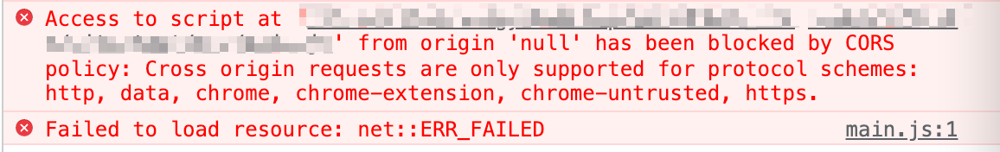
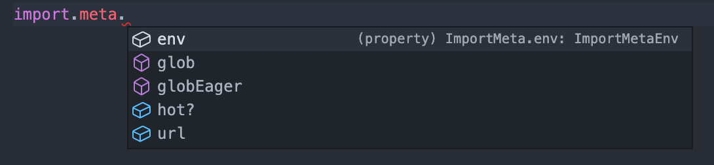

vite 官方定义为下一代的前端开发与构建工具。

:::tip 背景
在实际开发中，我们编写的代码往往是不能被浏览器直接识别的，比如 ES6、TypeScript、Vue 文件。所以我们必须通过构建工具来对代码进行转换、编译，类似的工具有 webpack、rollup、parcel。但是随着项目越来越大，需要处理的 JavaScript 呈指数级增长，模块越来越多，构建工具需要很长的时间才能开启服务器，HMR 也需要几秒钟才能在浏览器反应出来。开发体验不好。
:::

## Vite 简单使用

vite 主要由两部分组成:

- 一个开发服务器，它基于原生 ES 模块提供了丰富的内建功能，HMR 的速度非常快速;
  - 意味着许多代码不需要再转译直接传给浏览器处理，对于生产环境不识别 ESM 的浏览器，构建时再做适配。开发阶段只需要使用那些支持 ESM 的浏览器就好。
- 一套构建指令，它使用 rollup 打开我们的代码，并且它是预配置的，可以输出生产环境的优化过的静态资源;

chrome 已经支持 ESM（注意`script`标签需要写`type="module"`），但是需要起一个本地服务（这里注意如果是浏览器原生解析 import 语句时是需要后缀的，被当作 url）。

直接在浏览器运行代码会报错：



> 在 MDN 上面有给出解释:
>
> https://developer.mozilla.org/zh-CN/docs/Web/JavaScript/Guide/Modules
>
> 你需要注意本地测试 — 如果你通过本地加载 Html 文件 (比如一个 file:// 路径的文件), 你将会遇到 CORS 错误，因 为 Javascript 模块安全性需要。
>
> 你需要通过一个服务器来测试。

需要注意的是：

:::caution
有的时候后缀名可能是`mjs`，这是在 `Node.js` 环境下，如果脚本文件里面使用 `import` 或者 `export` 命令，那么就必须采用 `.mjs` 后缀名。

`Node.js` 遇到 `.mjs` 文件，就认为它是 ES6 模块，默认启用严格模式，不必在每个模块文件顶部指定 `"use strict"` 。

如果不希望将后缀名改成 `.mjs` ，可以在项目的 `package.json` 文件中，指定 `type` 字段为 `module` 。但是一旦设置了以后，该目录里面的 JS 脚本，就被解释用 ES6 模块。 如果这时还要使用 CommonJS 模块，那么需要将 CommonJS 脚本的后缀名都改成 `.cjs` 。

```js
//module-a.mjs
const methodA = () => {
  console.log("a");
};

export { methodA };

// main.js
async function func() {
  // 加载一个 ES 模块
  // 文件名后缀需要是 mjs
  const moduleA = await import("./module-a.mjs"); // 动态导入一个模块
  // const { methodA } = await import("./module-a.mjs"); 结果是 undefined  node-version v14.18.1
  // 需要写成 const { methodA: a } = await import("./module-a.mjs");
  console.log(moduleA.methodA(), "main.js"); // methodA
}

func();

module.exports = {
  func,
};
```

:::

```shell
npm install vite
```

命令行`npx vite`启动。

> 注意 vite 要求 node 版本大于 12。

打包：`npx vite build`

我们可以通过 `preview` 的方式，开启一个本地服务来预览打包后的效果：`npx vite preview`

### Vite 对 css 的支持

vite 可以直接支持 css 的处理：直接导入 css 即可。

vite 可以直接支持 css 预处理器，比如 less：

- 直接导入 less;
- 之后安装 less 编译器;
  - ` npm install less -D`

vite 直接支持 postcss 的转换:

- 只需要安装 postcss
  - ` npm install postcss postcss-preset-env -D`
- 并且配置 postcss.config.js 的配置文件即可;

```js
// postcss.config.js
module.exports = {
  plugins: [require("post-preset-env")],
};
```

### Vite 对 TypeScript 的支持

vite 对 TypeScript 是原生支持的，它会直接使用 ESBuild 来完成编译：只需要直接导入即可；

查看浏览器中的请求，会发现请求的依然是 ts 的代码：

- 这是因为 vite 中的服务器 Connect 会对我们的请求进行拦截；
- 获取 ts 编译后的代码，给浏览器返回，浏览器可以直接进行解析；


> 源码模块还会设置协商缓存，当模块没有改变时，浏览器的请求会返回 304 Not Modified

vite 会在本地利用`connect`搭建一个服务器，拦截浏览器的请求（请求源码），并且进行源码的转换，然后以 ESM 的形式再返回给浏览器，整个过程中没有对文件进行打包编译，所以其运行速度比原始的 webpack 开发编译速度快出许多！

:::caution
在 vite2 中，已经不再使用 Koa 了，而是使用 Connect 来搭建的服务器
:::

不过要注意的是 **Vite 对 ts 只编译不做校验**。为了实现校验，我们需要配置`tsconfig.json`文件，利用`tsc --noEmit`来做校验但是不输出资源：

```json
{
  "scripts": {
    // 开发阶段启动 Vite Dev Server
    "dev": "vite",
    // 生产环境打包
    // 或者 "tsc --noEmit && vite build"
    "build": "tsc && vite build",
    // 生产环境打包完预览产物
    "preview": "vite preview"
  }
}
```

> tsc 作为 TypeScript 的官方编译命令，可以用来编译 TypeScript 代码并进行类型检查

```json
// tsconfig.json
{
  "compilerOptions": {
    // 省略其他配置
    // 1. noEmit 表示只做类型检查，而不会输出产物文件
    // 2. 这行配置与 tsc --noEmit 命令等效
    "noEmit": true
  }
}
```

#### `isolatedModules`

```json
// tsconfig.json
{
  "compilerOptions": {
    "target": "esnext",
    "module": "esnext",
    "moduleResolution": "node",
    "strict": true,
    "jsx": "preserve",
    "sourceMap": true,
    "resolveJsonModule": true,
    "esModuleInterop": true,
    "lib": ["esnext", "dom"],
    "isolatedModules": true,
    "types": ["vite/client"]
  },
  "include": ["src/**/*.ts", "src/**/*.d.ts", "src/**/*.tsx"],
  "exclude": ["node_modules"]
}
```

注意这里配置属性 `isolatedModules` 需要设置为 `true`，主要 vite 对于 ts 的编译没有 tsc 那么强大：

> 不设置的话，运行时会出现问题，开发时不能识别下面三种状况带来的问题

- re-exporting ：（import 后重新 export）在开发时可以报错，而不至于拖到运行时
- const enum ：ts 在使用 const enum 的时候会直接替换成一个常量，vite 提供的 ts 语法转译不认识这种语法
- 非模块文件：如果设置了 isolatedModules，则所有实现文件都必须是模块（这意味着它具有某种形式的导入/导出）。如果任何文件不是模块，则会发生错误

> 主要是 vite 或者说是 esbuild 只执行没有类型信息的转译，并不支持某些特性，如 const enum 和隐式类型导入。转译时只会抹去类型信息，比如 import 一个类型，不会去管类型信息。详见：https://www.typescriptlang.org/tsconfig#isolatedModules

#### `vite/client` 客户端类型

还可以配置`"types": ["vite/client"]`。



Vite 默认的类型定义是写给它的 Node.js API 的。可以将 `vite/client` 添加到 `tsconfig` 中的 `compilerOptions.types` 下，这将会提供以下类型定义补充：

- 资源导入 (例如：导入一个 .svg 文件)
- import.meta.env 上 Vite 注入的环境变量的类型定义
- import.meta.hot 上的 HMR API 类型定义

### vite 对 react 的支持

`.jsx` 和 `.tsx` 文件同样开箱即用，它们也是通过 ESBuild 来完成的编译：

- 所以我们只需要直接编写 react 的代码即可；
- 注意：在 index.html 加载 main.js 时，我们需要将 main.js 的后缀，修改为 main.jsx 作为后缀名;

> esbuild 的支持

### vite 中的环境变量

`import.meta.env`，vite 中默认存在四个环境变量：

- MODE 当前处于的模式
- BASE_URL 部署应用时的基本 URL。他由 base 配置项决定。
- PROD 应用是否运行在生产环境
- DEV

注意在正式环境是不存在`import.meta.env`这样一个对象，会被替换成一个对象。我们还可以在根目录下新建`.env`文件来声明自定义的环境，

```
// .env
// 格式是 VITE_
VITE_TITLE=hello
```

然后可以在 `import.meta.env.VITE_TITLE` 拿到字符串 `"hello"`。也可以新建 `.env.development` 或者 `.env.production` 文件来针对开发或者生产环境，只会被开发或者生产环境用到，表现为在 `import.meta.env` 会增加 `.env.development` 或者 `.env.production` 定义的属性。

也可以通过不同的 MODE 去改变读取环境变量的方式`vite --mode test`，就会去读取 `.env.test` 下的环境变量

另外可以在`vite-env.d.ts`文件中去声明：

```ts
// vite-env.d.ts
/// <reference types="vite/client" />
interface ImportMetaEnv {
  VITE_TITLE: string;
}
```

这样我们的`import.meta.env`会出现`VITE_TITLE`的智能提示。

### vite 的 HMR

> 通过 websocket

vite 实现了一套 HMR API：

```js
// test.js
function render() {
  //...dosomethong
}

// 监听该文件热更新的代码
if (import.meta.hot) {
  import.meta.hot.accept((newModule) => {
    newModule.render();
  });
}
```

## Vite 在开发时为什么这么快

- 利用原生 ESM 的能力，许多代码不需要再转译直接传给浏览器处理，而且是请求时再去加载
- 利用 esbuild 进行预构建
  - 目前我们的包都是 CommonJS 的，所以需要转换为 ESM。不过 vite 使用 esbuild 进行预构建，而且 vite 并不会一开始就把全部依赖都预构建，如果遇到一个新的依赖关系导入，而这个依赖关系还没有在缓存中，Vite 将重新运行依赖构建进程并重新加载页面。
  - 在 `node_modules/.vite` 目录下会看到预构建的文件
- 缓存，解析后的**依赖请求**会以 HTTP 头 `max-age=31536000,immutable` 强缓存，以提高在开发时的页面重载性能。一旦被缓存，这些请求将永远不会再到达开发服务器。如果安装了不同的版本（这反映在包管理器的 lockfile 中），则附加的版本 query 会自动使它们失效。解析后的**源码请求**会作协商缓存，`304 Not Modified`

### 依赖预构建

Vite 提倡 no-bundle，能做到开发时的模块按需编译，而不用像 webpack 先打包完再加载。

在 Vite 中代码分为两类：

1. 源码，即业务代码
2. 依赖，即 `node_modules` 中的代码

我们说 Vite 提倡 no-bundle，是对于源码。对于第三方依赖而言，Vite 还是选择打包（bundle），并且使用速度极快的打包器 Esbuild，达到秒级的依赖编译速度。

依赖预构建做了两件事：

1. 将其他格式（如 CommonJS）转换为 ESM 格式，使其在浏览器通过 `<script type="module"><script>` 的方式正常加载。
2. 打包第三方库的代码，将各个第三方库分散的文件合并到一起，减少 HTTP 请求数量，避免页面加载性能劣化

作为本地文件系统的缓存：在 `node_modules/.vite` 目录下会看到预构建的文件。

而在浏览器访问页面后，打开网络调试面板，可以发现第三方包的引入路径已经被重写:


而且解析后的**依赖请求**会以 HTTP 头 `max-age=31536000,immutable` 强缓存：


缓存过期时间被设置为一年，表示缓存过期前浏览器对 react 预构建产物的请求不会再经过 Vite Dev Server，直接用缓存结果。

如果以下 3 个地方都没有改动，Vite 将一直使用缓存文件:

- package.json 的 dependencies 字段
- 各种包管理器的 lock 文件
- optimizeDeps 配置内容

## Rollup

Rollup 是一款 ES Modules 打包器，而 Webpack 的定位是 JavaScript 应用程序的模块打包器。Rollup 的初衷是希望能够提供一个高效的 ES Modules 打包器，充分利用 ES Modules 的各项特性，构建出结构扁平，性能出众的类库。

> 通常来讲应用开发使用 Webpack，类库或者框架开发使用 Rollup。

### 基本使用

```shell
npm i rollup -D
```

安装完后会在 node_modules/.bin 目录中提供一个 CLI 程序，可以通过这个 CLI 去使用 Rollup 打包。

> 在不传入任何参数的情况下，执行 `npx rollup` 会在控制台打印帮助信息。

```shell
npx rollup ./src/index.js
```

这里指定的打包入口是 `src/index.js` 文件。Rollup 会直接将打包结果打印到控制台中。我们需要通过 CLI 的 --file 参数指定输出文件路径：

```shell
npx rollup ./src/index.js --file ./dist/bundle.js
```

这样打包的结果就会输出到文件中。

**输出的结果中只会保留那些用到的部分，对于未引用部分都没有输出。** Rollup 默认会自动开启 Tree-shaking 优化输出结果，实际上 Tree-shaking 的概念最早也就是 Rollup 这个工具提出的。

### Rollup 配置文件

这个文件虽然同样是运行在 Node.js 环境中，但是 Rollup 会额外处理配置文件，所以在 rollup.config.js 中我们可以直接使用 ES Modules 标准。

```js
// rollup.config.js
export default {
  input: "src/index.js",
  output: {
    // 产物输出目录
    file: "dist/bundle.js",
    // 输出格式
    format: "es",
  },
};
```

在该文件下我们需要导出一个配置对象，在这个对象中我们可以通过 input 属性指定打包的入口文件路径，通过 output 指定输出相关配置，output 属性是一个对象，在 output 对象中可以使用 file 属性指定输出的文件名，format 属性指定输出代码的格式。

我们可以通过 --config 或者 -c 参数来表明使用项目中的配置文件；当然也可以指定配置文件名称

```shell
npx rollup --config # 使用默认配置文件
npx rollup -c
npx rollup --config rollup.prod.js # 指定配置文件路径
```

在 `package.json` 中：

```json
{
  "scripts": {
    // rollup 打包命令，`-c` 表示使用配置文件中的配置
    "build": "npx rollup -c"
  }
}
```

### 属性说明

打包入口 input 可以有三种格式：字符串、字符串数组及对象。第一种对应单一入口的情况，后两种会分别打包到单独的文件中。

```js
// 字符串类型设置单一入口
input: 'src/main.js'

// 字符串数组
input: ['src/a.js', 'src/b.js']

// 对象
input: {
    a: 'src/a.js',
    b: 'src/b.js'
}
```

打包出口 `output` 对象有很多属性：

```js
{
  output: {
    // 产物输出目录
    dir: "path.resolve(__dirname, 'dist')",
    // 以下三个配置项都可以使用这些占位符:
    // 1. [name]: 去除文件后缀后的文件名
    // 2. [hash]: 根据文件名和文件内容生成的 hash 值
    // 3. [format]: 产物模块格式，如 es、cjs
    // 4. [extname]: 产物后缀名(带`.`)
    // 入口模块的输出文件名
    entryFileNames: "[name].js",
    // 非入口模块(如动态 import)的输出文件名
    chunkFileNames: "chunk-[hash].js",
    // 静态资源文件输出文件名
    assetFileNames: "assets/[name]-[hash][extname]",
    // 产物输出格式，包括`amd`、`cjs`、`es`、`iife`、`umd`、`system`
    format: "cjs",
    // 是否生成 sourcemap 文件
    sourcemap: true,
    // 如果是打包出 iife/umd 格式，需要对外暴露出一个全局变量，通过 name 配置变量名
    name: "MyBundle",
    // 全局变量声明
    globals: {
      // 项目中可以直接用`$`代替`jquery`
      jquery: "$",
    },
  },
};
```

其中的 format 是设置生成包的格式，默认是 es，还有 amd、cjs、es、iife、umd、system：

- amd：异步模块定义，用于像 RequireJS 这样的模块加载器
- cjs：CommonJS，适用于 Node.js 和 Browserify/Webpack 等
- es：将软件包保存为 ES 模块文件，在现代浏览器中可以通过 `<script type="module">` 标签引入
- iife：自执行功能，适合作为 `<script>` 标签包含。Tips：iife 代表立即调用的函数表达式
- umd：通用模块定义，集 amd，cjs 和 iife 为一体
- system：SystemJS 加载器格式

### 代码拆分 Code Splitting

对于代码拆分，在动态加载或设置了多个入口文件时，Rollup 会自动将代码拆分成块，并且我们可以通过 output.manualChunks 选项明确告诉 Rollup 哪些模块要拆分成单独的块。

为了使用代码拆分功能实现动态加载，也就是在需要执行函数时才加载对应的包，列举一下在 main.js 的代码：

```js
// src/main.js
export default function () {
  import("./exportDemo.js").then(({ default: obj }) => console.log(obj));
}
```

Rollup 将使用动态导入来创建一个仅按需加载的单独块。为了让 Rollup 知道第二个块的放置位置，我们通过 output.dir 来设置文件夹存放打包文件：

```js
// rollup.config.js
export default {
  input: "src/main.js",
  output: {
    dir: "dist",
    format: "cjs",
  },
};
```

我们运行命令可以看到在 dist 文件夹中生成了两个文件，一个 main.js，一个 exportDemo-d13e707d.js，这个名字其实是 exportDemo-[hash].js，这里 [hash] 是一个基于内容的哈希字符串。我们也可以通过指定 output.chunkFileNames 和 output.entryFileNames 选项来设置文件命名。比如设置了 chunkFileNames（非入口文件(模块)的输出文件名） 和 entryFileNames（入口文件的输出文件名）：

```js
// rollup.config.js
export default {
  input: "src/main.js",
  output: {
    dir: "dist",
    format: "cjs",
    chunkFileNames: "hellorollup-chunk-[name]-[hash].js",
    entryFileNames: "hellorollup-[name].js",
  },
};
```

结果是在 dist 目录下有 `hellorollup-main.js`和`hellorollup-chunk-exportDemo-[hash].js`两个文件

代码拆分的另一个用途就是能够指定多个共享依赖项的入口文件，如果有多个入口文件对同一个文件依赖，会**创建额外的模块，只加载必要的最少的资源。**我们再添加一个入口文件 main1.js，在 main1.js 中我们同样引入 exportDemo.js 文件：

```js
// src/main1.js
import { default as obj } from "./exportDemo.js";
export default function () {
  console.log(obj);
}
```

同时把 src/main1.js 也作为打包入口：

```js
// rollup.config.js
export default {
  input: ["src/main.js", "src/main1.js"],
  output: {
    dir: "dist",
    format: "cjs",
    chunkFileNames: "hellorollup-chunk-[name]-[hash].js",
    entryFileNames: "hellorollup-[name].js",
  },
};
```

可以看到打包之后创建了三个文件`hellorollup-amin.js`，`hellorollup-amin1.js`，`hellorollup-chunk-exportDemo-[hash].js`

这两个入口文件导入模块的方式是**创建额外的模块，只加载必要的最少的资源。**：

```js
// dist/hellorollup-mian.js
"use strict";
function main() {
  Promise.resolve()
    .then(function () {
      return require("./hellorollup-chunk-exportDemo-39836610.js");
    })
    .then(({ default: obj }) => console.log(obj));
}
module.exports = main;
```

```js
// dist/hellorollup-mian1.js
"use strict";
var exportDemo = require("./hellorollup-chunk-exportDemo-39836610.js");
function main1() {
  console.log(exportDemo["default"]);
}
module.exports = main1;
```

当然还可以把代码打包为不同格式，以应对各个版本浏览器上不同的支持情况。比如我希望我的代码可以构建为 ES 模块文件和适用于 system.js 的格式，分别存放在 dist/es 和 dist/system 文件夹中。

```js
// rollup.config.js
export default {
  input: "src/main.js",
  output: [
    {
      dir: "dist/es",
      format: "es",
      chunkFileNames: "hellorollup-chunk-[name]-[hash].js",
      entryFileNames: "hellorollup-[name].js",
    },
    {
      dir: "dist/system",
      format: "system",
      chunkFileNames: "hellorollup-chunk-[name]-[hash].js",
      entryFileNames: "hellorollup-[name].js",
    },
  ],
};
```

打包结果，分别按照 es 格式和 system 格式生成了输出文件：

```js
// dist/es/hellorollup.main.js
function main() {
  import("./hellorollup-chunk-exportDemo-bae3d89c.js").then(
    ({ default: obj }) => console.log(obj)
  );
}
export { main as default };

// dist/system/hellorollup.main.js
System.register([], function (exports, module) {
  "use strict";
  return {
    execute: function () {
      exports("default", main);

      function main() {
        module
          .import("./hellorollup-chunk-exportDemo-8e5bfab8.js")
          .then(({ default: obj }) => console.log(obj));
      }
    },
  };
});
```

这样我们就可以在 html 中用不同的方式引入：

```html
<script type="module">
  // 如果在低版本浏览器，这种输出结果是无法正常执行的。
  import main from "./dist/es/hellorollup-main.js";
  main();
</script>
<script>
  System.import("./dist/system/hellorollup-main.js").then(({ default: main }) =>
    main()
  );
</script>
```

目前所有支持动态导入的输出格式中，只有 AMD 和 system 两种格式打包的结果适合于浏览器环境。AMD 标准在浏览器中也不是直接支持的，也就是说我们还是需要使用一个支持这个标准的库来加载这些输出的模块，例如 `Require.js`，具体使用方式参考：

```html
<!DOCTYPE html>
<html lang="en">
  <head>
    <meta charset="UTF-8" />
    <title>AMD Format output</title>
  </head>
  <body>
    <script
      src="https://unpkg.com/requirejs@2.3.6/require.js"
      data-main="dist/index.js"
    ></script>
  </body>
</html>
```

### Rollup 提供的方法

我们可以用 JavaScript API 来调用 Rollup，主要分为 rollup.rollup 和 rollup.watch 两个 API。

基于这两个 JavaScript API 我们可以很方便地在代码中调用 Rollup 的打包流程，相比于配置文件有了更多的操作空间。

- rollup.rollup，用来一次性地进行 Rollup 打包
- rollup.watch，用来完成 watch 模式下的打包，即每次源文件变动后自动进行重新打包

比如：

```js
// build.js
const rollup = require("rollup");

// 常用 inputOptions 配置
const inputOptions = {
  input: "./src/index.js",
  external: [],
  plugins: [],
};

const outputOptionsList = [
  // 常用 outputOptions 配置
  {
    dir: "dist/es",
    entryFileNames: `[name].[hash].js`,
    chunkFileNames: "chunk-[hash].js",
    assetFileNames: "assets/[name]-[hash][extname]",
    format: "es",
    sourcemap: true,
    globals: {
      lodash: "_",
    },
  },
  // 省略其它的输出配置
];

async function build() {
  let bundle;
  let buildFailed = false;
  try {
    // 1. 调用 rollup.rollup 生成 bundle 对象
    bundle = await rollup.rollup(inputOptions);
    for (const outputOptions of outputOptionsList) {
      // 2. 拿到 bundle 对象，根据每一份输出配置，调用 generate 和 write 方法分别生成和写入产物
      const { output } = await bundle.generate(outputOptions);
      await bundle.write(outputOptions);
    }
  } catch (error) {
    buildFailed = true;
    console.error(error);
  }
  if (bundle) {
    // 最后调用 bundle.close 方法结束打包
    await bundle.close();
  }
  process.exit(buildFailed ? 1 : 0);
}

build();
```

之后可以`node build.js`，就可以用写代码的方式来调用 Rollup 打包的过程，主要的执行步骤如下：

1. 通过 rollup.rollup 方法，传入 inputOptions，生成 bundle 对象
2. 调用 bundle 对象的 generate 和 write 方法，传入 outputOptions，分别完成产物和生成和磁盘写入
3. 调用 bundle 对象的 close 方法来结束打包

```js
// watch.js
const rollup = require("rollup");

const watcher = rollup.watch({
  // 和 rollup 配置文件中的属性基本一致，只不过多了`watch`配置
  input: "./src/index.js",
  output: [
    {
      dir: "dist/es",
      format: "esm",
    },
    {
      dir: "dist/cjs",
      format: "cjs",
    },
  ],
  watch: {
    exclude: ["node_modules/**"],
    include: ["src/**"],
  },
});

// 监听 watch 各种事件
watcher.on("restart", () => {
  console.log("重新构建...");
});

watcher.on("change", (id) => {
  console.log("发生变动的模块id: ", id);
});

watcher.on("event", (e) => {
  if (e.code === "BUNDLE_END") {
    console.log("打包信息:", e);
  }
});
```

可以通过执行 `node watch.js` 开启 Rollup 的 watch 打包模式，当改动一个文件后可以看到日志，Rollup 会自动进行了重新打包，并触发相应的事件回调函数。

### Rollup 插件

Rollup 自身的功能只是打包 ES Modules，例如加载其他类型的资源文件或者支持导入 CommonJS 模块，又或是编译 ES 新特性，这些额外的需求 Rollup 同样支持使用插件去扩展实现。

通常 Rollup 插件的名称格式为：`@rollup/plugins-xxx`。

#### 加载 npm 模块

Rollup 默认只能够按照文件路径的方式加载本地的模块文件，对于 node_modules 目录中的第三方模块，并不能像 Webpack 一样，直接通过模块名称直接导入。

为了抹平这个差异，Rollup 给出了一个 @rollup/plugin-node-resolve 插件，通过使用这个插件，我们就可以在代码中直接使用模块名称导入模块了。

同样，我们需要先安装这个插件，具体命令如下：

```shell
npm i @rollup/plugin-node-resolve -D
```

1. @rollup/plugin-node-resolve 是为了允许我们加载第三方依赖，否则像 import React from 'react' 的依赖导入语句将不会被 Rollup 识别
2. @rollup/plugin-commonjs 的作用是将 CommonJS 格式的代码转换为 ESM 格式

安装完成过后，打开配置文件，导入插件函数，然后把它配置到 plugins 数组中。具体配置如下：

```js
// ./rollup.config.js
import resolve from "@rollup/plugin-node-resolve";
import commonjs from "@rollup/plugin-commonjs";

export default {
  input: "src/index.js",
  output: {
    file: "dist/bundle.js",
    format: "es",
  },
  plugins: [resolve(), commonjs()],
};
```

完成以后我们就可以回到代码中直接导入 node_modules 中的第三方模块了。例如：

```js
// ./src/index.js
import { camelCase } from "lodash-es";
console.log(camelCase("hello rollup"));
```

#### 加载 cjs 模块

由于 Rollup 设计的是只处理 ES Modules 模块的打包，所以如果在代码中导入 CommonJS 模块，默认是不被支持的。但是目前大量的 NPM 模块还是使用 CommonJS 方式导出成员，所以为了兼容这些模块。官方给出了一个插件，叫作 @rollup/plugin-commonjs。

这里添加了一个 cjs-module.js 文件，具体代码如下：

```js
// ./src/cjs-module.js
module.exports = {
  foo: "bar",
};
```

这个文件中使用 CommonJS 的方式导出了一个对象。然后回到入口文件中通过 ES Modules 的方式导入，具体代码如下：

```js
// ./src/index.js
// 导入 CommonJS 模块成员
import cjs from "./cjs-module";
// 使用模块成员
console.log(cjs); // { foo: 'bar' }
```

入口文件导入的结果就是 cjs-module.js 中导出的对象了。

### 自定义 Rollup 插件

详细文档看这个：https://rollupjs.org/guide/en/#build-hooks

hooks 分为 build 阶段的 hooks 和 output 阶段的 hooks：

- Build Hook 即在 Build 阶段执行的钩子函数，在这个阶段主要进行模块代码的转换、AST 解析以及模块依赖的解析，那么这个阶段的 Hook 对于代码的操作粒度一般为模块级别，也就是单文件级别
- Ouput Hook(官方称为 Output Generation Hook)，则主要进行代码的打包，对于代码而言，操作粒度一般为 chunk 级别(一个 chunk 通常指很多文件打包到一起的产物)

> 具体官网有顺序图

```js
// 自定义 rollup 插件 demo
export function cancleConsole() {
  return {
    name: "cancle-console",
    transform(code, id) {
      if (id.endsWith(".js")) {
        return {
          code: code.replace(/console\.log/g, ""),
        };
      }
    },
  };
}
```

### 总结

Rollup 确实有它的优势：

- 输出结果更加扁平，执行效率更高；
- 自动移除未引用代码；
- 打包结果依然完全可读。

但是它的缺点也同样明显：

- 加载非 ESM 的第三方模块比较复杂；
- 因为模块最终都被打包到全局中，所以无法实现 HMR；
- 浏览器环境中，代码拆分功能需要使用 Require.js 这样的 AMD 库。

## vite 插件开发

文档非常棒：https://cn.vitejs.dev/guide/api-plugin.html

理论上来讲，如果一个 rollup 插件如果没有使用`moduleParsed`钩子（每次 Rollup 完全解析模块后都会调用此钩子），以及它在打包钩子和输出钩子之间没有很强的耦合，就可以在 vite 中使用。

一个 Rollup 插件只在构建阶段有意义，则可以在 `build.rollupOptions.plugins` 属性中配置。
