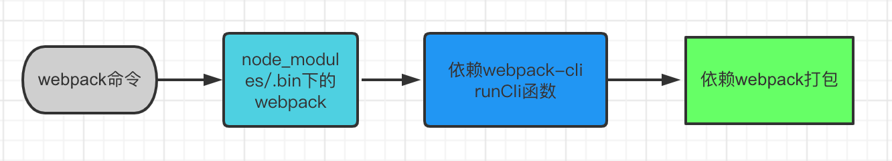

:::tip
该笔记以webpack4为基础
:::

`Webpack`是一个静态的模块化打包工具。

> `webpack` 是通过模块之间依赖关系的分析来构建依赖图，通过不同的后缀对应的 `loader` 来对不同内容做转换，所以支持 `css`、`js`、`png` 等各种模块。



**`webpack`在执行时是依赖`webpack-cli`的，如果没有安装`webpack-cli`第三步就走不通就会报错；`webpack-cli`中代码执行，才是真正利用`webpack`进行编译和打包的过程;**

```shell
npm i webpack webpack-cli --save-dev
```
>  webpack 是 Webpack 的核心模块，webpack-cli 是 Webpack 的 CLI 程序，用来在命令行中调用 Webpack。

安装完成之后，webpack-cli 所提供的 CLI 程序就会出现在 node_modules/.bin 目录当中，我们可以通过 npx 快速找到 CLI 并运行它，具体操作如下：

```shell
npx webpack
```

npx 是 npm 5.2 以后新增的一个命令，可以用来更方便的执行远程模块或者项目 node_modules 中的 CLI 程序。


这个命令在执行的过程中，Webpack 会自动从 src/index.js 文件开始打包，然后根据代码中的模块导入操作，自动将所有用到的模块代码打包到一起。

完成之后，控制台会提示：顺着 index.js 有两个 JS 文件被打包到了一起。与之对应的就是项目的根目录下多出了一个 dist 目录，我们的打包结果就存放在这个目录下的 main.js 文件中。

## 简单例子


