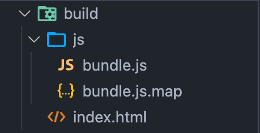
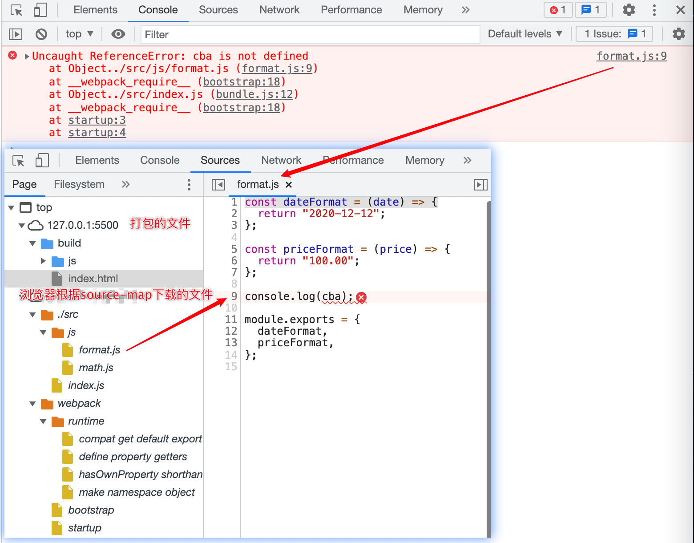

我们知道真实的运行在浏览器上的代码，和我们编写的代码是存在差异的：

- ES6 会被转成 ES5
- 对应行号、列号在经过编译后也会不一致
- 代码丑化压缩时，会将编码名称等修改
- 使用了 TypeScript 等方式编写的代码，最终转换成 JavaScript

所以就会有一个问题，当代码报错需要调试时(debug)，调试转换后的代码是很困难的，source-map 登场：

- source-map 本身作为一个文件，作用是把已转换的代码，映射到源文件；
- 使浏览器可以**重构原始源**并在调试器中**显示重建的原始源**；

## source-map 的使用

- webpack 在打包时，可以通过配置生成 source-map：
- 在转换后的代码，最后添加一个注释，它指向 sourcemap
  - ` //# sourceMappingURL=common.bundle.js.map`

浏览器会根据我们的注释，查找对应的 source-map，并且根据 source-map 还原我们的代码，方便进行调试。

```js
const path = require("path");
module.exports = {
  mode: "development",
  devtool: "source-map",
  entry: "./src/index.js",
  output: {
    filename: "js/bundle.js",
    // 必须是一个绝对路径
    path: path.resolve(__dirname, "./build"),
  },
  module: {
    rules: [{}],
  },
  plugins: [],
};
```



可以看到会生成 `bundle.js.map` 文件。

打开浏览器调试的时候，点击报错信息可以直接定位到源码。



## source-map 的属性

- version：当前使用的版本，也就是最新的第三版
- sources：从哪些文件转换过来的 source-map 和打包的代码(最初始的文件)
- names：转换前的变量和属性名称(因为我目前使用的是 development 模式，所以不需要保留转换前的名称)
- mappings：source-map 用来和源文件映射的信息(比如位置信息等)，一串 base64 VLQ(veriable- length quantity 可变长度值)编码
- file：打包后的文件(浏览器加载的文件)
- sourceContent：转换前的具体代码信息(和 sources 是对应的关系)
- sourceRoot：所有的 sources 相对的根目录

```json
// bundle.js.map
{
  "version": 3,
  "sources": [
    "webpack://01_learn_webpack/./src/index.js",
    "webpack://01_learn_webpack/./src/js/format.js",
    "webpack://01_learn_webpack/./src/js/math.js",
    "webpack://01_learn_webpack/webpack/bootstrap",
    "webpack://01_learn_webpack/webpack/runtime/compat get default export",
    "webpack://01_learn_webpack/webpack/runtime/define property getters",
    "webpack://01_learn_webpack/webpack/runtime/hasOwnProperty shorthand",
    "webpack://01_learn_webpack/webpack/runtime/make namespace object",
    "webpack://01_learn_webpack/webpack/startup"
  ],
  "names": [
    "require",
    "sum",
    "mul",
    "console",
    "log",
    "dateFormat",
    "priceFormat",
    "abc",
    "date",
    "price",
    "cba",
    "module",
    "exports",
    "num1",
    "num2"
  ],
  "mappings": ";;;;;;;;;;;;;AAAA;eACqBA,mBAAO,CAAC,mCAAD,C;IAApBC,G,YAAAA,G;IAAKC,G,YAAAA,G,EAEb;;;AACA;AAEAC,OAAO,CAACC,GAAR,CAAYH,GAAG,CAAC,EAAD,EAAK,EAAL,CAAf;AACAE,OAAO,CAACC,GAAR,CAAYF,GAAG,CAAC,EAAD,EAAK,EAAL,CAAf;AAEAC,OAAO,CAACC,GAAR,CAAYC,sDAAU,CAAC,KAAD,CAAtB;AACAF,OAAO,CAACC,GAAR,CAAYE,uDAAW,CAAC,KAAD,CAAvB;AAEAH,OAAO,CAACC,GAAR,CAAYG,GAAZ,E;;;;;;;;;;ACZA,IAAMF,UAAU,GAAG,SAAbA,UAAa,CAACG,IAAD,EAAU;AAC3B,SAAO,YAAP;AACD,CAFD;;AAIA,IAAMF,WAAW,GAAG,SAAdA,WAAc,CAACG,KAAD,EAAW;AAC7B,SAAO,QAAP;AACD,CAFD;;AAIAN,OAAO,CAACC,GAAR,CAAYM,GAAZ;AAEAC,MAAM,CAACC,OAAP,GAAiB;AACfP,YAAU,EAAVA,UADe;AAEfC,aAAW,EAAXA;AAFe,CAAjB,C;;;;;;;;;;;;;;;;ACVO,IAAML,GAAG,GAAG,SAANA,GAAM,CAACY,IAAD,EAAOC,IAAP,EAAgB;AACjC,SAAOD,IAAI,GAAGC,IAAd;AACD,CAFM;AAIA,IAAMZ,GAAG,GAAG,SAANA,GAAM,CAACW,IAAD,EAAOC,IAAP,EAAgB;AACjC,SAAOD,IAAI,GAAGC,IAAd;AACD,CAFM,C;;;;;;UCJP;UACA;;UAEA;UACA;UACA;UACA;UACA;UACA;UACA;UACA;UACA;UACA;UACA;UACA;;UAEA;UACA;;UAEA;UACA;UACA;;;;;WCrBA;WACA;WACA;WACA,cAAc,0BAA0B,EAAE;WAC1C,cAAc,eAAe;WAC7B,gCAAgC,YAAY;WAC5C;WACA,E;;;;;WCPA;WACA;WACA;WACA;WACA,wCAAwC,yCAAyC;WACjF;WACA;WACA,E;;;;;WCPA,6CAA6C,wDAAwD,E;;;;;WCArG;WACA;WACA;WACA,sDAAsD,kBAAkB;WACxE;WACA,+CAA+C,cAAc;WAC7D,E;;;;UCNA;UACA;UACA;UACA",
  "file": "js/bundle.js",
  "sourcesContent": [
    "// es module导出内容, CommonJS导入内容\nconst { sum, mul } = require(\"./js/math\");\n\n// CommonJS导出内容, es module导入内容\nimport { dateFormat, priceFormat } from \"./js/format\";\n\nconsole.log(sum(20, 30));\nconsole.log(mul(20, 30));\n\nconsole.log(dateFormat(\"aaa\"));\nconsole.log(priceFormat(\"bbb\"));\n\nconsole.log(abc);\n",
    "const dateFormat = (date) => {\n  return \"2020-12-12\";\n};\n\nconst priceFormat = (price) => {\n  return \"100.00\";\n};\n\nconsole.log(cba);\n\nmodule.exports = {\n  dateFormat,\n  priceFormat,\n};\n",
    "export const sum = (num1, num2) => {\n  return num1 + num2;\n};\n\nexport const mul = (num1, num2) => {\n  return num1 * num2;\n};\n",
    "// The module cache\nvar __webpack_module_cache__ = {};\n\n// The require function\nfunction __webpack_require__(moduleId) {\n\t// Check if module is in cache\n\tif(__webpack_module_cache__[moduleId]) {\n\t\treturn __webpack_module_cache__[moduleId].exports;\n\t}\n\t// Create a new module (and put it into the cache)\n\tvar module = __webpack_module_cache__[moduleId] = {\n\t\t// no module.id needed\n\t\t// no module.loaded needed\n\t\texports: {}\n\t};\n\n\t// Execute the module function\n\t__webpack_modules__[moduleId](module, module.exports, __webpack_require__);\n\n\t// Return the exports of the module\n\treturn module.exports;\n}\n\n",
    "// getDefaultExport function for compatibility with non-harmony modules\n__webpack_require__.n = function(module) {\n\tvar getter = module && module.__esModule ?\n\t\tfunction() { return module['default']; } :\n\t\tfunction() { return module; };\n\t__webpack_require__.d(getter, { a: getter });\n\treturn getter;\n};",
    "// define getter functions for harmony exports\n__webpack_require__.d = function(exports, definition) {\n\tfor(var key in definition) {\n\t\tif(__webpack_require__.o(definition, key) && !__webpack_require__.o(exports, key)) {\n\t\t\tObject.defineProperty(exports, key, { enumerable: true, get: definition[key] });\n\t\t}\n\t}\n};",
    "__webpack_require__.o = function(obj, prop) { return Object.prototype.hasOwnProperty.call(obj, prop); }",
    "// define __esModule on exports\n__webpack_require__.r = function(exports) {\n\tif(typeof Symbol !== 'undefined' && Symbol.toStringTag) {\n\t\tObject.defineProperty(exports, Symbol.toStringTag, { value: 'Module' });\n\t}\n\tObject.defineProperty(exports, '__esModule', { value: true });\n};",
    "// startup\n// Load entry module\n__webpack_require__(\"./src/index.js\");\n// This entry module used 'exports' so it can't be inlined\n"
  ],
  "sourceRoot": ""
}
```
