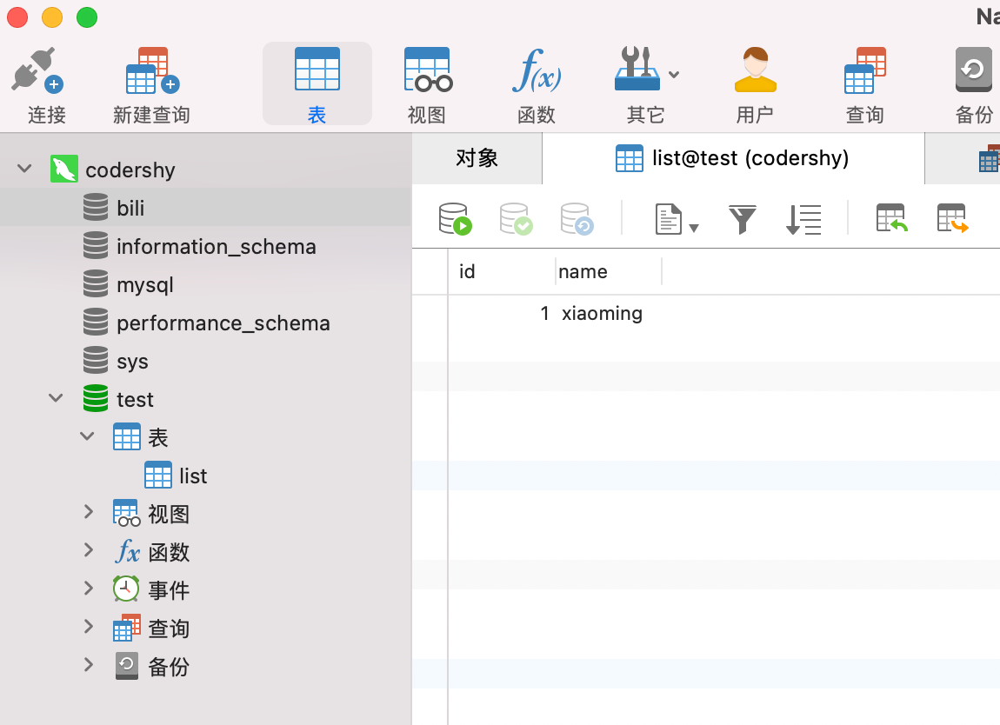
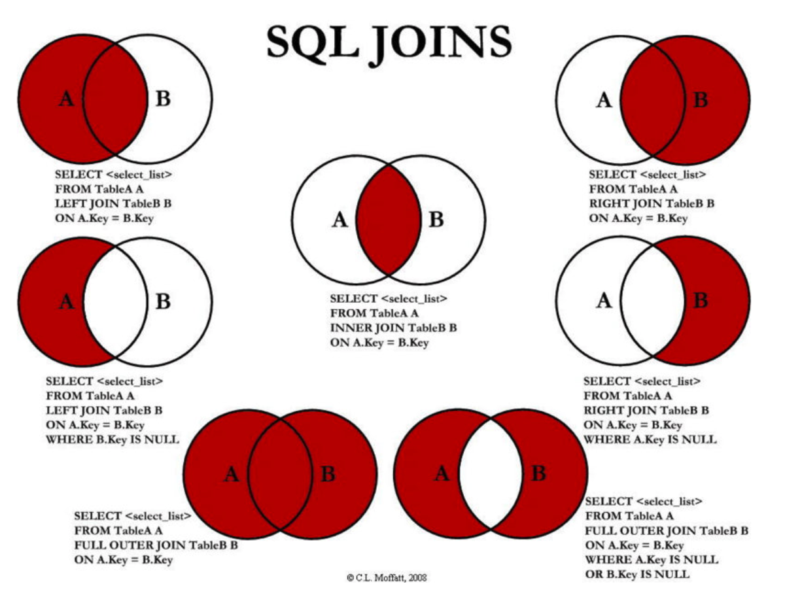
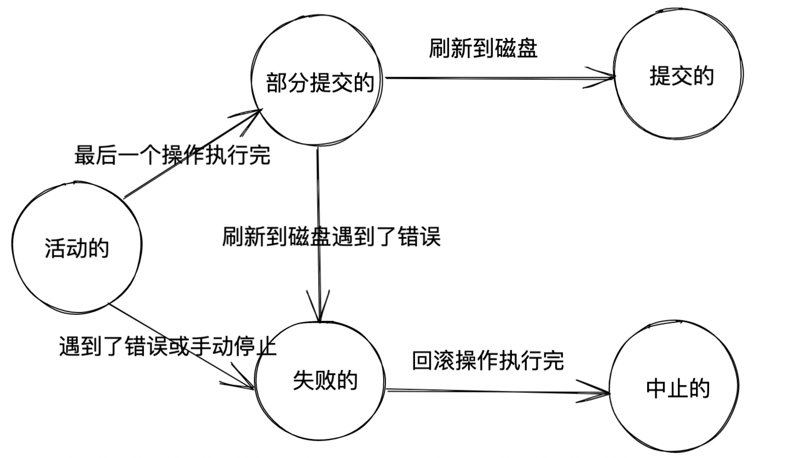

提到数据库，不仅仅要存储数据，同时还要满足数据的检索、获取、插入等能力。所以我们口中的数据库其实是有两个维度：

- 管理数据的软件：数据库管理系统（DataBase Management System）
- 存储数据：数据库（DataBase）

:::caution
我们下面提到的数据库指的都是数据库管理系统。
:::

一般会把数据库分成“关系型数据库”和“非关系型数据库”：所谓关系型数据库就是具有固定的行和列，每一列都存储固定含义的数据，数据一行行的排列；对于非关系型数据库，存储的数据之间不存在必然联系，很随意，类似于 word 文档。
:::tip
使用由行和列组成的表来存放数据的关系型数据库管理系统有好多种，比方说甲骨文的 Oracle，IBM 的 DB2，微软的 SQL Server，开源的 PostgreSQL 和 MySQL；非关系型数据库管理系统通常就是 MongoDB。
:::

## MySQL 的客户端/服务端架构

MySQL 在使用的时候会启动一个服务器程序，这个服务器程序直接和我们存储的数据打交道，可以有好多客户端程序连接到这个服务器程序，发送增删改查的请求，然后服务器程序就响应这些请求，从而操作它维护的数据。MySQL 的每个客户端都需要提供用户名密码才能登录，登录之后才能给服务器发请求来操作某些数据：

- 启动 MySQL 服务器程序。
- 启动 MySQL 客户端程序并连接到服务器程序。
- 在客户端程序中输入一些命令语句作为请求发送到服务器程序，服务器程序收到这些请求后，会根据请求的内容来操作具体的数据并向客户端返回操作结果。

### 客户端程序和服务器程序

#### 服务端程序

MySQL 安装目录下`/usr/local/mysql/bin`有许多可执行文件，比如`mysqld`可执行文件代表着服务器程序，我们运行这个可执行文件就会启动 MySQL 服务器。`mysqld`是 mysql 的核心程序，用于管理 mysql 的数据库文件以及用户的请求操作。mysqld 可以读取配置文件中的`[mysqld]`的部分。

也有`mysqld_safe`可执行文件，`mysqld_safe`脚本会在启动 MySQL 服务器后继续监控其运行情况，并在其死机时重新启动它。相当于多了一个守护进程，`mysqld`挂了会自动把`mysqld`进程拉起来。

:::tip
`mysql.server` 脚本其实也是调用 `mysqld_safe` 脚本去启动 MySQL 服务器的。

`vim ~/.bash_profile 添加alias start-sql="sudo /usr/local/mysql/support-files/mysql.server start" 然后 :wq 然后 source ~/.bash_profile`
添加`alias end-sql="sudo /usr/local/mysql/support-files/mysql.server stop"`杀死进程。
:::

#### 客户端程序

在服务器启动后，就可以启动客户端程序来连接到服务器了。`bin`目录下有许多客户端程序，比方说`mysqladmin`、`mysqldump`、`mysqlcheck`等。

这里重点关注`mysql`这个可执行文件，通过这个可执行文件连接服务器，并且和服务器程序进程交互，也就是发送请求以及接收服务器的处理结果。

我们需要将路径加入到`.bash_profile`中：`PATH=$PATH:/usr/local/mysql/bin`。执行该可执行文件时需要为其传递额外的参数，

```shell
mysql -h主机名  -u用户名 -p密码
```

- `-h` 服务器地址；如果服务器程序运行在本机，可以省略该参数
- `-u` 用户名，作为超级管理员的我们的用户名是 root
- `-p` 表示密码，通常不显示的写密码，而是`mysql -hlocalhost -uroot -p`，点击回车会提示输入密码。

:::tip

- 如果你非要在显式的把密码输出来，那密码值和-p 之间不能有空白字符，其他参数名之间可以有空白字符，就像这样：

```shell
mysql -h localhost -u root -p123456
```

如果加上了空白字符就是错误的，比如这样：

```
mysql -h localhost -u root -p 123456
```

- mysql 的各个参数的摆放顺序没有硬性规定，也就是说你也可以这么写：

```
mysql -p  -u root -h localhost
```

- 如果你的服务器和客户端安装在同一台机器上，-h 参数可以省略，就像这样：

```
mysql -u root -p
```

:::

启动了 MySQL 客户端程序之后，界面上会一直显示：`mysql>`，这是一个提示符，可以在后边输入我们的命令然后按下回车键就把命令从客户端程序发送到了服务器程序。当一条命令从客户端发送给了 MySQL 服务器之后，服务器处理完后就会给客户端发送回来处理结果，然后显示到界面上。

## GUI 工具

图像化操作数据库的工具，比起命令行，高亮美观直观。推荐 Navicat。

> 连接 -> MySQL -> 显示当前的所有数据库 -> 点击某个数据库会出现当前库下的表

我们可以在某一个连接下点击新建查询，去写 sql 语句。比如`CREATE DATABASE bili;`，选中然后右键出现`运行已选择的`，就会新建一个数据库，在连接下刷新就可以看到该数据库。



## SQL 语句

（和数据库沟通的语言）
SQL 语句可以用于对数据库进行操作，SQL 是 `Structured Query Language`，称之为结构化查询语言，简称 SQL。

- 通常关键字是大写的，比如 CREATE、TABLE、SHOW 等等；
- 一条语句结束后，需要以 `;` 结尾；
- 如果遇到关键字作为表明或者字段名称，可以使用``包裹；

### DDL

DDL 全称是 Data Definition Language：数据定义语言；可以通过 DDL 语句对数据库或者表进行创建、删除、修改等操作。

#### 对数据库的操作

```sql
# 查看所有的数据库
SHOW DATABASES;

# 选择某一个数据库
USE bili;

# 查看当前正在使用的数据库
SELECT DATABASE();

# 创建一个新的数据库
CREATE DATABASE douyu;
# 开发中常用IF NOT EXISTS，这个命令的意思是如果指定的数据库不存在的话就创建它，否则什么都不做（可以看做是一种兜底）
CREATE DATABASE IF NOT EXISTS douyu;
# 还可以规定字符编码和排列比较规则
# 比较规则（COLLATE会影响到ORDER BY语句的顺序，会影响到WHERE条件中大于小于号筛选出来的结果等等等等）
# 这里提一句：utf8只是Unicode字符集的一种编码方案，
# Unicode字符集可以采用utf8、utf16、utf32这几种编码方案，
# utf8使用1～4个字节编码一个字符，utf16使用2个或4个字节编码一个字符，utf32使用4个字节编码一个字符。
# MySQL中并不区分字符集和编码方案的概念，所以后边把utf8、utf16、utf32都当作一种字符集对待。
CREATE DATABASE IF NOT EXISTS huya DEFAULT CHARACTER SET utf8mb4
				COLLATE utf8mb4_0900_ai_ci;
# _ai accent insensitive 不区分重音
# _as accent sensitive 区分重音
# _ci case insensitive 不区分大小写

# 删除数据库
# 删除一个不存在的数据库会报错，所以用IF EXISTS来兜底，如果存在就删除，否则什么都不做
DROP DATABASE IF EXISTS douyu;

# 修改数据库的编码
ALTER DATABASE huya CHARACTER SET = utf8
				COLLATE = utf8_unicode_ci;
```

:::tip
utf8 字符集表示一个字符需要使用 1 ～ 4 个字节，但是我们常用的一些字符使用 1 ～ 3 个字节就可以表示了。

- utf8mb3：阉割过的 utf8 字符集，只使用 1 ～ 3 个字节表示字符。

- utf8mb4：正宗的 utf8 字符集，使用 1 ～ 4 个字节表示字符。

有一点需要大家十分的注意，在 MySQL 中 utf8 是 utf8mb3 的别名，所以之后在 MySQL 中提到 utf8 就意味着使用 1~3 个字节来表示一个字符，如果有使用 4 字节编码一个字符的情况，比如存储一些 emoji 表情啥的，那请使用 utf8mb4。
:::

#### 对数据表的操作

```sql
# 查看所有的表
SHOW TABLES;

# 新建表
CREATE TABLE IF NOT EXISTS `students` (
	`name` VARCHAR(10) NOT NULL,
	`age` int,
	`score` int,
	`height` DECIMAL(10,2),
	`birthday` YEAR,
	`phoneNum` VARCHAR(20) UNIQUE
);

# 删除表
DROP TABLE IF EXISTS `moment`;

# 查看表的结构
DESC students;
# 查看创建表的SQL语句
SHOW CREATE TABLE `students`;
-- CREATE TABLE `students` (
--   `name` varchar(10) DEFAULT NULL,
--   `age` int DEFAULT NULL,
--   `score` int DEFAULT NULL
-- ) ENGINE=InnoDB DEFAULT CHARSET=utf8mb4 COLLATE=utf8mb4_0900_ai_ci

# 完整的创建表的语法
CREATE TABLE IF NOT EXISTS `users`(
	id INT PRIMARY KEY AUTO_INCREMENT,
	name VARCHAR(20) NOT NULL,
	age INT DEFAULT 0,
	phoneNum VARCHAR(20) UNIQUE DEFAULT '',
	createTime TIMESTAMP
);

# 修改表
# 1.修改表的名字
ALTER TABLE `users` RENAME TO `user`;
# 2.添加一个新的列
ALTER TABLE `user` ADD COLUMN `updateTime` TIMESTAMP;
# 3.修改字段的名称
ALTER TABLE `user` CHANGE `phoneNum` `telPhone` VARCHAR(20);
# 4.修改字段的类型
ALTER TABLE `user` MODIFY `name` VARCHAR(30);
# 5.删除某一个字段
ALTER TABLE `user` DROP `age`;

# 根据一个表结构去创建另外一张表
CREATE TABLE `user2` LIKE `user`;
# 根据另外一个表中的所有内容，创建一个新的表
CREATE TABLE `user3` (SELECT * FROM `user`);
```

### DML

DML 即 Data Manipulation Language，翻译过来叫做数据操纵语句

对数据库的增删改

```sql
# DML
# 插入数据
INSERT INTO `user` VALUES (110, 'why', '020-110110', '2020-10-20', '2020-11-11');
INSERT INTO `user` (name, telPhone, createTime, updateTime)
						VALUES ('kobe', '000-1111111', '2020-10-10', '2030-10-20');

INSERT INTO `user` (name, telPhone)
						VALUES ('lilei', '000-1111112');

# 需求：createTime和updateTime可以自动设置值
ALTER TABLE `user` MODIFY `createTime` TIMESTAMP DEFAULT CURRENT_TIMESTAMP;
ALTER TABLE `user` MODIFY `updateTime` TIMESTAMP DEFAULT CURRENT_TIMESTAMP
																			 ON UPDATE CURRENT_TIMESTAMP;

INSERT INTO `user` (name, telPhone)
						VALUES ('hmm', '000-1111212');

INSERT INTO `user` (name, telPhone)
						VALUES ('lucy', '000-1121212');


# 删除数据
# 删除所有的数据
DELETE FROM `user`;
# 删除符合条件的数据
DELETE FROM `user` WHERE id = 110;

# 更新数据
# 更新所有的数据
UPDATE `user` SET name = 'lily', telPhone = '010-110110';
# 更新符合条件的数据
UPDATE `user` SET name = 'lily', telPhone = '010-110110' WHERE id = 115;
```

### DQL

DQL:Data Query Language(数据查询语言)

- SELECT 用于从一个或者多个表中检索选中的行(Record)。

基本格式：

```sql
SELECT select_expr [, select_expr]...
          [FROM table_references]
          [WHERE where_condition]
          [ORDER BY expr [ASC | DESC]]
          [LIMIT {[offset,] row_count | row_count OFFSET offset}]
          [GROUP BY expr]
          [HAVING where_condition]
```

#### 一些例子

```sql
# 创建products的表
CREATE TABLE IF NOT EXISTS `products` (
	id INT PRIMARY KEY AUTO_INCREMENT,
	brand VARCHAR(20),
	title VARCHAR(100) NOT NULL,
	price DOUBLE NOT NULL,
	score DECIMAL(2,1),
	voteCnt INT,
	url VARCHAR(100),
	pid INT
);

# 1.基本查询
# 查询表中所有的字段以及所有的数据
SELECT * FROM `products`;
# 查询指定的字段
SELECT title, price FROM `products`;
# 对字段结果起一个别名
SELECT title as phoneTitle, price as currentPrice FROM `products`;


# 2.where条件
# 2.1. 条件判断语句
# 案例：查询价格小于1000的手机
SELECT title, price FROM `products` WHERE price < 1000;
# 案例二：价格等于999的手机
SELECT * FROM `products` WHERE price = 999;
# 案例三：价格不等于999的手机
SELECT * FROM `products` WHERE price != 999;
SELECT * FROM `products` WHERE price <> 999;
# 案例四：查询品牌是华为的手机
SELECT * FROM `products` WHERE brand = '华为';

# 2.2. 逻辑运算语句
# 案例一：查询1000到2000之间的手机
SELECT * FROM `products` WHERE price > 1000 AND price < 2000;
SELECT * FROM `products` WHERE price > 1000 && price < 2000;
# BETWEEN AND 包含等于
SELECT * FROM `products` WHERE price BETWEEN 1099 AND 2000;

# 案例二：价格在5000以上或者是品牌是华为的手机
SELECT * FROM `products` WHERE price > 5000 || brand = '华为';

# 将某些值设置为NULL
-- UPDATE `products` SET url = NULL WHERE id >= 85 and id <= 88;
# 查询某一个值为NULL
SELECT * FROM `products` WHERE url IS NULL;
-- SELECT * FROM `products` WHERE url = NULL;
-- SELECT * FROM `products` WHERE url IS NOT NULL;

# 2.3.模糊查询
SELECT * FROM `products` WHERE title LIKE '%M%';
SELECT * FROM `products` WHERE title LIKE '%P%';
SELECT * FROM `products` WHERE title LIKE '_P%';


# 3.对结果进行排序
SELECT * FROM `products` WHERE brand = '华为' || brand = '小米' || brand = '苹果';
SELECT * FROM `products` WHERE brand IN ('华为', '小米', '苹果')
												 ORDER BY price ASC, score DESC;


# 4.分页查询
# LIMIT limit OFFSET offset;
# Limit offset, limit;
SELECT * FROM `products` LIMIT 20 OFFSET 0;
SELECT * FROM `products` LIMIT 20 OFFSET 20;
SELECT * FROM `products` LIMIT 40, 20;
```

这里提一下分页查询：分页实际上就是从结果集中“截取”出第 M~N 条记录。这个查询可以通过 `LIMIT <N-M> OFFSET <M>`子句实现
offset 偏移量就是本页第一条数据的位置，limit 就是本页一共的数据量：

- 比如每页 3 条记录。要获取第 1 页的记录，可以使用 LIMIT 3 OFFSET 0
  - LIMIT 3 OFFSET 0 表示，对结果集从 0 号记录开始，最多取 3 条。注意 SQL 记录集的索引从 0 开始。
- 要查询第 2 页，那么我们只需要“跳过”头 3 条记录，也就是对结果集从 3 号记录开始查询，把 OFFSET 设定为 3
  - LIMIT 3 OFFSET 3;
- 查询第 3 页的时候，OFFSET 应该设定为 6:
  - LIMIT 3 OFFSET 6;

## MySQL 数据类型

## 表约束

### 主键:PRIMARY KEY

一张表中，我们为了区分每一条记录的唯一性，必须有一个字段是永远不会重复，并且不会为空的，这个字段我们通常会将它设置为主键:

- 主键是表中唯一的索引;
- 并且必须是 NOT NULL 的，如果没有设置 NOT NULL，那么 MySQL 也会隐式的设置为 NOT NULL;
- 主键也可以是多列索引，PRIMARY KEY(key_part, ...)，我们一般称之为联合主键;
- 建议:开发中主键字段应该是和业务无关的，尽量不要使用业务字段来作为主键;

> 一个表最多只能有一个主键，主键的值不能重复，通过主键可以找到唯一的一条记录。

```sql
# 把这个主键声明放到列定义的后边
CREATE TABLE student_info (
    number INT,
    name VARCHAR(5),
    sex ENUM('男', '女'),
    id_number CHAR(18),
    department VARCHAR(30),
    major VARCHAR(30),
    enrollment_time DATE,
    PRIMARY KEY (number)
);
```

创建表的时候就声明了主键，MySQL 会对我们插入的记录做校验，如果新插入记录的主键值已经在表中存在了，那就会报错。

另外，主键列默认是有 NOT NULL 属性，也就是必填的，如果填入 NULL 值会报错

### 唯一:UNIQUE

- 某些字段在开发中我们希望是唯一的，不会重复的，比如手机号码、身份证号码等，这个字段我们可以使用 UNIQUE 来约
  束:
- 使用 UNIQUE 约束的字段在表中必须是不同的;
- 对于所有引擎，UNIQUE 索引允许 NULL 包含的列具有多个值 NULL。

基本用法为：

```shell
UNIQUE KEY [约束名称] (列名1, 列名2, ...)
```

一个表中可以为不同的列添加多个 UNIQUE 属性，也就是添加多个 UNIQUE 约束，每添加一个 UNIQUE 约束，我们就可以给它起个名，这也是约束名称的含义。不过约束名称是被中括号`[]`扩起来的，意味着我们写不写都可以，如果不写的话 MySQL 自己会帮我们起名。

```sql
CREATE TABLE student_info (
    number INT PRIMARY KEY,
    name VARCHAR(5),
    sex ENUM('男', '女'),
    id_number CHAR(18),
    department VARCHAR(30),
    major VARCHAR(30),
    enrollment_time DATE,
    UNIQUE KEY uk_id_number (id_number)
);
```

#### 主键和 UNIQUE 的区别

主键和 UNIQUE 约束都能保证某个列或者列组合的唯一性，但是：

- 一张表中只能定义一个主键，却可以定义多个 UNIQUE 约束！

- 规定：主键列不允许存放 NULL，而声明了 UNIQUE 属性的列可以存放 NULL，而且 NULL 可以重复地出现在多条记录中！

### 外键约束

如果 A 表中的某个列或者某些列依赖与 B 表中的某个列或者某些列，那么就称 A 表为子表，B 表为父表。子表和父表可以使用外键来关联起来。

比如我们的商品信息，会有品牌这样的字段，不过对于品牌这个字段我们应该还有更多的信息，比如品牌排名、品牌官网、品牌市值。所以可以把所有的品牌数据新建一个表，将两张表联系起来，我们可以将 products 表中的 brand_id 关联到 brand 中的 id，**在定义子表的时候约定外键**

这是定义外键的语法：

```sql
CONSTRAINT [外键名称] FOREIGN KEY(列1, 列2, ...) REFERENCES 父表名(父列1, 父列2, ...);
```

> 外键名称也是可选的，我们不自己命名的话，MySQL 自己会帮助我们命名。

也可以简写

- 如果是创建表添加外键约束，我们需要在创建表的()最后添加如下语句;
  - `FOREIGN KEY (brand_id) REFERENCES brand(id);`
- 如果是表已经创建好，额外添加外键:
  - `ALTER TABLE `products` ADD FOREIGN KEY (brand_id) REFERENCES brand(id);`

```sql
CREATE TABLE student_score (
    number INT,
    subject VARCHAR(30),
    score TINYINT,
    PRIMARY KEY (number, subject),
    CONSTRAINT FOREIGN KEY(number) REFERENCES student_info(number)
);
```

:::caution
父表中被子表依赖的列或者列组合必须建立索引，如果该列或者列组合已经是主键或者有 UNIQUE 属性，那么它们也就被默认建立了索引。
:::

## 索引

### 索引的意义

索引的全部意义就是通过缩小一张表中需要查询的记录/行的数目来加快搜索的速度。可以理解为是某个数据库一个目录索引。

一个索引是存储的表中一个特定列的值数据结构。索引建立的基础是表的某一列（一般是主键的值）。所以，要记住的关键点是索引包含一个表中某一列的值，并且这些值存储在一个数据结构中。每个索引都对应一棵 B+树，B+树分为好多层，最下边一层是叶子节点，其余的是内节点。所有用户记录都存储在 B+树的叶子节点，所有目录项记录都存储在内节点。

### 聚簇索引

InnoDB 存储引擎会自动为主键（如果没有它会自动帮我们添加）建立聚簇索引，聚簇索引的叶子节点包含完整的用户记录。

聚簇索引有两个特点：

- 使用记录主键值的大小进行记录和页的排序，这包括三个方面的含义：

  - 页内的记录是按照主键的大小顺序排成一个单向链表。

  - 各个存放用户记录的页也是根据页中用户记录的主键大小顺序排成一个双向链表。

  - 存放目录项记录的页分为不同的层次，在同一层次中的页也是根据页中目录项记录的主键大小顺序排成一个双向链表。

- B+树的叶子节点存储的是完整的用户记录。

  - 所谓完整的用户记录，就是指这个记录中存储了所有列的值（包括隐藏列）。

我们把具有这两种特性的 B+树称为聚簇索引，所有完整的用户记录都存放在这个聚簇索引的叶子节点处。这种聚簇索引并不需要我们在 MySQL 语句中显式的使用 INDEX 语句去创建，InnoDB 存储引擎会自动的为我们创建聚簇索引。另外在 InnoDB 存储引擎中，聚簇索引就是数据的存储方式（所有的用户记录都存储在了叶子节点），也就是所谓的索引即数据，数据即索引。

### 二级索引

我们可以为自己感兴趣的列建立二级索引，二级索引的叶子节点包含的用户记录由索引列 + 主键组成，所以如果想通过二级索引来查找完整的用户记录的话，需要通过回表操作，也就是在通过二级索引找到主键值之后再到聚簇索引中查找完整的用户记录。

B+树中每层节点都是按照索引列值从小到大的顺序排序而组成了双向链表，而且每个页内的记录（不论是用户记录还是目录项记录）都是按照索引列的值从小到大的顺序而形成了一个单链表。如果是联合索引的话，则页面和记录先按照联合索引前边的列排序，如果该列值相同，再按照联合索引后边的列排序。

通过索引查找记录是从 B+树的根节点开始，一层一层向下搜索。由于每个页面都按照索引列的值建立了 Page Directory（页目录），所以在这些页面中的查找非常快。

> 回顾下数据结构，B-树，也称为 B 树，是一种平衡的多叉树，平衡二叉树（AVL）指的是：一棵空树或它的左右两个子树的高度差的绝对值不超过 1，并且左右两个子树都是一棵平衡二叉树。
>
> - B-树内部节点是保存数据的;而 **B+树内部节点是不保存数据的，只作索引作用，它的叶子节点才保存数据**。
> - B+树相邻的叶子节点之间是通过链表指针连起来的，B-树却不是。
> - 查找过程中，B-树在找到具体的数值以后就结束，而 **B+树则需要通过索引找到叶子结点中的数据才结束**
> - B-树中任何一个关键字出现且只出现在一个结点中，而 B+树可以出现多次。

### 创建和删除索引的语句

**用`INDEX`（或者`KEY`）关键字**
:::tip
InnoDB 和 MyISAM 会自动为主键或者声明为 UNIQUE 的列去自动建立 B+树索引，但是如果我们想为其他的列建立索引就需要我们显式的去指明。如果为每一个列去创建索引，每建立一个索引都会建立一棵 B+树，每插入一条记录都要维护各个记录、数据页的排序关系，这是很费性能和存储空间的。
:::

我们可以在创建表的时候指定需要建立索引的单个列或者建立联合索引的多个列：

```sql
CREATE TALBE 表名 (
    各种列的信息 ··· ,
    [KEY|INDEX] 索引名 (需要被索引的单个列或多个列)
)
```

其中的 KEY 和 INDEX 是同义词，任意选用一个就可以。我们也可以在修改表结构的时候添加索引：

```shell
ALTER TABLE 表名 ADD [INDEX|KEY] 索引名 (需要被索引的单个列或多个列);
```

也可以在修改表结构的时候删除索引：

```shell
ALTER TABLE 表名 DROP [INDEX|KEY] 索引名;
```

比方说我们想在创建 index_demo 表的时候就为 c2 和 c3 列添加一个联合索引，可以这么写建表语句：

```sql
CREATE TABLE index_demo(
    c1 INT,
    c2 INT,
    c3 CHAR(1),
    PRIMARY KEY(c1),
    INDEX idx_c2_c3 (c2, c3)
);
```

在这个建表语句中我们创建的索引名是 `idx_c2_c3`，这个名称可以随便起，不过我们还是建议以 `idx`为前缀，后边跟着需要建立索引的列名，多个列名之间用下划线`_`分隔开。

如果我们想删除这个索引，可以这么写：

```shell
ALTER TABLE index_demo DROP INDEX idx_c2_c3;
```

## SQL 多表查询

- 左连接（左表唯一 -- 返回左表有但右表没有关联数据的记录）
- 右连接（右表唯一）
- 内连接（获取两个表中指定字段满足匹配关系的记录）
- 全连接（返回两个表中的所有行）



```sql
# 1.基本数据的模拟
CREATE TABLE IF NOT EXISTS students(
	id INT PRIMARY KEY AUTO_INCREMENT,
	name VARCHAR(20) NOT NULL,
	age INT
);

CREATE TABLE IF NOT EXISTS courses(
	id INT PRIMARY KEY AUTO_INCREMENT,
	name VARCHAR(20) NOT NULL,
	price DOUBLE
);

INSERT INTO `students` (name, age) VALUES('why', 18);
INSERT INTO `students` (name, age) VALUES('tom', 22);
INSERT INTO `students` (name, age) VALUES('lilei', 25);
INSERT INTO `students` (name, age) VALUES('lucy', 16);
INSERT INTO `students` (name, age) VALUES('lily', 20);

INSERT INTO `courses` (name, price) VALUES ('英语', 100);
INSERT INTO `courses` (name, price) VALUES ('语文', 666);
INSERT INTO `courses` (name, price) VALUES ('数学', 888);
INSERT INTO `courses` (name, price) VALUES ('历史', 80);
INSERT INTO `courses` (name, price) VALUES ('物理', 888);
INSERT INTO `courses` (name, price) VALUES ('地理', 333);


# 2.建立关系表
CREATE TABLE IF NOT EXISTS `students_select_courses`(
	id INT PRIMARY KEY AUTO_INCREMENT,
	student_id INT NOT NULL,
	course_id INT NOT NULL,
	FOREIGN KEY (student_id) REFERENCES students(id) ON UPDATE CASCADE,
	FOREIGN KEY (course_id) REFERENCES courses(id) ON UPDATE CASCADE
);

# 3.学生选课
# why选择了英文、数学、历史
INSERT INTO `students_select_courses` (student_id, course_id) VALUES (1, 1);
INSERT INTO `students_select_courses` (student_id, course_id) VALUES (1, 3);
INSERT INTO `students_select_courses` (student_id, course_id) VALUES (1, 4);


INSERT INTO `students_select_courses` (student_id, course_id) VALUES (3, 2);
INSERT INTO `students_select_courses` (student_id, course_id) VALUES (3, 4);


INSERT INTO `students_select_courses` (student_id, course_id) VALUES (5, 2);
INSERT INTO `students_select_courses` (student_id, course_id) VALUES (5, 3);
INSERT INTO `students_select_courses` (student_id, course_id) VALUES (5, 4);


# 4.查询的需求
# 4.1. 查询所有有选课的学生，选择了哪些课程
SELECT stu.id id, stu.name stuName, stu.age stuAge, cs.id csId, cs.name csName, cs.price csPrice
FROM `students` stu
JOIN `students_select_courses` ssc ON stu.id = ssc.student_id
JOIN `courses` cs ON ssc.course_id = cs.id;


# 4.2. 查询所有的学生的选课情况
SELECT stu.id id, stu.name stuName, stu.age stuAge, cs.id csId, cs.name csName, cs.price csPrice
FROM `students` stu
LEFT JOIN `students_select_courses` ssc ON stu.id = ssc.student_id
LEFT JOIN `courses` cs ON ssc.course_id = cs.id;

# 4.3. 哪些学生是没有选课
SELECT stu.id id, stu.name stuName, stu.age stuAge, cs.id csId, cs.name csName, cs.price csPrice
FROM `students` stu
LEFT JOIN `students_select_courses` ssc ON stu.id = ssc.student_id
LEFT JOIN `courses` cs ON ssc.course_id = cs.id
WHERE cs.id IS NULL;

# 4.4. 查询哪些课程是没有被选择的
SELECT stu.id id, stu.name stuName, stu.age stuAge, cs.id csId, cs.name csName, cs.price csPrice
FROM `students` stu
RIGHT JOIN `students_select_courses` ssc ON stu.id = ssc.student_id
RIGHT JOIN `courses` cs ON ssc.course_id = cs.id
WHERE stu.id IS NULL;

# 4.5. 某一个学生选了哪些课程（why）
SELECT stu.id id, stu.name stuName, stu.age stuAge, cs.id csId, cs.name csName, cs.price csPrice
FROM `students` stu
LEFT JOIN `students_select_courses` ssc ON stu.id = ssc.student_id
LEFT JOIN `courses` cs ON ssc.course_id = cs.id
WHERE stu.id = 2;
```

## 事务

> 事务的英文是 transaction，英文直译就是交易，买卖的意思，交易就是买的人付钱，卖的人交货，不能付了钱不交货，交了货不付钱把，所以交易本身就是一种不可分割的操作。

### 事务的概念

事务对应着一个或多个数据库操作，这些操作需要保证原子性、隔离性、一致性和持久性。

- 原子性：一个事务（transaction）中的所有操作，要么全部完成，要么全部不完成，不会结束在中间某个环节。事务在执行过程中发生错误，会被回滚（Rollback）到事务开始前的状态，就像这个事务从来没有执行过一样。

- 一致性：在事务开始之前和事务结束以后，数据库的完整性没有被破坏。这表示写入的资料必须完全符合所有的预设规则，这包含资料的精确度、串联性以及后续数据库可以自发性地完成预定的工作。

- 隔离性：数据库允许多个并发事务同时对其数据进行读写和修改的能力，隔离性可以防止多个事务并发执行时由于交叉执行而导致数据的不一致。事务隔离分为不同级别，包括读未提交（Read uncommitted）、读提交（read committed）、可重复读（repeatable read）和串行化（Serializable）。

- 持久性：事务处理结束后，对数据的修改就是永久的，即便系统故障也不会丢失。

事务分为以 5 下个状态：

- **活动的（active）**
  事务对应的数据库操作正在执行过程中时，我们就说该事务处在活动的状态。

- **部分提交的（partially committed）**
  当事务中的最后一个操作执行完成，但由于操作都在内存中执行，所造成的影响并没有刷新到磁盘时，我们就说该事务处在部分提交的状态。

- **失败的（failed）**
  当事务处在活动的或者部分提交的状态时，可能遇到了某些错误（数据库自身的错误、操作系统错误或者直接断电等）而无法继续执行，或者人为的停止当前事务的执行，我们就说该事务处在失败的状态。

- **中止的（aborted）**
  如果事务执行了半截而变为失败的状态，比如我们前边唠叨的狗哥向猫爷转账的事务，当狗哥账户的钱被扣除，但是猫爷账户的钱没有增加时遇到了错误，从而当前事务处在了失败的状态，那么就需要把已经修改的狗哥账户余额调整为未转账之前的金额，换句话说，就是要撤销失败事务对当前数据库造成的影响。书面一点的话，我们把这个撤销的过程称之为回滚。当回滚操作执行完毕时，也就是数据库恢复到了执行事务之前的状态，我们就说该事务处在了中止的状态。

- **提交的（committed）**
  当一个处在部分提交的状态的事务将修改过的数据都同步到磁盘上之后，我们就可以说该事务处在了提交的状态。

联系如下：



只有当事务处于提交的或者中止的状态时，一个事务的生命周期才算是结束了。对于已经提交的事务来说，该事务对数据库所做的修改将永久生效，对于处于中止状态的事务，该事务对数据库所做的所有修改都会被回滚到没执行该事务之前的状态。

### 事务语句

- BEGIN [WORK] 或 START TRANSACTION 显式地开启一个事务；

  - START TRANSACTION 后边可以跟着修饰符。
    - READ ONLY：标识当前事务是一个只读事务，也就是属于该事务的数据库操作只能读取数据，而不能修改数据；
    * READ WRITE：标识当前事务是一个读写事务，也就是属于该事务的数据库操作既可以读取数据，也可以修改数据；
    * WITH CONSISTENT SNAPSHOT：启动一致性读；

- COMMIT [WORK]。COMMIT 会提交事务，并使已对数据库进行的所有修改成为永久性的；

- ROLLBACK [WORK]。回滚会结束用户的事务，并撤销正在进行的所有未提交的修改；

- SAVEPOINT identifier，SAVEPOINT 允许在事务中创建一个保存点，一个事务中可以有多个 SAVEPOINT；

- RELEASE SAVEPOINT identifier 删除一个事务的保存点，当没有指定的保存点时，执行该语句会抛出一个异常；

- ROLLBACK TO identifier 把事务回滚到标记点；

- SET TRANSACTION 用来设置事务的隔离级别。InnoDB 存储引擎提供事务的隔离级别有 READ UNCOMMITTED、READ COMMITTED、REPEATABLE READ 和 SERIALIZABLE。

**COMMIT**

```sql
mysql> BEGIN;
Query OK, 0 rows affected (0.00 sec)

mysql> UPDATE account SET balance = balance - 10 WHERE id = 1;
Query OK, 1 row affected (0.02 sec)
Rows matched: 1  Changed: 1  Warnings: 0

mysql> UPDATE account SET balance = balance + 10 WHERE id = 2;
Query OK, 1 row affected (0.00 sec)
Rows matched: 1  Changed: 1  Warnings: 0

mysql> COMMIT;
Query OK, 0 rows affected (0.00 sec)
```

**ROLLBACK**

```sql
mysql> BEGIN;
Query OK, 0 rows affected (0.00 sec)

mysql> UPDATE account SET balance = balance - 10 WHERE id = 1;
Query OK, 1 row affected (0.00 sec)
Rows matched: 1  Changed: 1  Warnings: 0

mysql> UPDATE account SET balance = balance + 1 WHERE id = 2;
Query OK, 1 row affected (0.00 sec)
Rows matched: 1  Changed: 1  Warnings: 0

mysql> ROLLBACK;
Query OK, 0 rows affected (0.00 sec)
```

## Node 使用 MySQL

在 Node 的代码中执行 SQL 语句来，这里我们可以借助于两个库：

- mysql：最早的 Node 连接 MySQL 的数据库驱动
- mysql2：在 mysql 的基础之上，进行了很多的优化、改进

> 具体来讲，更高的性能！支持 PreparedStatement，多次查询性能更高，书写 SQL 更简单；自带 Promise 包装器，可以直接使用 async/await 语法；绝大部分 api 和 mysql 库兼容，意味着 mysql 的文档和线上资料亦可作为参考。

Prepared Statement(预编译语句):

- 提高性能：将创建的语句模块发送给 MySQL，然后 MySQL 编译(解析、优化、转换)语句模块，并且存储它但是不执行，之后我们在真正执行时会提供实际的参数才会执行；就算多次执行，也只会编译一次，所以性能是更高的
- 防止 sql 注入

```shell
npm install mysql2
```

mysql2 的使用过程如下:

- 第一步:创建连接(通过 createConnection)，并且获取连接对象;
- 第二步:执行 SQL 语句即可(通过 query);

```js
const mysql = require("mysql2");

// 1.创建数据库连接
const connection = mysql.createConnection({
  host: "localhost",
  port: 3306,
  database: "test",
  user: "root",
  password: "test",
});

// 2.执行SQL语句
const statement = `
  SELECT * FROM products WHERE price > 6000;
`;
connection.query(statement, (err, results, fields) => {
  console.log(results);
});
```

前面我们是创建了一个连接(connection)，但是如果我们有多个请求的话，该连接很有可能正在被占用，我们是否需要每次一个请求都去创建一个新的连接呢?

- 事实上，mysql2 给我们提供了连接池(connection pools);
- 连接池可以在需要的时候自动创建连接，并且创建的连接不会被销毁，会放到连接池中，后续可以继续使用;
- 我们可以在创建连接池的时候设置 LIMIT，也就是最大创建个数;

```js
const mysql = require("mysql2");

// 1.创建连接池
const connections = mysql.createPool({
  host: "localhost",
  port: 3306,
  database: "test",
  user: "root",
  password: "test",
  connectionLimit: 10,
});

// 2.使用连接池
// 预处理语句，要用 execute => 相当于先 prepare 再 query
const statement = `
  SELECT * FROM products WHERE price > ? AND score > ?;
`;
connections.execute(statement, [6000, 7], (err, results) => {
  console.log(results);
});
```

### promise 方式

mysql2 提供了很多种支持 promise 的方式，最常用的是：

```js
const mysql = require("mysql2");

const config = require("./config");

const connections = mysql.createPool({
  // 真实开发需要写到 config 里
  host: config.MYSQL_HOST,
  port: config.MYSQL_PORT,
  database: config.MYSQL_DATABASE,
  user: config.MYSQL_USER,
  password: config.MYSQL_PASSWORD,
});

const statement = `SELECT * FROM products WHERE price > ? AND score > ?`;

connections
  .promise()
  .execute(statement, [6000, 7])
  .then((result) => {
    console.log(result);
  })
  .catch((err) => {
    console.log(err);
  });
```

比如 `.env` 文件中（git 中忽略该文件）：

```
APP_HOST=http://localhost
APP_PORT=8000

MYSQL_HOST=localhost
MYSQL_PORT=3306
MYSQL_DATABASE=xxx
MYSQL_USER=root
MYSQL_PASSWORD=xxx
```

```js
// config.js
const dotenv = require("dotenv");

dotenv.config();
// 可以在 process.env 里直接拿到 .env 的内容
module.exports = {
  APP_HOST,
  APP_PORT,
  MYSQL_HOST,
  MYSQL_PORT,
  MYSQL_DATABASE,
  MYSQL_USER,
  MYSQL_PASSWORD,
} = process.env;
```

## ORM

对象关系映射(英语:Object Relational Mapping，简称 ORM，或 O/RM，或 O/R mapping)，是一种程序设计的方案：

- 从效果上来讲，它提供了一个可在编程语言中，使用 虚拟对象数据库 的效果；
- 比如在 Java 开发中经常使用的 ORM 包括：Hibernate、MyBatis；

Node 当中的 ORM 我们通常使用的是 sequelize;

:::tip
直接执行 sql 比较繁琐，能不能只操作对象，对象属性变了就自动去执行 sql 来同步数据库。-- ORM

数据库和对象关系的映射就叫做 ORM（Object Relational Mapping），也就是把表映射成对象，把表与表之间的关联映射成对象之间的关系。之后对对象的操作会通过 sql 同步到数据库。
:::

```shell
npm install sequelize mysql2
```
