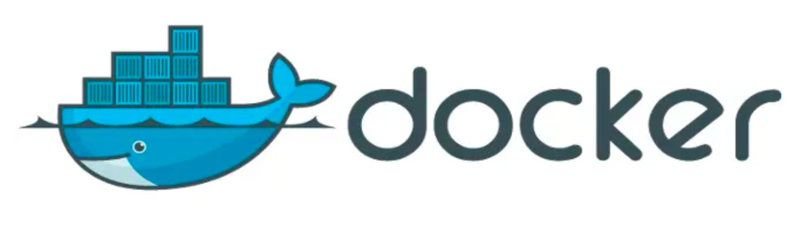
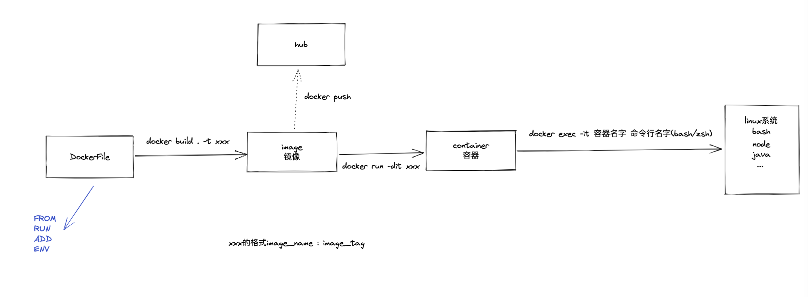
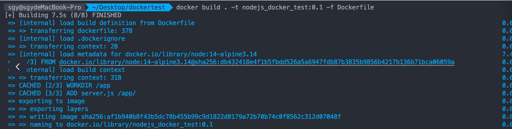
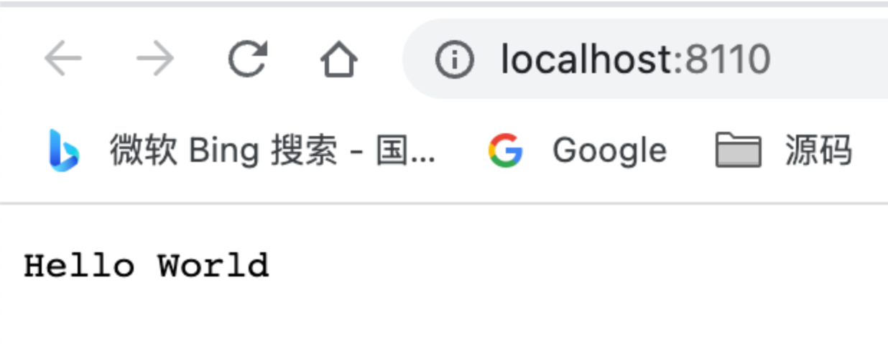

容器化是为了解决环境配置而出现的技术，有两种方案，虚拟机和 linux 容器。

### 虚拟机

虚拟机可以在一种操作系统里面运行另一种操作系统，比如在 Windows 系统里面运行 Linux 系统。应用程序对此毫无感知，因为虚拟机看上去跟真实系统一模一样，而对于底层系统来说，虚拟机就是一个普通文件，不需要了就删掉，对其他部分毫无影响。

虽然用户可以通过虚拟机还原软件的原始环境。但是，这个方案有几个缺点：

- （1）资源占用多
  - 虚拟机会独占一部分内存和硬盘空间。它运行的时候，其他程序就不能使用这些资源了。哪怕虚拟机里面的应用程序，真正使用的内存只有 1MB，虚拟机依然需要几百 MB 的内存才能运行。
- （2）冗余步骤多
  - 虚拟机是完整的操作系统，一些系统级别的操作步骤，往往无法跳过，比如用户登录。
- （3）启动慢
  - 启动操作系统需要多久，启动虚拟机就需要多久。可能要等几分钟，应用程序才能真正运行。

### linux 容器

容器存放的是应用程序和运行程序所依赖的系统环境，打包之后可以直接移植到一个主机上，所以 docker 的图标就是鲸鱼载着集装箱（一个个容器）；

容器的优势：

- （1）启动快
  - 容器里面的应用，直接就是底层系统的一个进程，而不是虚拟机内部的进程。所以，启动容器相当于启动本机的一个进程，而不是启动一个操作系统，速度就快很多。
- （2）资源占用少
  - 容器只占用需要的资源，不占用那些没有用到的资源；虚拟机由于是完整的操作系统，不可避免要占用所有资源。另外，多个容器可以共享资源，虚拟机都是独享资源。
- （3）体积小
  - 容器只要包含用到的组件即可，而虚拟机是整个操作系统的打包，所以容器文件比虚拟机文件要小很多。

### 虚拟机与容器的区别

容器和虚拟机的区别在于，虚拟机需要去先虚拟硬件，然后再装操作系统和应用；而容器直接使用原来的操作系统，只需要打包应用和依赖的环境即可，应用共享相同的操作系统，更轻量。

### Docker

Docker 属于 Linux 容器的一种封装，提供简单易用的容器使用接口。它是目前最流行的 Linux 容器解决方案。

Docker 将应用程序与该程序的依赖，打包在一个文件里面。运行这个文件，就会生成一个虚拟容器。程序在这个虚拟容器里运行，就好像在真实的物理机上运行一样。有了 Docker，就不用担心环境问题。

总体来说，Docker 的接口相当简单，用户可以方便地创建和使用容器，把自己的应用放入容器。容器还可以进行版本管理、复制、分享、修改，就像管理普通的代码一样。

整体流程：



`docker login` 输入用户名和密码

把镜像 `push` 到 `docker hub`：`docker push [image_name:tag]`

`docker pull [image_name:tag]` 就可以拉下来，可以参考 [Docker 命令-docker pull](https://www.jianshu.com/p/f0c6302e869e)

或者在 Dockerfile 里，`FROM [image_name:tag]`，使用 remote-containers 插件，就可以连接 docker，获取镜像。

### 简单使用

目录结构：

```
dockertest
├─ Dockerfile
└─ server.js
```

Dockerfile：

```
# 选择基础镜像
FROM node:14-alpine3.14

# 设定服务工作路径
WORKDIR /app

# 从当前路径拷贝到容器中的 /app/ 目录下
ADD server.js /app/

# 运行 npm install
# RUN npm install

# 指定容器监听端口
EXPOSE 8110

# 在容器运行时执行
CMD ["node", "server.js"]
```

server.js：

```js
const http = require("http");

http
  .createServer(function (request, response) {
    // 发送 HTTP 头部
    // HTTP 状态值: 200 : OK
    // 内容类型: text/plain
    response.writeHead(200, { "Content-Type": "text/plain" });

    // 发送响应数据 "Hello World"
    response.end("Hello World");
  })
  .listen(8110, () => {
    console.log("服务器已启动，地址是：http://localhost:8110");
  });
```

构建镜像的命令：

```shell
docker build . -t [image_name:image_tag] -f [dockerfile_name]
```

- -f --file 参数是：Dockerfile 的名称（默认值为"$PATH/dockerfile"）
- -t, --tag 参数是：以"名称：标签"格式命名的镜像名称和标签

`docker built . -t nodejs_docker_test:0.1 -f Dcokerfile`：



构建完镜像，可以生成容器：

```shell
docker run --name [docker_runtime_name] -p [local_port:image_port] -d [image_name:image_tag]
```

- --name 容器的名称，如果不写会自动给一个哈希值
- -p 本机的端口与容器端口的映射关系
- -d 后台运行容器，并且会输出容器 id
- image_name:image_tag 是镜像 tag（构建镜像时我们指定的）

`docker run --name nodejs_docker_container -p 8110:8110 -d nodejs_docker_test:0.1`

通过 run 命令启动时，将容器的端口映射到主机的端口。在容器成功启动之后，可以通过访问当前机器的 IP 地址，加端口就可以访问到现在拉起的服务：



容器端口和本机端口不冲突，是两个 namespace 下的端口，但是本机的端口在机器上是唯一的， 如果运行多个容器时，请确保机器上的端口唯一。否则启动容器时会报错端口冲突。

也通过本地 curl 命令，可以看到正确返回了 nodejs 的代码设置：

```
curl http://localhost:8110

// 控制台输出 hello world
```

当然 vscode 也有插件，`remote-containers`：可以方便的在连接 Docker 容器。可以尝试一下，做端口转发非常方便。

`cmd+shift+p` 输入 `rebuild and reopen in container`，回车。

- 参考这个 [VSCode 云端开发环境搭建 （Remote-Containers)](https://www.jianshu.com/p/84898e937c5a)
