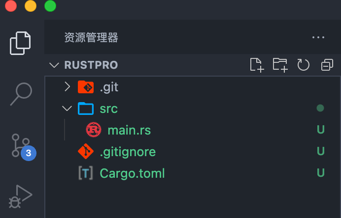
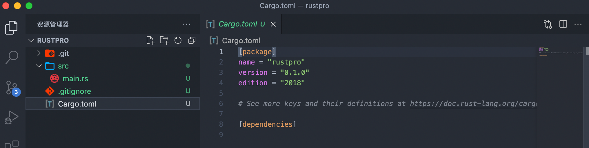
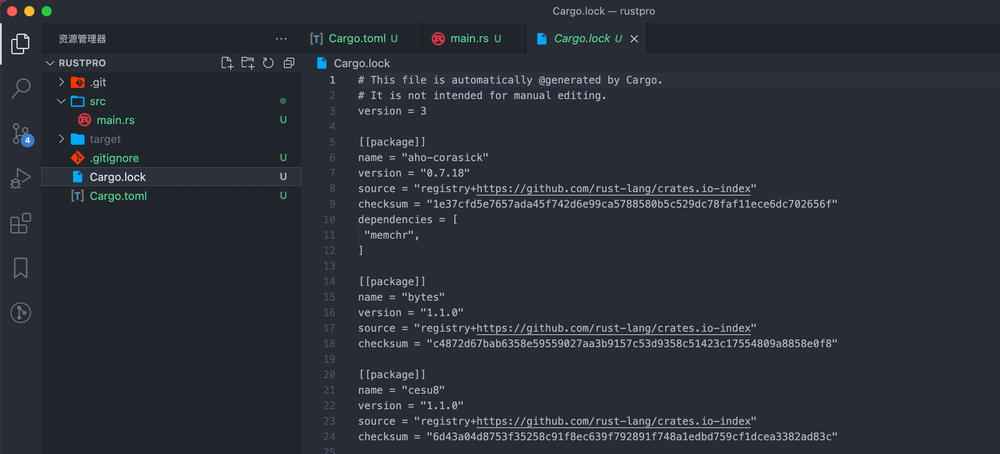

Rust 是一门兼顾内存安全、高并发和稳定运行的编程语言。

从语言的内核来看，它重塑了我们对一些基本概念的理解。比如 Rust 清晰地定义了变量在一个作用域下的生命周期，让开发者在摒弃垃圾回收（GC）这样的内存和性能杀手的前提下，还能够无需关心手动内存管理，让内存安全和高性能二者兼得。

从语言的外观来看，它使用起来感觉很像 Python/TypeScript 这样的高级语言，表达能力一流，但性能丝毫不输于 C/C++，从而让表达力和高性能二者兼得。

> C++ 这种古老语言都是手动回收内存的<br/>
> Java、JavaScript 等语言都有专门的 GC 来回收内存<br/>
> Rust 则是通过编译器限制了堆上的对象只能被一个变量引用，多了就复制或者只是借用，然后变量在作用域销毁时回收对应的对象，也就是所有权机制<br/>

## rust 的包管理工具

**cargo 是类似于 npm 的存在。**

```shell
cargo init
```



`cargo.toml` 相当于 `package.json`，也是声明包信息和 `dependencies` 的。

> 对比`npm init`后只有`package.json`，`rust`甚至还多了`src`并且初始化了`git`

`cargo.toml` 的内容是这样的：



`[package]` 下声明的是包的信息，`[dependencies]` 下声明的是依赖信息。

安装新依赖通常是编辑`Cargo.toml`文件，在`[dependencies]`表中添加新依赖，最后执行`cargo build`命令（安装依赖）。

> 删除和更新依赖跟这个类似都需要编辑 Cargo.toml 文件然后执行 cargo build 命令。

然后编译和执行：

```shell
cargo build
cargo run
```

执行完`cargo build`会有 `Cargo.lock`和`target`目录（编译后的二进制可执行文件`./target/debug`），`cargo` 也有类似于 `package-lock.json` 的 `Cargo.lock` 来记录了依赖的具体信息：



## 数据类型

> Rust 虽然是一门强类型语言，但编译器支持类型推导，这使得写代码时的直观感受和写脚本语言差不多。

## 所有权

所有的程序都必须和计算机内存打交道，从内存中申请空间来存放程序的运行内容，在不需要的时候释放这些空间。对于内存管理，有三种方案：

1. 垃圾回收机制(GC)，在程序运行时不断寻找不再使用的内存，典型代表：Java、Go、JS
2. 手动管理内存的分配和释放, 在程序中，通过函数调用的方式来申请和释放内存，典型代表：C++
3. 通过所有权来管理内存，编译器在编译时会根据一系列规则进行检查

Rust 选择了第三种，并且这种检查只发生在编译期，对于程序运行期，不会有任何性能上的损失。

在其它语言中，我们用 `var a = "hello world"` 的方式给 a 赋值，也就是把等式右边的 `"hello world"` 字符串赋值给变量 a ，而在 Rust 中，我们这样写： `let a = "hello world"` ，同时给这个过程起了另一个名字：**变量绑定**。

之所以用绑定，是因为 Rust 最核心的原则——所有权，简单来讲，任何内存对象都是有主人的，绑定就是把这个内存对象绑定给一个变量，让这个变量成为它的所有者（owner）。

所有权有两个规则：

1. Rust 中每一个值都**只有**一个所有者（值绑定到某个变量上）
2. 当所有者（变量）离开作用域范围时，这个值将被丢弃（drop）

比如：

```rust
let s1 = String::from("hello");
let s2 = s1;

println!("{}, world!", s1);
```

这个会报错，因为值 "hello" 的所有权已经转移（move）到 s2 了，再去访问 s1，Rust 禁止你使用无效的引用。

再来看这个：

```rust
fn main() {
    let x: &str = "hello, world";
    let y = x;
    println!("{},{}",x,y);
}
```

输出：

```
hello, world,hello, world
```

:::tip
实际上这里的`&str` 就是创建一个指向"hello, world"的引用
:::

这段代码和之前的 String 有一个本质上的区别：在 String 的例子中 s1 持有了通过 `String::from("hello")` 创建的值的所有权，而这个例子中，x 只是引用了存储在二进制中的字符串 "hello, world"，并没有持有所有权。

在这里，`let y = x` ，仅仅是对该引用进行了拷贝，此时 y 和 x 都引用了同一个字符串。

具体见[引用](#引用)。

### copy

```rust
let x = 5;
let y = x;

println!("x = {}, y = {}", x, y);
```

这段代码并不会报错，而是输出：

```
x = 5, y = 5
```

整型这样的基本类型在编译时是已知大小的，会被存储在栈上，所以拷贝其实际的值是快速的。这意味着没有理由在创建变量 y 后使 x 无效（x、y 都仍然有效）。

Rust 有一个叫做 Copy 的特征，可以用在类似整型这样在栈中存储的类型。如果一个类型拥有 Copy 特征，一个旧的变量在被赋值给其他变量后仍然可用。

copy 的规则是：

1. 任何基本类型的组合可以 Copy
2. 不需要分配内存或某种形式资源的类型是可以 Copy 的

具体来说：

- 所有整数类型，比如 u32。
- 布尔类型，bool，它的值是 true 和 false。
- 所有浮点数类型，比如 f64。
- 字符类型，char。
- 元组，当且仅当其包含的类型也都是 Copy 的时候。比如，(i32, i32) 是 Copy 的，但 (i32, String) 就不是。
- 不可变引用 &T ，但是注意: 可变引用 `&mut T` 是不可以 Copy 的

### 引用

在 rust 中，引用是基于指针实现的，指针保存的是指向内存的地址，引用可以看作是某块内存的别名（alias），rust 里`&`操作符不是拿到内存地址，而是基于内存地址封装的引用类型。

先看一下变量在内存中的地址，以 go 为例：

```go
package main

import "fmt"

func main() {
 var a int = 10

 fmt.Printf("变量的地址: %x\n", &a)
}
```

输出：

```
变量的地址: 140000140a0
```

而指针变量指向了一个值的内存地址，声明一个指针：

```go
var var_name *var-type
```

`var-type` 为指针类型，`var_name` 为指针变量名，`*` 号用于指定变量是作为一个指针。以下是有效的指针声明：

```go
var ip *int        /* 指向整型*/
var fp *float32    /* 指向浮点型 */
```

指针类型前面加上 \* 号（前缀）来获取指针所指向的内容：

```go
package main

import "fmt"

func main() {
   var a int= 20   /* 声明实际变量 */
   var ip *int        /* 声明指针变量 */

   ip = &a  /* 指针变量的存储地址 */

   fmt.Printf("a 变量的地址是: %x\n", &a  )

   /* 指针变量的存储地址 */
   fmt.Printf("ip 变量储存的指针地址: %x\n", ip )

   /* 使用指针访问值 */
   fmt.Printf("*ip 变量的值: %d\n", *ip )
}
```

输出：

```
a 变量的地址是: 140000140a0
ip 变量储存的指针地址: 140000140a0
*ip 变量的值: 20
```

但是，在 rust 中，引用`&x`理解为 x 的借用（borrowing），通过`&`操作租借所有权（`&`不可变引用，`&mut` 可变引用），不过租用所有权会让所有者（owner）受到两个限制：

1. 不可变引用期间，owner 不能修改资源，并且不能再进行可变引用
2. 可变引用期间，owner 不能访问资源，并且不能再出借所有权
   备注，可变引用就是允许修改变量的值：

```rust
fn main() {
    let mut s = String::from("hello");

    change(&mut s);
}

fn change(some_string: &mut String) {
    some_string.push_str(", world");
    println!("{}", some_string);
}
```

输出：

```
hello, world
```

关于引用：

```rust
fn main() {
    let s1 = String::from("hello");

    let len = calculate_length(&s1);

    println!("The length of '{}' is {}.", s1, len);
}

fn calculate_length(s: &String) -> usize {
    s.len()
}
```

输出：The length of 'hello' is 5.

注意，这里是把 s1 的引用作为参数传递给 calculate_length 函数，而不是把 s1 的所有权转移给该函数。& 符号即是引用，它们允许你使用值，但是不获取所有权（租借所有权）；通过 &s1 语法，我们创建了一个指向 s1 的引用，但是并不拥有它。因为并不拥有这个值，当引用离开作用域后，其指向的值也不会被丢弃。

```rust
use std::any::type_name;

fn test_type<T>(_: T) {
    println!("{:?}", { type_name::<T>() });
}
fn main() {
    let x = 5;
    let y = &x;
    // 判断类型
    test_type(x);
    test_type(y); //  可以使用值，但是是引用类型
    test_type(*y); // 解引用，拿到值

    print!("x is {} and y is {}, 解引用 {}", x, y, *y);
}
```

输出：

```
"i32"
"&i32"
"i32"
x is 5 and y is 5, 解引用 5
```

注意：使用 `*y` 来解出引用所指向的值（也就是解引用）

## 生命周期
