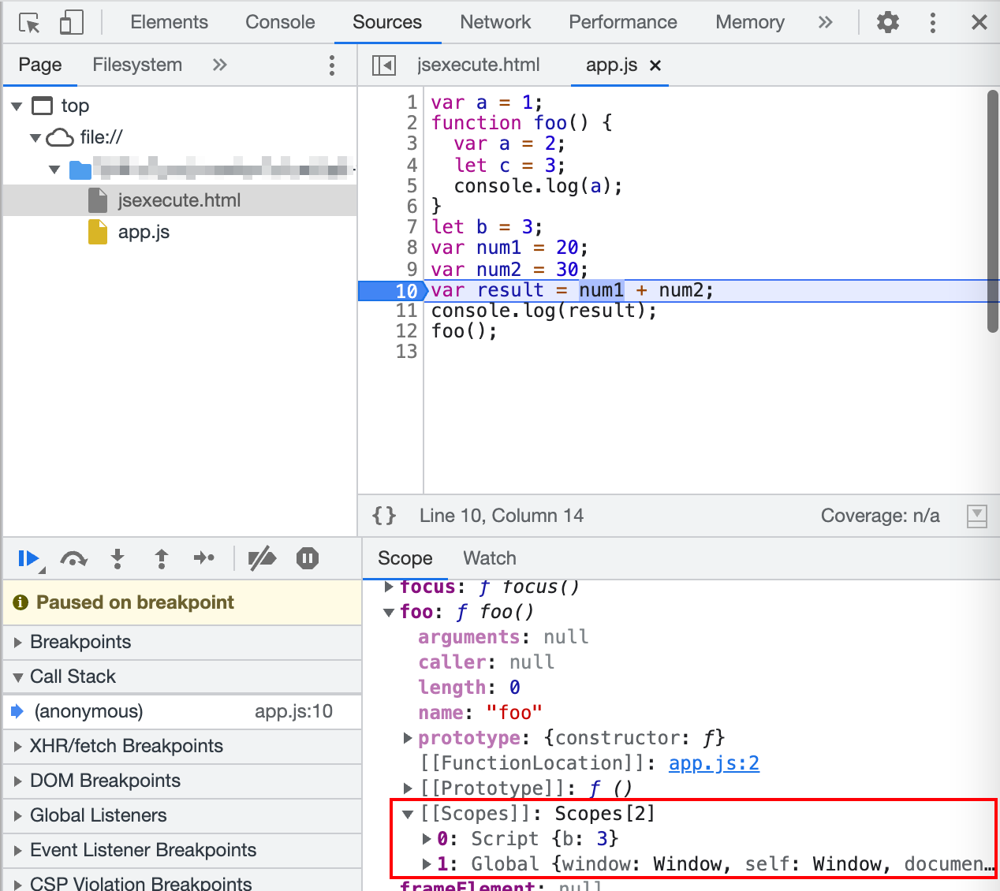
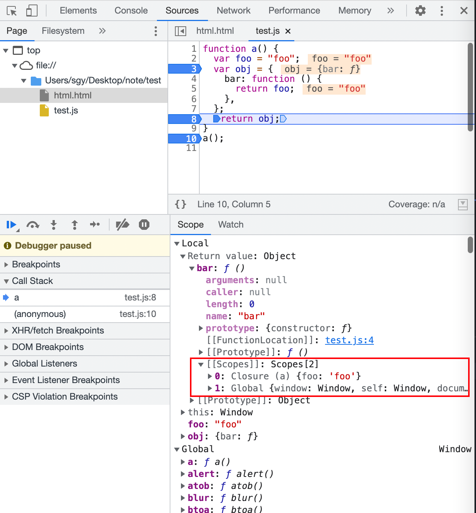

# 代码在 JS 中是如何被执行的呢？

我们需要先介绍执行上下文（Execution Context），有两种执行上下文：

- 全局执行上下文
- 函数执行上下文

:::tip 执行上下文
执行上下文就是 js 的执行环境，会包括三个部分：

- this
- 变量对象 (Variable Object，简称 VO)；在最新的规范中已经改为变量环境（variable environment，简称 VE）
- 作用域链 (scope chain)

对于变量对象，在全局执行上下文中就是全局对象 Global Object (简称 GO)，该对象所有的作用域(scope)都可以访问; 里面会包含 Date、Array、String、 number、setTimeout、setInterval 等等; 其中还有一个 window 属性指向自己;

在函数执行上下文中就是活跃对象 Activation Object(简称 AO)，AO 中包含形参、arguments、函数定义和定义的变量。

对于作用域链，就是词法环境中的外部词法环境引用这个属性（outer environment），全局执行上下文的作用域链是 null（词法环境中外部词法环境引用属性为 null）；函数执行上下文中就是从里到外直到最外层的词法环境中外部词法环境引用为 null。

:::

上下文会有两个阶段，创建和执行。创建阶段就是确定 this、变量对象、作用域链；执行阶段就是从上往下一行行读 code，具体来讲 js 引擎内部有一个执行上下文栈(Execution Context Stack，简称 ECS)，它是用于执行代码的调用栈。

- 初始化全局执行上下文，创建全局对象等上下文属性
- 入栈，执行前，在 parser 转成 AST 的过程中，会将全局定义的变量、函数等加入到 Global Object 中，但是并不会赋值；执行时对变量赋值或者执行其他函数
- 遇到函数执行，初始化函数执行上下文，并且入栈，执行前，在 parser 转成 AST 的过程中，会将函数内的变量、函数等加入到 Activation Object 中，但是并不会赋值；执行时对变量赋值或者执行其他函数

# 跟着例子

```js
var a = 1;
function foo() {
  var a = 2;
  let c = 3;
  console.log(a);
}
let b = 3;
const d = 4;
{
  let r = 5;
  console.log(r);
}
var num1 = 20;
var num2 = 30;
var result = num1 + num2;
console.log(result);
foo();
```

首先会创建全局执行上下文，初始化全局对象，接下来会进入执行上下文栈 Call Stack，可以看到 Call Stack 多了 anonymous （匿名），在执行前会将全局定义的变量、函数等加入到 Global Object 中，但是并不会赋值：就是说`a=undefined`、`b=undefined`、`num1=undefined`、`num2=undefined`、`result=undefined`，函数会进行预解析：只验证函数语法是否有效、解析函数声明、确定函数作用域，不生成 AST，如下



:::tip 注意
这里`foo`里的`[[Scopes]]`属性：
`[[Scopes]]` 是 Chrome 开发者工具在内部添加和使用的私有属性。表示可以从该函数访问哪些变量（承担着作用域链的角色）。

比如下面的例子，我们`return`的`obj`闭包，其`[[Scopes]]`属性就有外层作用域和`Global`全局作用域。


:::

<!-- 就是外部的作用域环境，有`Scrept`和`Global`。 -->

:::caution
注意这里有一个`let b = 3;`，外层的`let/const`会定义在`Script`作用域中（该作用域和`Global`并列），而对于`{}`定义的作用域只有执行到这里，才会生成一个`Block`作用域。
:::

执行时，会从上往下一行行执行代码，进行赋值，遇到函数执行会创建函数执行上下文，入栈，开始全量解析，生成 ast 结构，执行时再进行赋值操作，执行完毕，函数执行上下文出栈，程序退出销毁全局执行上下文（比如关闭浏览器）。


