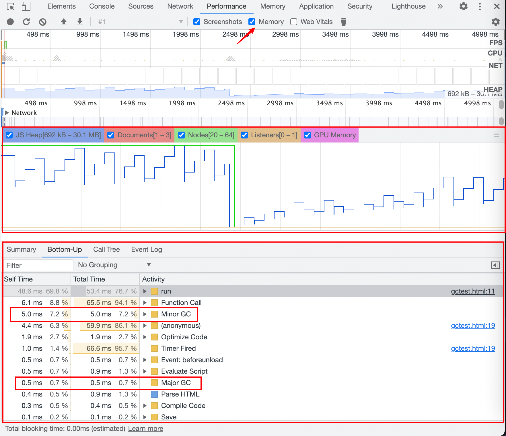
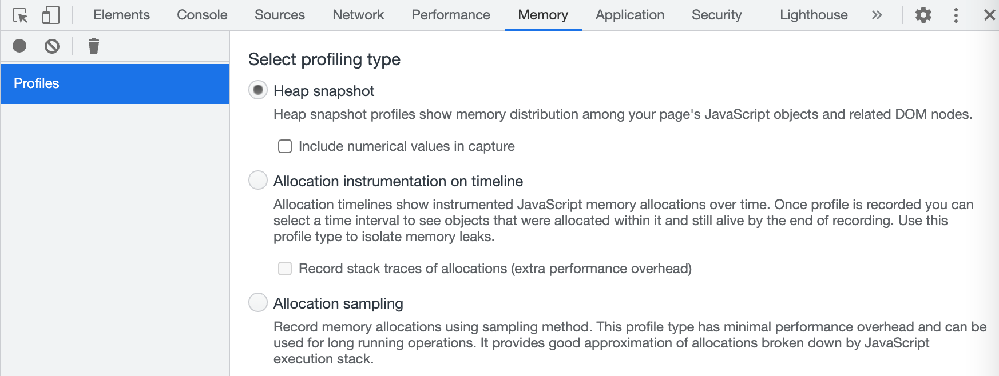

我们在学到数据类型的时候就知道，基础数据类型分配在栈上（变量名、变量值），引用数据类型分配在堆上（变量名、变量值存的是堆上的引用地址）。

## 栈 Stack

栈结构是程序运行的基础，因为每当函数被调用，一块连续的内存就会在栈顶被分配出来，这块内存被称为帧（frame）；

第一次载入`JS`代码，首先会创建一个全局环境（就是`main`函数对应的帧），直到程序退出才会被销毁（比如关闭浏览器）；随着函数一层层被调用，栈会一层层扩展；调用结束，栈又会一层层回溯，把内存释放回去。

一旦当前程序的调用栈超出了系统允许的最大栈空间，无法创建新的帧，来运行下一个要执行的函数，就会发生栈溢出，这时程序会被系统终止，产生崩溃信息。最常见的是递归函数没有设置边界，最后溢出，这时程序会被系统终止，产生崩溃信息。

只需要移动栈指针（stack pointer），虽然函数对应的执行上下文虽然保存在栈内存中，但是已经是无效内存了，再次调用另外一个函数时，这块内容会被直接覆盖掉，用来存放另外一个函数的执行上下文。

## 堆 Heap

堆是一种经过排序的树形数据结构，且能够保证父节点比子节点大（或小）。堆的特点是根结点的值最小（或最大），且根结点的两个子树也是一个堆。当根节点保存堆中最大值时，称为大根堆；反之，则称为小根堆。

通常我们所说的堆的数据结构，是指二叉堆。二叉堆（Binary Heap）是最简单、常用的堆，是一棵符合堆的性质的完全二叉树。它可以实现 O(logn) 地插入或删除某个值，并且 O(1) 地查询最大（或最小）值。

由于堆的这个特性，常用来实现优先队列，堆的存取是随意，这就如同我们在图书馆的书架上取书，虽然书的摆放是有顺序的，但是我们想取任意一本时不必像栈一样，先取出前面所有的书，我们只需要关心书的名字。

## 内存的生命周期

- 分配内存（创建时）
- 读写内存（对变量的读写操作）
- 释放内存

`JavaScript`是使用垃圾回收的语言，也就是执行环境负责在代码执行时管理内存。重点在于标记不再被使用的变量：

- 标记清除
- 引用计数

如果一个内存不再被需要了，就需要把内存释放掉，以便内存的再次使用。这里比较难的问题就是“如何判断内存是否不再被需要”。垃圾回收算法主要依赖于引用（reference）的概念，来判断内存是否被需要。在内存管理的环境中，一个对象如果有访问另一个对象的权限（隐式或者显式），叫做一个对象引用另一个对象。

垃圾收集算法中，IE 6, 7 采用的是引用计数垃圾收集算法。该算法把“对象是否不再需要”简化定义为“对象有没有其他对象引用到它”。如果没有引用指向该对象（零引用），对象将被垃圾回收机制回收。该算法有一个弊端就是“循环引用”，是导致内存泄漏的重要原因。

而从 2012 年起，所有的现代浏览器都换成了标记-清除算法,这个算法把“对象是否不再需要”简化定义为“对象是否可以获得”。是否可获得的判断标准就是这个对象是否被 root 引用（包含直接引用和间接引用），如果不被引用到，就被收回。这样就很好的避免了循环引用的问题。

先说一下引用计数。

### 引用计数

**记录每个值被引用的次数。**

声明变量并且赋一个引用值时，这个值的引用数为`1`；如果同一个值又赋给另一个变量，那么引用数会增加`1`，如果这个变量被其他值覆盖，那么引用数减`1`。当一个值的引用数为零，就意味着不会再被访问到，所以可以安全释放对应的内存空间。

引用计数的问题在于可能会有循环引用：

> 对象 A 的一个指针指向`B`，对象`B`也引用了`A`对象。

```js
function badCycle() {
  var cycleObj1 = {};
  var cycleObj2 = {};
  cycleObj1.target = cycleObj2;
  cycleObj2.target = cycleObj1;
}

badCycle();
```

如果是引用计数，对于`cycleObj1`和`cycleObj2`，这两个对象的引用数都是`1`，所以不会被释放；不过对于标记清除来讲，当`badCycle()`执行完，`cycleObj1`和`cycleObj2`不会在上下文中再出现，所以对应的内存也会被释放。

### 标记清除

在 V8 中，使用的是分代垃圾回收，会把内存分为两个部分：新分配的对象的新生代（young generation）和长期存在的对象的老生代（old generation），新生代的内存空间较小（1 ～ 8M），用于创建和分配新的内存，老生代的空间较大，用于存放存活时间较长的对象。

> 由于大多数对象都死于年轻时，因此这种分代的策略使垃圾回收器可以在较小的新生代（称为清道夫）中执行常规的短时间垃圾回收，而不必在老生代中跟踪对象。

新生代和老生代的垃圾回收是两个方案：

- 新生代：新生代使用半空间（semi-space）分配策略，其中新对象最初是在新生代的活动半空间（active semi-space 又叫使用区）中分配的。一旦该半空间变满，清除操作会将活动对象（live objects 又叫空闲区）移动到另一个半空间。曾经被移动过的对象被提升为老生代，并被认为是长期存活（long-living）的。一旦移动了活动对象，新的半空间将变为活动状态（空闲区 -> 使用区），而旧半空间中的所有剩余死亡对象都将被丢弃（使用区 -> 空闲区）。
- 老生代：**标记清除方案。** 标记阶段会从根对象（`window`）出发遍历堆中所有对象，并对**可以访问到的对象进行标记**；清除阶段则是对未标记对象的空间进行回收。


新加入的对象都会存放到使用区，当使用区快被写满时，就需要执行一次垃圾清理操作。

当开始进行垃圾回收时，新生代垃圾回收器会对使用区中的活动对象做标记，标记完成之后将使用区的活动对象复制进空闲区并进行排序，随后进入垃圾清理阶段，即将非活动对象占用的空间清理掉。最后进行角色互换，把原来的使用区变成空闲区，把原来的空闲区变成使用区。

当一个对象经过多次复制后依然存活，它将会被认为是生命周期较长的对象，随后会被移动到老生代中，采用老生代的垃圾回收策略进行管理

大部分的对象，会在新生代里面被回收，这个时候发生的 GC 就是 minor GC，而不被回收的对象就会被移动到老生代。在老生代进行的 GC 操作，就是 major GC.

minor GC 相对于 major GC，触发的更加频繁，并且处理速度也比较快。因为一是内存空间小，相对涉及的对象数也比较少。二是分成了两个半区，避免了内存整理压缩（标记整理算法）等操作。新生代清除的持续时间取决于新生代中活动对象的数量。当大多数对象在新生代中变得无法到达时，清除速度会很快（<1 ms）。但是，如果大多数对象在清除过程中幸存下来，则清除的持续时间可能会明显更长。

在老生代里，当内存使用超出限制时，就会触发 major GC，回收算法就是使用的我们说的标记-清除（mark-sweep）算法，通常来说，标记整个年老区需要很长的时间，这里 V8 做了优化，支持增量标记（增量就是将一次 GC 标记的过程，分成了很多小步，每执行完一小步就让应用逻辑执行一会儿，这样交替多次后完成一轮 GC 标记）。在清除完垃圾以后，以避免清除后年老区产生的内存碎片，还要进行内存压缩的操作（标记整理算法），这个操作也比较耗时。所以可以看出，major GC 确实要比 minor GC 多花很多的时间。

:::tip
分代的目的主要是为了优化：

分代式机制把一些新、小、存活时间短的对象作为新生代，采用一小块内存频率较高的快速清理，而一些大、老、存活时间长的对象作为老生代，使其很少接受检查，新老生代的回收机制及频率是不同的，可以说此机制的出现很大程度提高了垃圾回收机制的效率。
:::

> 浏览器的最快的渲染频率是 60fps，也就是是说每帧的时间间隔是 16.7ms，如果浏览器在 16.7ms 内完成了所有的操作（包括 js 的运行和渲染），剩下的时间就是空闲时间，在这些空闲时间里面，就会执行 GC 操作，以便可以把 GC 操作的影响降到最低。

参考：

- https://v8.js.cn/blog/concurrent-marking/
- https://juejin.cn/post/6981588276356317214

## 调试

查看浏览器的 JavaScript 的内存使用情况：

- chrome 的 dev-tools 里面的 performance， 好处是可以看到随着时间的变化，看到内存的使用的情况。可以很容易了解到 GC 操作和内存的分配，从而发现内存是否泄漏和 GC 是否频繁的问题。

- dev-tools 里面的 profiles。内存快照的优点是详细的展示了某一时刻的内存的使用情况，包括：什么类型的数据占用了多大的内存，以及变量之间的引用关系。通过这些，我们就可以找到内存使用的问题所在，找到解决内存问题的方法。

### Performance

点击 reload，勾选 memory



第一个红框里，随着时间增加内存会有升有降；第二个红框里，表示的是在这段时间里执行的任务，以及任务的耗时。

每隔一段时间，内存的使用就会大幅的下降，那就说明浏览器进行了 GC 操作。可以注意到，GC 操作也是花费时间的，minor GC 和 major GC 一共花费了 5.5ms（5+0.5ms），所以这也是我们需要避免频繁的 GC 操作的原因。避免的方式，就是在频繁执行的方法里（如动画），尽可能的减少创建对象，尽可能的使用缓存对象来代替创建新对象。

```js
// 测试代码
var run = function () {
  var d = [];

  for (var i = 0; i < 100000; i++) {
    d.push(Math.random());
  }
};

setInterval(function () {
  run();
}, 100);
```

### Memory



- Heap snapshot - 用以打印堆快照，堆快照显示页面的 js 对象和相关 DOM 节点之间的内存分配
- Allocation instrumentation on timeline - 在时间轴上记录内存信息，随着时间变化记录内存信息和内存被回收的情况，主要用来分析内存泄漏的问题。
- Allocation sampling - 内存信息采样，使用采样的方法记录内存分配。此配置文件类型具有最小的性能开销，可用于长时间运行的操作。它提供了由 javascript 执行堆栈细分的良好近似值分配。

具体参考：https://www.cnblogs.com/ys-ys/p/11336811.html
