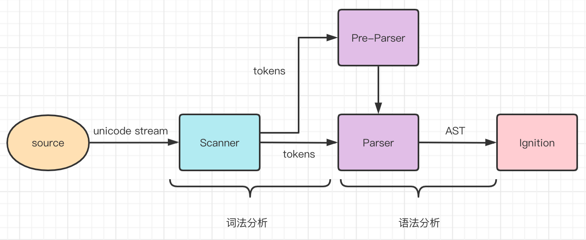
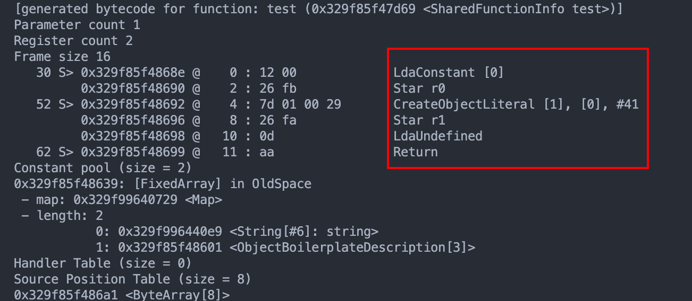

# v8 的工作流程

v8 是 Google 开源的 JavaScript 引擎。有三个核心模块：

- 解析器（Parser）

- 解释器（Ignition）

- 优化编译器（TurboFan）

## v8 的整体工作流程

v8 执行 JS 源码时：

1. 解析器（**Parser**）会把源码解析为抽象语法树（AST）
2. 解释器（**Ignotion**）再将 AST 翻译为字节码，边解释边执行
3. 解释器会记录特定代码片段的运行次数，如果代码运行次数超过某个阈值，那么该段代码会被标记为热点代码（hot code），并将运行信息反馈给优化编译器（**TurboFan**）

优化编译器会根据反馈信息（比如类型信息），优化并编译字节码，生成优化后的机器码，这样该段代码再次执行时，解释器就直接使用优化机器码执行，不用再次解释，大大提高了代码运行效率。

:::tip 即时编译
这种在运行时编译代码的技术也被叫做 JIT（即时编译），通过 JIT 可以极大提高 JS 代码的执行性能。
:::

### 解析器**Parser**的工作流程

解析器有两个部分组成：词法分析器，语法分析器



整个解析过程由两部分组成：

- 词法分析：将字符流转换为 tokens，字符流就是我们编写的一行行代码，token 是指语法上不能再分割的最小单位，可能是单个字符，也可能是字符串，图中**Scanner**就是 v8 的词法分析器
- 语法分析：根据语法规则，将 tokens 组成一个有嵌套层级结构的抽象语法树（表示源码的树形结构的JSON对象），如果源码不符合语法规范，解析过程就会终止并抛出语法错误。图中**Parser**和**Pre-Parser**就是语法分析器

#### 词法分析

:::tip tokens 的样子
`[{token},{token},...]`<br/>
每一个 token 就是一个 JSON 对象，比如：<br/>

```json
{
  "type": "Punctuator",
  "value": "="
}
```

:::

Scanner 负责接收 Unicode 字符流，并将其解析为 tokens，提供给解析器使用。比如 `var a = 1`; 这行代码，经过词法分析后的 tokens 就是下面这样：

```json
[
  {
    "type": "Keyword",
    "value": "var"
  },

  {
    "type": "Identifier",
    "value": "a"
  },

  {
    "type": "Punctuator",
    "value": "="
  },

  {
    "type": "Numeric",
    "value": "1"
  },

  {
    "type": "Punctuator",
    "value": ";"
  }
]
```
可以看到， `var a = 1`; 这样一行代码包括 5 个tokens：

- 关键字 `var`
- 标识符 `name`
- 赋值运算符  `=`
- 分割符 `;`

#### 语法分析

有了tokens，v8的解析器会通过语法分析，由tokens生成AST，`var a = 1;` 这行代码生成的AST的JSON结构如下：

```json
{
  "type": "Program",
  "start": 0,
  "end": 10,
  "body": [
    {
      "type": "VariableDeclaration",
      "start": 0,
      "end": 10,
      "declarations": [
        {
          "type": "VariableDeclarator",
          "start": 4,
          "end": 9,
          "id": {
            "type": "Identifier",
            "start": 4,
            "end": 5,
            "name": "a"
          },
          "init": {
            "type": "Literal",
            "start": 8,
            "end": 9,
            "value": 1,
            "raw": "1"
          }
        }
      ],
      "kind": "var"
    }
  ],
  "sourceType": "module"
}
```

#### 延迟解析

对于函数进行预解析，不生成AST，调用（解释器**Ignition**解释执行）时再全量解析（生成AST）。

**Pre-Parser**被用来做延迟解析（Lazy Parsing）：
- 对于不是立即执行的函数，只进行预解析（Pre Parser），只有当函数调用时，才对函数进行全量解析。

- 进行预解析时，只验证函数语法是否有效、解析函数声明、确定函数作用域，不生成 AST

以一段代码为例：

```js
function foo(a, b) {
    var res = a + b;
    return res;
}
var a = 1;
var c = 2;
foo(1, 2);
```
由于 **Scanner** 是按字节流从上往下一行行读取代码的，所以 V8 解析器也是从上往下解析代码。当 V8 解析器遇到函数声明 foo 时，发现它不是立即执行，所以会用 **Pre-Parser** 解析器对其预解析，过程中只会解析函数声明，不会解析函数内部代码，不会为函数内部代码生成 AST。

然后 **Ignition** 解释器会把 AST 编译为字节码并执行，解释器会按照自上而下的顺序执行代码，先执行 `var a = 1;`  和 `var a = 2;` 两个赋值表达式，然后执行函数调用 `foo(1, 2)` ，这时 **Parser** 解析器才会继续解析函数内的代码、生成 AST，再交给 **Ignition** 解释器编译执行。

:::tip 预解析的目的
- 代码执行时间变长：一次性解析所有代码，必然会增加代码的运行时间。
- 消耗更多内存：解析完的 AST，以及根据 AST 编译后的字节码都会存放在内存中，必然会占用更多内存空间。
- 占用磁盘空间：编译后的代码会缓存在磁盘上，占用磁盘空间。
:::

### 解释器**Ignition**的工作流程

通常一个几 KB 的文件，转换为机器码可能就是几十兆，这会消耗巨大的内存空间。**V8 为了解决内存占用问题引入了字节码。**

V8 的字节码是对机器码的抽象， V8 字节码就是一个个指令，这些指令组合到一起实现我们编写的功能。

**Ignition** 解释器在执行字节码时，主要使用通用寄存器和累加寄存器（accumulator register），函数参数和局部变量都保存在通用寄存器中，累加寄存器用于保存中间结果。

:::tip 输出字节码
安装了 Node.js ，可以通过 `node --print-bytecode index.js` 命令查看 JavaScript 文件生成的字节码
:::

```js
function test() {
  var str = "string";
  var obj = { a: 0 };
  return obj
}

test();
```

```shell
node --print-bytecode index.js
```




```bytecode
LdaConstant [0] #从常量池里取[0]的部分，即'string'的地址
Star r0         #保存到r0寄存器： var str = 'string'
CreateObjectLiteral [1], [0] #创建一个字面量对象
Star r1         #把这个对象保存r1寄存器： var obj = {a: 0} 
LdaUndefined #将 Undefined 加载到累加器中
Return #表示结束当前函数的执行，并返回累加寄存器中的值
```

:::caution 注意
注意，**Ignition** 解释器在执行字节码时，依旧需要将字节码转换为机器码，因为 CPU 只能识别机器码。
:::


虽然多了一层字节码的转换，看起来效率低了，但相比于机器码，基于字节码可以更方便进行性能优化。V8也的确做了很多性能优化工作，其中最主要的就是使用 **Turbofan** 编译器编译热点代码，这些被标记的代码会被 Turbofan 编译器编译生成效率更高的机器码。


:::tip 
这些性能优化，使得如今基于字节码架构的性能远超当年直接编译机器码架构的性能。
:::

### 优化编译器**Turbofan**的工作流程

V8 为了提升 JavaScript 的执行性能，在优化编译方面做了很多工作，其中最主要有内联和逃逸分析两种算法。

#### 内联 inlining

内联：为了降低复杂度合并冗余代码、合并常量。

比如：

```js
function add(x, y) {
  return x + y;
}
function three() {
  return add(1, 2);
}
```
如果不经优化，直接编译该段代码，则会分别生成两个函数的机器码。但为了进一步提升性能，**TurboFan** 优化编译器首先会对以上两个函数进行内联，然后再编译。

```js
function three_add_inlined() {
  var x = 1;
  var y = 2;
  var add_return_value = x + y;
  return add_return_value;
}
```

更进一步，由于函数 `three_add_inlined` 中 x 和 y 的值都是确定的，所以 three_add_inlined 还可以进一步优化，直接返回结果 3 ：

```js
function three_add_const_folded() {
  return 3;
}
```

这样最终编译生成的机器码相比优化前，就少非常多了，执行效率自然也高很多。

#### 逃逸分析 Escape Analysis


逃逸分析：分析对象的生命周期是否仅限于当前函数，然后替换未逃逸对象。

:::tip
比如使用基本数据类型替换掉对象，这样可以直接将变量加载到寄存器上，不再需要再从内存中访问对象属性，提升了执行效率的同时还减少了内存使用。
:::


```js
class Point {
  constructor(x, y) {
    this.x = x;
    this.y = y;
  }
  distance(that) {
    return Math.abs(this.x - that.x)
         + Math.abs(this.y - that.y);
  }
}
function manhattan(x1, y1, x2, y2) {
  const a = new Point(x1, y1);
  const b = new Point(x2, y2);
  return a.distance(b);
}
```

**TurboFan** 首先会通过内联，将 `manhattan` 函数转换为下面这样的函数：

```js
function manhattan_inlined(x1, y1, x2, y2) {
  const a = {x:x1, y:y1};
  const b = {x:x2, y:y2};
  return Math.abs(a.x - b.x)
       + Math.abs(a.y - b.y);
}
```

接下来就会对 `manhattan_inlined` 中的对象进行逃逸分析：
- 对象在函数内部定义
- 对象只作用域函数内部，如：没有被返回、没有传递应用给其他函数等

满足上述两个条件的即为未逃逸对象。

我们就可以对函数中的对象进行替换，使用标量替换掉对象：

```js
function manhattan_scalar_eplacement(x1, y1, x2, y2) {
  var a_x = x1;
  var a_y = y1;
  var b_x = x2;
  var b_y = y2;
  return Math.abs(a_x - b_x)
       + Math.abs(a_y - b_y);
}
```

这样函数内就不再有对象定义，取而代之的是 a_x a_y b_x b_y ，且直接来源于函数参数。

### 小结

- 解析器 **Parser** 将 JavaScript 源码解析为 AST，解析过程分为词法分析和语法分析，V8 通过预解析 **Pre-Parser** 提升解析效率

- 解释器 **Ignition** 根据 AST 生成字节码并执行。这个过程中会收集执行反馈信息，交给 **TurboFan** 进行优化编译

- **TurboFan** 根据 **Ignition** 收集的反馈信息，将字节码编译为优化后的机器码，后续 **Ignition** 用优化机器码代替字节码执行，进而提升性能