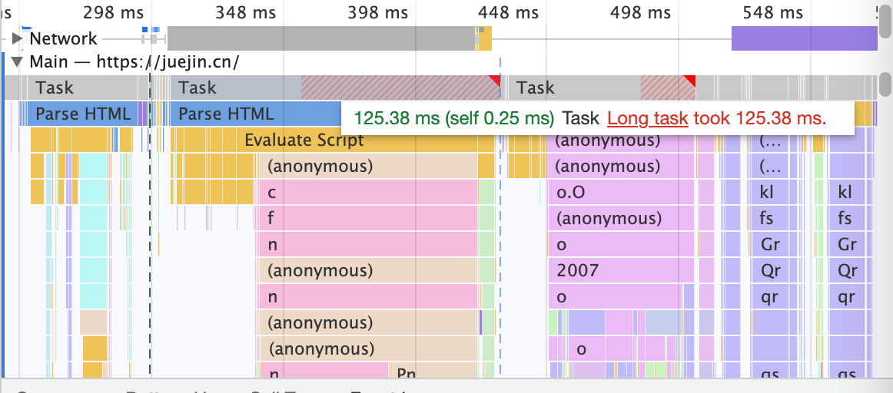

## 单线程的 JS

脚本语言（JS、python）编写的代码通常是**逐行解释执行而非编译**（c/c++,java），所以通常又叫做解释性语言。

解释器解释执行 JS 代码， javascript 有著名的 V8（Android，Chrome）与 JSCore（IOS，Safari）等优秀的解释器引擎。

javascript 的特点是单线程，即同一时间只能做一件事。设计为单线程，主要就是为了避免多线程操作 DOM 造成 UI 冲突。比如存在多个线程同时操作同一个 DOM，浏览器该如何判断最终的 UI 效果是采用哪个线程的结果？

单线程意味着代码都是同步执行的，执行顺序从上到下，上一段代码执行完才会执行下一段代码。如果前一段代码耗时很长，后面的就需要一直等着。

不过我们通常还会提到异步这个概念，看起来异步和单线程是矛盾的，异步是 js 运行时，也就是浏览器以及 nodejs 提供的。

> JS 在同一时间只能执行一个函数，无论在栈顶的是什么，它是一门同步语言。但是因为 Web API 模块可以不断的向任务队列添加回调函数，而任务队列又可以不断的把回调函数函数推入执行栈，所以可以认为 JS 是在异步运行。**本质上就是利用同步去实现的异步**。

## 事件循环

之前提到耗时的操作会让 JS 线程阻塞，所以真正耗时的操作并不是 JS 线程来完成，浏览器本身是多进程的架构，真正耗时的操作都是浏览器的其他线程来完成，比如网络请求（ajax）、定时器，浏览器只需要在特定时刻执行相应的回调函数，这一机制就是事件循环。

### 定义

事件循环可以看作 JS 运行时的一部分，浏览器的 web api 会为异步代码单独开启一个执行线程，当异步代码执行完毕（比如 setTimeout 计时结束），会将代码中的回调推入任务队列中，等到调用栈为空，再将队列中的回调函数推入执行栈中执行，等到栈空以及任务队列也为空，事件循环仍会不断的检测任务队列中是否有代码，如果有就会被推入调用栈中。

### 宏任务和微任务

根据任务优先级的不同，事件循环会维护两个队列，宏任务队列和微任务队列：

- 宏任务队列(macrotask queue 又叫 task queue)：顶层 script 代码、ajax（xhr）、setTimeout、setInterval、requestAnimationFrame、UI Rendering 等
- 微任务队列(microtask queue):Promise 的 then 回调、 Mutation Observer API、queueMicrotask()等

执行顺序如下：

1. main script 中的代码优先执行（编写的顶层 script 代码，这是一个宏任务）
2. 在执行过程中会产生一些宏任务和微任务，分别入队，然后执行所有的微任务（回调），直到微任务队列为空，然后从宏任务队列取出一个宏任务执行，再执行所有的微任务（回调）;

- 宏任务一次只从宏任务队列中取一个任务执行，执行完后就去执行微任务队列中的任务
- 微任务队列中所有的任务都会被依次取出来执行，直到微任务队列为空
  - 如果在执行微任务的过程中，又产生了微任务，那么会加入到 微任务的队列的末尾，也会在这个周期被调用执行
- 定时器不是绝对准确的
  - SetTimeout/SetInterval 只是在指定时间后将其回调函数放入到宏任务队列中

微任务可以视为优先级更高，高优任务也很好理解，MutationObserver 和 Object.observe 都是监听某个对象的变化的，变化是很瞬时的事情，肯定要马上响应，不然可能又变了，Promise 是组织异步流程的，异步结束调用 then 也是很高优的。

这就是浏览器里的 Event Loop 的设计：设计 Loop 机制和 Task 队列是为了支持异步，解决逻辑执行阻塞主线程的问题，设计 MicroTask 队列的插队机制（执行一个宏任务，插入一堆微任务）是为了解决高优任务尽早执行的问题。

## 面试题

### promise 的一个细节

更详细的讨论在 [PromsieResolveThenableJob](https://zhuanlan.zhihu.com/p/53944576)

```js
const p = Promise.resolve();
const promiseA = new Promise((res) => res(p));
promiseA.then((res) => {
  console.log("最后执行");
});

p.then((res) => {
  console.log("先执行");
}).then((res) => {
  console.log("第二个执行");
});
```

上面的代码可以等价为下面的伪代码：

```js
const p = Promise.resolve();
(() => {
  // 任务1
  // 产生一个 PromsieResolveThenableJob 放入微任务队列，主要目的是使 promiseA 遵循 p 的状态，将两者的状态关联起来，当 p 执行完后，promiseA 的状态才能同步
  // 任务2
  // 因为p 已经是 resolved(状态为fulfilled)的，所以立即将 resolve1 任务2 添加到微任务队列
  p.then(
    (resolved1) => resolved1, // 任务2
    (rejectd1) => rejectd1
  ).then(
    // 执行了上一个then 的 resolve 后，会注册下一个 then 微任务，放到微任务队列
    (resolved2) => resolved2, // 任务3
    (rejected2) => rejected2
  );
  // 在 resolve2 执行后，promiseA 才是 resolved (状态为 fulfilled，值为 p 的 fulfilled value)，才会去执行 promsieA.then
})();
```

这里 PromsieResolveThenableJob 主要是因为 new Promise(res=>res(p)) 的，会有一个状态同步，p 都执行完后，promiseA 的状态才会确定。如果改成 Promise.resolve(p)：

```js
const p = Promise.resolve();
const promiseA = Promise.resolve(p);
promiseA.then((res) => {
  console.log("最后执行");
});

p.then((res) => {
  console.log("先执行");
}).then((res) => {
  console.log("第二个执行");
});
```

输出为：

```
最后执行
先执行
第二个执行
```

这是因为：**Promise.resolve(p)直接返回 p， promiseA 的状态就确定了，状态同步一步到位。**

### 面试题

#### 面试题 1

```js
console.log(1);

setTimeout(() => {
  console.log(2);
  Promise.resolve().then(() => {
    console.log(3);
  });
});

new Promise((resolve, reject) => {
  console.log(4);
  resolve(5);
}).then((data) => {
  console.log(data);
});

setTimeout(() => {
  console.log(6);
});

console.log(7);
```

```
1 4 7 5 2 3 6
```

#### 面试题 2

```js
console.log(1);

setTimeout(() => {
  console.log(2);
  Promise.resolve().then(() => {
    console.log(3);
  });
});

new Promise((resolve, reject) => {
  console.log(4);
  resolve(5);
}).then((data) => {
  console.log(data);

  Promise.resolve()
    .then(() => {
      console.log(6);
    })
    .then(() => {
      console.log(7);

      setTimeout(() => {
        console.log(8);
      }, 0);
    });
});

setTimeout(() => {
  console.log(9);
});

console.log(10);
```

```
1 4 10 5 6 7 2 3 9 8
```

#### 面试题 3

```js
setTimeout(function () {
  console.log("setTimeout1");
  new Promise(function (resolve) {
    resolve();
  }).then(function () {
    new Promise(function (resolve) {
      resolve();
    }).then(function () {
      console.log("then4");
    });
    console.log("then2");
  });
});

new Promise(function (resolve) {
  console.log("promise1");
  resolve();
}).then(function () {
  console.log("then1");
});

setTimeout(function () {
  console.log("setTimeout2");
});

console.log(2);

queueMicrotask(() => {
  console.log("queueMicrotask1");
});

new Promise(function (resolve) {
  resolve();
}).then(function () {
  console.log("then3");
});
```

```
promise -> 2 -> then1 -> queueMicrotask1 -> then3 ->setTimeout1 -> then2 -> then4 -> setTimeout2
```

#### 一个比较奇怪的面试题

```js
Promise.resolve()
  .then(() => {
    console.log(0);
    // 1.直接return一个值 相当于return new Promise(resolve => resolve(4)) => resolve(4)，然后 then 回调放入队列中，即 1 后
    // return 4

    // 2.return thenable的值
    // 不是普通的值, 会多加一次微任务（实际上是多一个 PromsieResolveThenableJob 微任务）
    // 0 -> return new Promise(thenable) -> 1
    // 执行完 return new Promise(thenable) 会在队列加入 PromsieResolveThenableJob，放到 1 后
    // => 0 , 1 -> PromsieResolveThenableJob -> 2
    // 执行完 PromsieResolveThenableJob，才会 resolve(4)，然后在队列加入 resolve(4).then 的回调
    // => 0  1 , 2 -> 4
    // return {
    //   then: function (resolve) {
    //     resolve(4);
    //   },
    // };

    // 3.return Promise
    // 不是普通的值, 多加一次微任务
    // Promise.resolve(4), 又多加一次微任务
    // 一共多加两次微任务，才会执行后面链式then的回调
    return Promise.resolve(4);
  })
  .then((res) => {
    console.log(res);
  });

Promise.resolve()
  .then(() => {
    console.log(1);
  })
  .then(() => {
    console.log(2);
  })
  .then(() => {
    console.log(3);
  })
  .then(() => {
    console.log(5);
  })
  .then(() => {
    console.log(6);
  });

// 1.return 4
// 0
// 1
// 4
// 2
// 3
// 5
// 6

// 2.return thenable
// 0
// 1
// 2
// 4
// 3
// 5
// 6

// 3.return promise
// 0
// 1
// 2
// 3
// 4
// 5
// 6
```

- https://juejin.cn/post/7055202073511460895#heading-34

事件循环中，当 return 一个 promise 的时候，会这样处理：会调用 NewPromiseResolveThenableJobTask 产生一个微任务加入微任务队列，取 promiseResolveThenableJobTask 执行时，相当于执行了 p3.then((value) => {ReslovePromise(p2, value)}) 因为 p3 的状态是 fulfilled ，所以会将其 onFulfilled 加入 microtask 队列，p3.onFulfilled 出队执行，p3.onFulfilled 是 (value) => {ReslovePromise(p2, value)}, 参数 value 是 4，所以此时就执行 ReslovePromise(p2, 4),这就相当于调用了 p2 的 resolve， p2 的 值变为 4， 状态为变 fulfilled，p2.onFulfilled 加入队列。

所以返回 Promsie 对象会产生两个 microtask：

1. promiseResolveThenableJobTask
2. 2.p3.onFulfilled(返回的 p3 这个 promise)；

所以 p2 的 onfullfilled （`(res) => { console.log(res); }`） 会等待两个微任务加入队列再执行。

#### 经典题

```js
console.log("script start");

async function async1() {
  await async2();

  console.log("async1 end");
}
async function async2() {
  console.log("async2 end");
}

async1();

setTimeout(function () {
  console.log("setTimeout");
}, 0);

new Promise((resolve) => {
  console.log("Promise");
  resolve();
})
  .then(function () {
    console.log("promise1");
  })
  .then(function () {
    console.log("promise2");
  });

console.log("script end");
```

```
script start -> async2 end -> promise -> script end -> async1 end -> promise1 -> promise2 -> setTimeout
```

实际上，v8 对 async 做了一个优化，async1 其等价的 v8 优化后的代码为：

```js
function async1() {
  new Promise((resolve) => {
    const p = Promise.resolve(async2());
    p.then(() => {
      console.log("async1 end");
      resolve();
    });
  });
}
```

- Promise.resolve 的参数如果是 Promise 则直接返回这个 Promise
- new Promise 替换为了 Promise.resolve

参考资料：

- 更快的异步函数和 Promise: https://v8.js.cn/blog/fast-async/
- v8 是怎么实现更快的 await ？深入理解 await 的运行机制: https://zhuanlan.zhihu.com/p/53944576

## 渲染是一个宏任务

mdn 上有一句话 **在开始下一次循环之前执行一些必要的渲染和绘制操作。** 这看起来就像 ui 渲染是在每一次循环之间执行。实际上这依赖于浏览器的具体实现，各个浏览器可能并不一样。

- [mdn](https://developer.mozilla.org/zh-CN/docs/Web/API/HTML_DOM_API/Microtask_guide/In_depth#%E4%BA%8B%E4%BB%B6%E5%BE%AA%E7%8E%AF%EF%BC%88event_loops%EF%BC%89)

可以打开 performance 面板，**渲染是一个宏任务，通过 Event Loop 来做一帧帧的渲染。**

### 细节

主线程负责通过 Event Loop 的方式来不断的执行 JS 和渲染，也有一些别的线程，比如合成渲染图层的线程，Web Worker 的线程等。其实这里我们主要需要关注 Main，因为他是主线程的一个执行情况的监控。点开后，我们可以看当前线程里面一些任务的执行堆栈耗时，我们需要重点关注一些标红（也就是有较高耗时）的任务。

Main 这部分记录着 Event Loop 的执行过程，即记录着 JS 执行的调用栈和页面渲染的流程。渲染的每一帧会绘制到界面上。

每个小灰块就是一个个 Task，也就是宏任务。Event Loop 就是循环执行宏任务。每个 Task 都有自己的调用栈，可以看到函数的执行路径，耗时等信息。图中宽度代表了耗时，可以直观的通过块的宽窄来分析性能。

执行完宏任务会执行所有的微任务，在图中也可以清晰的看到：


这些是 Main 线程的执行逻辑，也就是通过 Event Loop 来不断执行 JS 和渲染。

你会看到一个个很小的灰块，也就是一个个 Task，每隔一段时间（16ms）都会执行，点击它，就会看到其实他做的就是渲染，包括计算布局，更新渲染树，合并图层、渲染等。


**渲染是一个宏任务，通过 Event Loop 来做一帧帧的渲染。**

通过 Performance 调试工具，我们可以看到 Main 线程 Event Loop 的细节，看到 JS 执行和渲染的详细过程。

有时你可能会看到有的 Task 部分被标红了，还警告说这是 Long Task。



因为渲染和 JS 执行都是在同一个 Event Loop 内做的，那如果有执行时间过长的 Task，自然会导致渲染被延后，也就是掉帧，用户感受到的就是页面的卡顿。

避免 Long Task，这是网页性能优化的一个重点。这也是为什么 React 使用了 Fiber 架构的可打断的组件树渲染，替代掉了之前的递归渲染整个组件树的方式，就是为了不产生 Long Task。

## NodeJS 中的事件循环

**我们讨论的都是针对 Node.js 11.x 以上的版本**

NodeJS 环境相对于浏览器分得更加细致。

Node.js 的 Event Loop 是基于 libuv 实现的。

通过 Node.js 的官方文档可以得知，其事件循环的顺序分为以下六个阶段，每个阶段都会处理专门的任务：

1. timers： 计时器阶段，用于处理 setTimeout 以及 setInterval 的回调函数
2. pending callbacks： 用于执行某些系统操作的回调，例如 TCP 错误
3. idle, prepare： Node 内部使用，不用做过多的了解
4. poll： 轮询阶段，执行队列中的 I/O 队列，并检查定时器是否到时
5. check： 执行 setImmediate 的回调
6. close callbacks： 处理关闭的回调，例如 socket.destroy()

以上六个阶段，我们需要重点关注的只有四个，分别是 timers 、poll 、check 、close callbacks

**这四个阶段都有各自的宏队列。在执行的过程中会不断检测微队列中是否存在待执行任务，若存在，则执行微队列中的任务，等到微队列为空了，再执行宏队列中的任务，只有当本阶段的宏队列中的任务处理完以后，才会进入下一个阶段。**

从一次事件循环的 Tick 来说，Node 的事件循环更复杂，它也分为微任务和宏任务:

- 宏任务(macrotask)：setTimeout、setInterval、IO 事件、setImmediate、close 事件;
- 微任务(microtask)：Promise 的 then 回调、process.nextTick、queueMicrotask;

但是，Node 中的事件循环不只是微任务队列和宏任务队列：

- 微任务队列：
  - next tick queue：process.nextTick
  - other queue：Promise 的 then 回调、queueMicrotask
- 宏任务队列：
  - timer queue：setTimeout、setInterval
  - poll queue：IO 事件
  - check queue：setImmediate
  - close queue：close 事件

在每一次事件循环的 tick 中，会按照如下顺序来执行代码：

- next tick microtask queue
- other microtask queue
- timer queue
- poll queue
- check queue
- close queue

```js
setTimeout(() => {
  console.log(1);
}, 0);

setImmediate(() => {
  console.log(2);
});

new Promise((resolve) => {
  console.log(3);
  resolve();
  console.log(4);
}).then(() => {
  console.log(5);
});

console.log(6);

process.nextTick(() => {
  console.log(7);
});

console.log(8);

/* 打印结果：
   3
   4
   6
   8
   7
   5
   1
   2
*/
```

同步的代码一定是最先打印的，因此先打印的分别是 3 4 6 8

再来判断一下异步的代码，setTimeout 被送入 timers queue ；setImmediate 被送入 check queue ；then() 被送入 other microtask queue ；process.nextTick 被送入 next tick queue

然后按照流程，首先检测到微队列中有待执行任务，并且我们说过，next tick queue 的优先级高于 other microtask queue，因此先打印了 7，然后打印了 5 ；到此为止微队列中的任务都被执行完了，接着就进入 timers queue 中阶段，所以打印了 1，当前阶段的队列为空了，按照顺序进入 poll 阶段，但发现队列为空，所以进入了 check 阶段，上面说过了这个阶段是专门处理 setImmediate 的，因此最后就打印了 2
