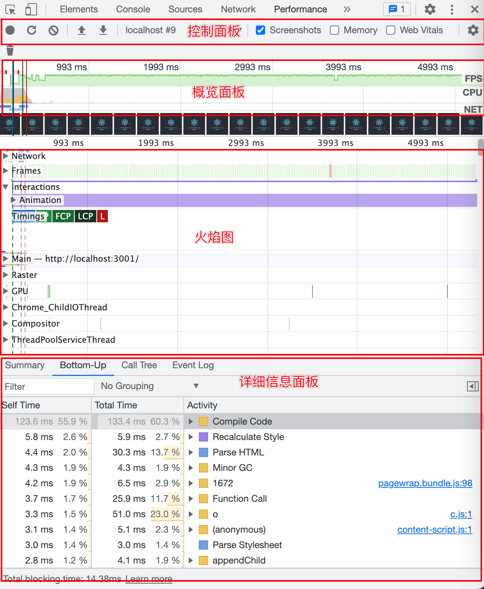
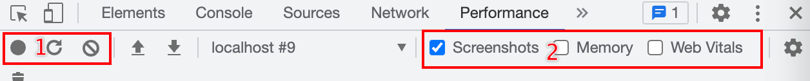
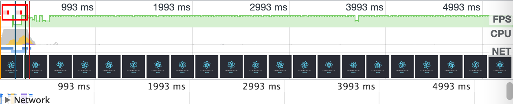
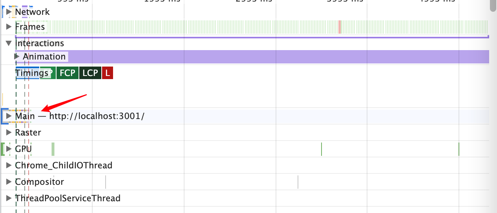
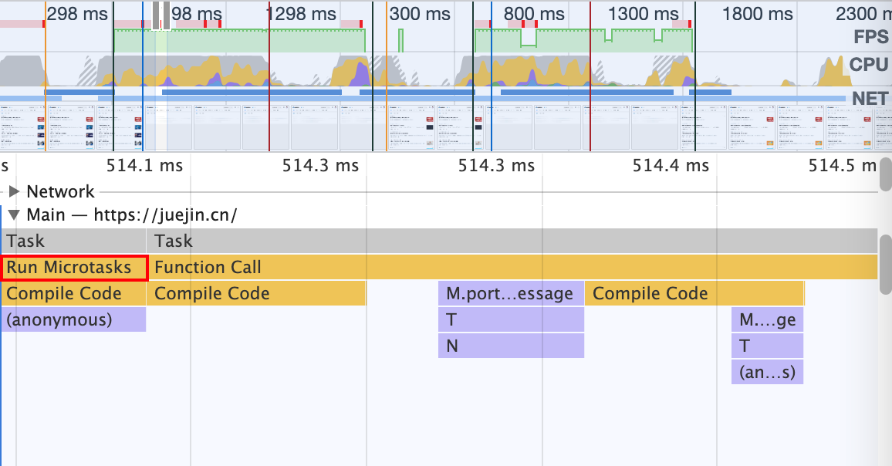
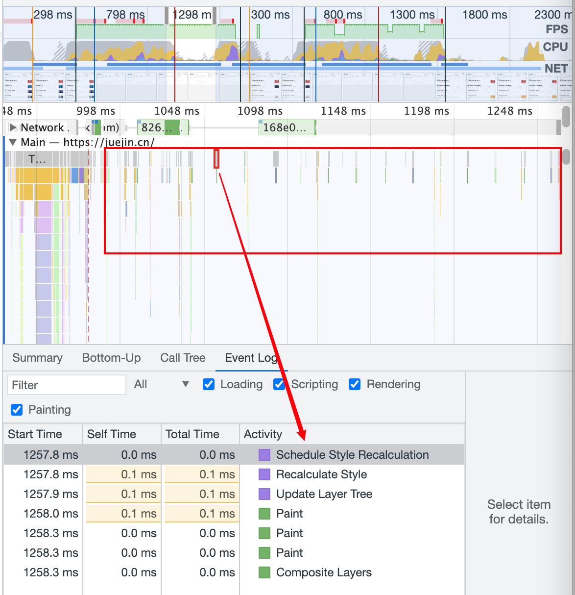
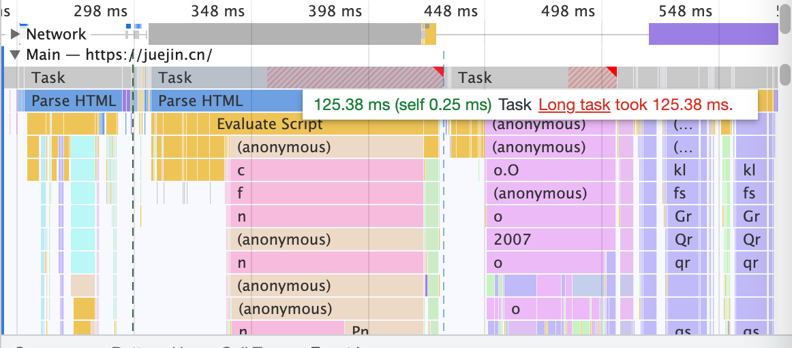
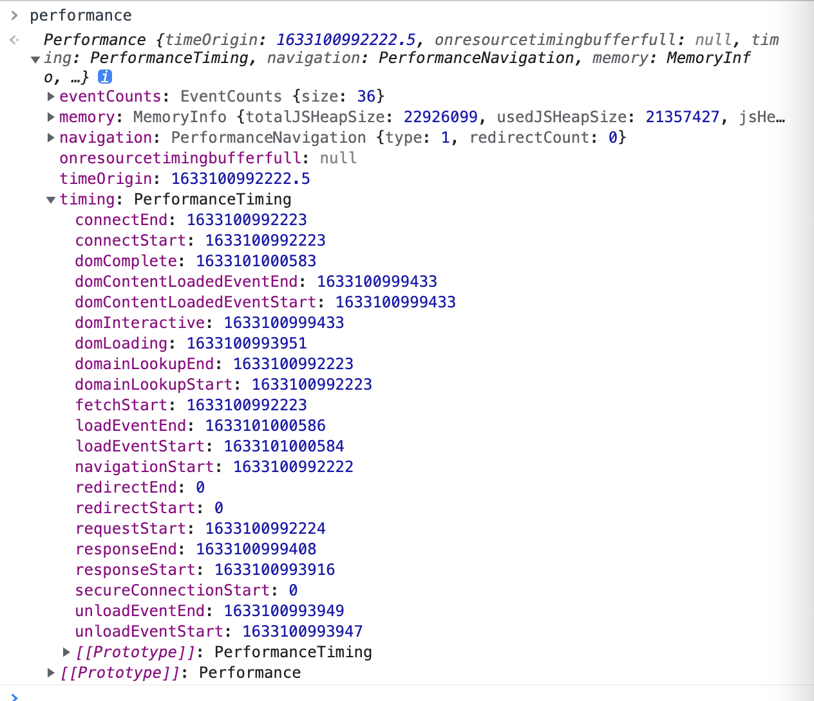
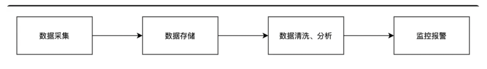

这一部分主要介绍 Performance 工具 & API。

## Chrome Performance 工具

我们先启动一个`react`工程：

```shell
npx create-react-app performance-demo --template typescript
npm run start
```



打开 Chrome 中 Performance ，点击 reload，就是上图的样子。可以看到主要分了四个板块：

- 控制面板
- 概览面板
- 火焰图
- 详细信息面板

### 控制面板

开启记录，停止记录，配置记录期间需要记录的内容。



控制面板分为两个区域，操作 1 区依次是"Record/Stop"、"Reload"、"Clear"：

- "Record/Stop"：一般用于录制页面交互过程的性能变化数据，选择任意想要测试的过程，点击“Record”，并在测量结束之后，点击“Stop”，之后 Chrome 就会自动解析这段时间内抓取的数据，并生成报告。
- "Reload"：一般用于录制首屏加载的性能变化数据，它会自动刷新整个页面，并开始记录性能
- "Clear"：用于清除性能报告数据

操作 2 区可以选择报告展示内容，从左到右依次是 Screenshots、Memory、Web Vitals

- Screenshots：打开后可以在概览区看到屏幕的截图
- Memory：打开内存监控
- Web Vitals：定义良好网站的基本指标（简化性能指标的衡量标准）

### 概览面板

主要是对页面表现行为的一个概述，区域由三个图形记录组成。



- FPS（Frames Per Second）：绿色的柱越高，FPS 值也越高。FPS 图表上方的红色小块指明了长帧（long frame），这些可能是卡顿。
- CPU(CPU Resources)：这个面积图(area chart)表明了哪种事件在消耗 CPU 资源。
- NET：每种不同颜色的条代表一种资源。
  - 条越长表明获取该资源所花的时间越长。
- 每个条中的浅色部分代表等待时间（资源请求被发送到收到第一个响应字节的时间），深色部分代表文件传输时间（从收到第一个字节到这个资源完全被下载好）

- 蓝色 代表 HTML 文件，黄色 代表 Script 文件，紫色 代表 Stylesheets 文件， 绿色 代表 Media 文件，灰色 代表其他资源。

### 火焰图

- 火焰图（Flame Chart）: 可视化 CPU 堆栈(stack)信息记录。
  - 从不同的角度分析框选区域 。例如：Network，Frames, Interactions, Main 等

:::tip
在火焰图面板上你可能看到三根垂直的线，蓝线代表 DOMContentLoaded 事件，绿线代表渲染开始的时间( time to first paint)，红线代表 load 事件。
:::



网页的运行是有多个线程的，主线程负责通过 Event Loop 的方式来不断的执行 JS 和渲染，也有一些别的线程，比如合成渲染图层的线程，Web Worker 的线程等。其实这里我们主要需要关注 Main，因为他是主线程的一个执行情况的监控。点开后，我们可以看当前线程里面一些任务的执行堆栈耗时，我们需要重点关注一些标红（也就是有较高耗时）的任务。

Main 这部分记录着 Event Loop 的执行过程，即记录着 JS 执行的调用栈和页面渲染的流程。渲染的每一帧会绘制到界面上。

每个小灰块就是一个个 Task，也就是宏任务。Event Loop 就是循环执行宏任务。每个 Task 都有自己的调用栈，可以看到函数的执行路径，耗时等信息。图中宽度代表了耗时，可以直观的通过块的宽窄来分析性能。

执行完宏任务会执行所有的微任务，在图中也可以清晰的看到：



这些是 Main 线程的执行逻辑，也就是通过 Event Loop 来不断执行 JS 和渲染。

你会看到一个个很小的灰块，也就是一个个 Task，每隔一段时间都会执行，点击它，就会看到其实他做的就是渲染，包括计算布局，更新渲染树，合并图层、渲染等。



**渲染是一个宏任务，通过 Event Loop 来做一帧帧的渲染。**

通过 Performance 调试工具，我们可以看到 Main 线程 Event Loop 的细节，看到 JS 执行和渲染的详细过程。

有时你可能会看到有的 Task 部分被标红了，还警告说这是 Long Task。



因为渲染和 JS 执行都是在同一个 Event Loop 内做的，那如果有执行时间过长的 Task，自然会导致渲染被延后，也就是掉帧，用户感受到的就是页面的卡顿。

避免 Long Task，这是网页性能优化的一个重点。这也是为什么 React 使用了 Fiber 架构的可打断的组件树渲染，替代掉了之前的递归渲染整个组件树的方式，就是为了不产生 Long Task。

### 详细信息面板

当有具体事件被选择时，该面板展示这个事件的更多详细信息。如果没有事件被选择，该面板展示当前所选时间段的一些信息。详细面板支持精确到毫秒级别的分析，详细面板主要分了

- Summary 面板：从宏观层面概括了浏览器加载的总时间，主要记录了各个阶段的名称、占用时间、颜色信息。这里一般来说，需要着重关注的有两个：一是黄色的区域，代表脚本执行时间，另一个是紫色的渲染时间。
  - 颜色：蓝色 ；英文：Loading；含义：加载
  - 颜色：黄色 ；英文：Scripting；含义：脚本
  - 颜色：紫色 ；英文：Rendering；含义：渲染
  - 颜色：绿色 ；英文：Painting；含义：绘制
  - 颜色：深灰 ；英文：Other；含义：其他
  - 颜色：浅灰 ；英文：Idle；含义：空闲
- Bottom-Up 面板：Bottom-Up 中一共三列数据
  - Self Time：代表任务自身执行所消耗的时间。
  - Total Time：代表此任务及其调用的附属子任务一共消耗的时间。
  - Activity：具体的活动，部分带有 Source Map 链接，可以直接定位到花费时间的具体源码，方便我们进行定位和优化。Activity 中也有标注各自的颜色，和 Summary 中颜色是对应的。可以根据颜色快速判断是脚本执行、加载、还是渲染过程。
- Call-Tree 面板：Bottom-Up 类似事件冒泡，Call Tree 类似事件捕获。自上而下的 Call-Tree 更符合我们的人类正常思维，可以更直观地分析浏览器对页面的 build 精确到毫秒级的情况
- Event-Log 面板：展示所有阶段包括 loading、javascripting、rendering、painting 中各事件的耗时情况，并提供了 filter 输入框和按钮供你快速过滤，常见的优化级别中一般用不到它。

## Performance Api

W3C 也定义了一套 Performance 标准，各个浏览器厂商基于标准提供了监控网络性能的一系列基础 Api，这些 Api 可以提供检测白屏时间、首屏时间、用户可操作的时间节点，页面总下载的时间、DNS 查询的时间、TCP 链接的时间等。我们完全可以利用这个搭建一个简易的性能监控工具，当然监控系统包含了数据采集->数据存储->清洗->监控几个过程。

### 属性

performance 包含三个对象，分别为 memory、navigation、timing

- memory：是和内存相关的，其提供对内存使用情况的描述，我们可以使用这个属性来订阅页面内存变化情况

  - jsHeapSizeLimit：堆内存大小的限制
  - totalJSHeapSize：总堆内存的大小
  - usedJSHeapSize：已经使用的堆内存大小

- navigation：含义是页面的来源信息，表述页面怎么跳转过来的，该对象有 2 个属性值

  - **redirectCount**：记录重定向次数，如果有重定向的话，页面通过几次重定向跳转而来，默认为 0
  - **type**：页面打开的方式，默认为 0，可取值为「0：表示正常进入该页面(非刷新、非重定向)」、「1：表示通过 window.location.reload 刷新的页面」、「2：表示通过浏览器的前进、后退按钮进入的页面」、「255：表示非以上的方式进入页面的」

- timing：提供页面加载过程中一系列关键时间点的高精度测量，它包含了网络、解析、加载等一系列的时间数据，我们监控网页性能也是基于此提供的属性。



- **navigationStart**：一个页面卸载结束时的时间戳。如果没有上一个页面的话，那么该值会和 fetchStart 的值相同
- **redirectStart**：第一个 http 重定向开始的时间戳，如果没有重定向，或者重定向到一个不同源的话，那么该值返回为 0
- **redirectEnd**：最后一个 HTTP 重定向完成时的时间戳。如果没有重定向，或者重定向到一个不同的源，该值也返回为 0
- **fetchStart**：浏览器准备好使用 http 请求抓取文档的时间(发生在检查本地缓存之前)。
- **domainLookupStart**：DNS 域名查询开始的时间，如果使用了本地缓存话，或持久链接，该值则与 fetchStart 值相同
- **domainLookupEnd**：DNS 域名查询完成的时间，如果使用了本地缓存话，或 持久链接，该值则与 fetchStart 值相同
- **connectStart**：HTTP 开始建立连接的时间，如果是持久链接的话，该值则和 fetchStart 值相同，如果在传输层发生了错误且需要重新建立连接的话，那么在这里显示的是新建立的链接开始时间
- **secureConnectionStart**：HTTPS 连接开始的时间，如果不是安全连接，则值为 0
- **connectEnd**：HTTP 完成建立连接的时间(完成握手)。如果是持久链接的话，该值则和 fetchStart 值相同，如果在传输层发生了错误且需要重新建立连接的话，那么在这里显示的是新建立的链接完成时间
- **requestStart**：http 请求读取真实文档开始的时间，包括从本地读取缓存，链接错误重连时
- **responseStart**：开始接收到响应的时间(获取到第一个字节的那个时候)。包括从本地读取缓存
- **responseEnd**：HTTP 响应全部接收完成时的时间(获取到最后一个字节)。包括从本地读取缓存
- **unloadEventStart**：前一个网页（和当前页面同域）unload 的时间戳，如果没有前一个网页或前一个网页是不同的域的话，那么该值为 0
- **unloadEventEnd**：和 unloadEventStart 相对应，返回是前一个网页 unload 事件绑定的回调函数执行完毕的时间戳。
- **domLoading**：开始解析渲染 DOM 树的时间
- **domInteractive**：完成解析 DOM 树的时间（只是 DOM 树解析完成，但是并没有开始加载网页的资源）
- **domContentLoadedEventStart**：DOM 解析完成后，网页内资源加载开始的时间
- **domContentLoadedEventEnd**：DOM 解析完成后，网页内资源加载完成的时间
- **domComplete**：DOM 树解析完成，且资源也准备就绪的时间。Document.readyState 变为 complete，并将抛出 readystatechange 相关事件
- **loadEventStart**：load 事件发送给文档。也即 load 回调函数开始执行的时间，如果没有绑定 load 事件，则该值为 0
- **loadEventEnd**：load 事件的回调函数执行完毕的时间，如果没有绑定 load 事件，该值为 0

### 指标计算

一个监控系统大致可以分为这个下面阶段，我们这里就先关注一下数据的采集阶段。数据采集阶段设计到两点，一个是数据的搜集，一个是数据的上报。



- 数据的搜集：数据搜集依赖于 Performance Api 拿到性能数据，我们参照一定的计算指标，得到计算值的集合。
- 数据的上报：将搜集到的数据上报到服务器，上报使用的方式也就是发送一个 http 请求， 不过目前因为监控数据采用 XHR 的请求上报，受到条件限制比较多，数据容易丢失，容易漏报，且对页面性能有一定的影响。而 sendBecan 是浏览器为了解决这些问题，它会使用户代理在有机会时异步地向服务器发送数据，同时不会延迟页面的卸载或影响下一导航的载入性能。这就解决了提交分析数据时的所有的问题：数据可靠，传输异步并且不会影响下一页面的加载。具体可以参考：https://developer.mozilla.org/zh-CN/docs/Web/API/Navigator/sendBeacon

可以通过 performance api 来实现我们经常关注的一些指标的计算和上报

```
重定向耗时  = redirectEnd - redirectStart;

DNS 查询耗时  = domainLookupEnd - domainLookupStart;

TCP 链接耗时  = connectEnd - connectStart;

HTTP 请求耗时  = responseEnd - responseStart;

解析 dom 树耗时  = domComplete - domInteractive;

白屏时间  = responseStart - navigationStart;

DOMready 时间  = domContentLoadedEventEnd - navigationStart;

onload 时间  = loadEventEnd - navigationStart;
```
