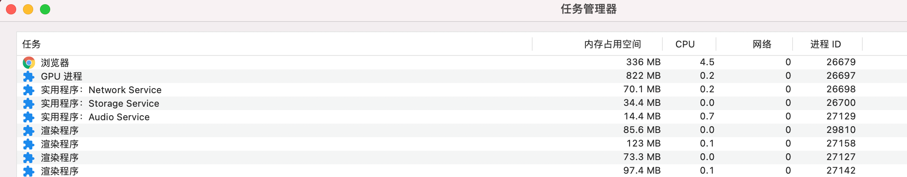

这是第一节，想要先聊一下浏览器的线程模型。

以 Chrome 为例，点击设置然后进入“更多工具”->“任务管理器”会看到：

可以看到，Chrome 开启了多个进程，包括浏览器进程、网络进程、GPU 进程等，这些都是通用的进程。

:::tip
图里有多个渲染进程，Chrome 为每个标签页开启了一个独立的渲染进程（ Renderer Process ），每个进程之间的资源（ CPU、内存等）和行为（ UI、逻辑等）互不共享，所以即便某个标签页崩溃了也不会影响其他标签页
:::

而在每个渲染进程中，浏览器会把不同的工作交给对应的线程，比如 GUI 渲染线程负责把 HTML 渲染成可视化的 UI；JavaScript 引擎线程负责解析和运行 JavaScript 代码逻辑；定时触发器线程负责处理 setTimeout/setInterval 定时器等。

:::caution
setTimeout/setInterval 并不是 JavaScript 语言的一部分，而是运行时（最初是浏览器，后来 Node.js 也提供了支持）提供的能力。

函数 setTimeout 接受两个参数：待加入队列的消息和一个时间值（可选，默认为 0）。这个时间值代表了消息被实际加入到队列的最小延迟时间。如果队列中没有其它消息并且栈为空，在这段延迟时间过去之后，消息会被马上处理。但是，如果有其它消息，setTimeout 消息必须等待其它消息处理完。因此第二个参数仅仅表示最少延迟时间，而非确切的等待时间。
:::

其中 GUI 渲染线程和 JavaScript 引擎线程是互斥的，JavaScript 在执行期间会阻塞 UI 的渲染，甚至如果脚本执行时间太长会由于页面长时间无响应然后崩溃。

在运行机制上，JavaScript 被设计为单线程的。主要就是为了避免多线程操作 DOM 造成 UI 冲突。比如存在多个线程同时操作同一个 DOM，浏览器该如何判断最终的 UI 效果是采用哪个线程的结果？这是经典的线程安全（也称为线程同步）问题，在多线程编程领域有很多解决方案，比如加入锁机制，但这样却又带来了更多的复杂性，与 JavaScript 简单易用的设计初衷相违背。

这同时也解释了为什么 GUI 渲染线程与 JavaScript 引擎线程是互斥的：JavaScript 代码有修改 DOM 的权限。

当 JavaScript 代码被执行时，GUI 渲染线程会被挂起，等待 JavaScript 引擎线程空闲时再被执行，以免在渲染期间被 JavaScript 重复地修改 DOM 造成不必要的渲染压力。采用互斥的模式等待 JavaScript 代码执行完毕后，可以保证渲染是最终的执行结果。所以浏览器的空闲（Idle）时长也成了衡量网站性能的重要指标之一，空闲时长多代表 JavaScript 逻辑不密集以及 DOM 改动频率低，这种情况下浏览器可以更快速顺畅地响应用户的交互行为。
