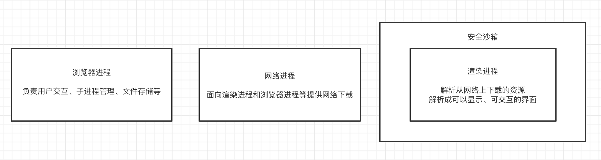

# 浏览器的架构

我们都知道 JavaScript 是单线程的，在某个时刻只有特定代码被执行，并阻塞其他代码。这意味着同步。

> 设计为单线程主要是对页面交互的同步处理。JS 的主要用途是与用户互动和操作 DOM，如果是多个线程会存在很严重的同步问题。

不过我们还听过异步这个词。当然，单线程和异步确实不能同时成为一个语言的特性。js 选择了成为单线程的语言，所以它本身不可能是异步的，但 js 的宿主环境（比如浏览器，Node）是多线程的，宿主环境通过某种方式（事件循环）使得 js 具备了异步的属性。

**所谓异步，也只是用同步去模拟。**

## 常见的浏览器内核

| 浏览器/runtime | 内核(渲染引擎)                  | JavaScript 引擎 |
| -------------- | ------------------------------- | --------------- |
| Chrome         | Blink(28~)<br/>Webkit(chrome27) | V8              |
| FireFox        | Gecko                           | SpiderMonkey    |
| Safari         | Webkit                          | JavaScriptCore  |
| Edge           | Blink                           | Chakra          |
| IE             | Trident(IE4~IE11)               | Chakra          |
| Node.js        | -                               | V8              |

## 浏览器架构

最新的 Chrome 浏览器包括：1 个浏览器（Browser）主进程、1 个 GPU 进程、1 个网络（NetWork Service）进程、多个渲染进程和多个插件进程。

> 打开 1 个页面至少需要 1 个浏览器主进程、1 个 GPU 进程、1 个网络进程以及 1 个渲染进程，共 4 个；如果打开的页面有运行插件的话，还需要再加上 1 个插件进程。

### 浏览器进程

浏览器的主进程负责界⾯显示（地址栏、导航栏、书签等）、处理用户事件、管理子进程等。

### 渲染进程

浏览器会为每个标签页单独启动一个渲染进程，所以它和上述进程不同，并不是唯一的。

> 出于安全考虑，渲染进程都是运行在沙箱模式下（通过操作系统的权限机制）。<br/>
> 因为我们在渲染进程里的一切都是在网络上拿到的，可能会有一些恶意代码利用浏览器漏洞对系统进行攻击。

渲染进程的任务是将 HTML、CSS 和 JavaScript 转化为⽤户可以与之交互的网页，**每个渲染进程都会启动单独的渲染引擎线程和 JavaScript 引擎（V8）线程。**

除此之外还包括事件触发线程，负责接收事件，并将回调函数放入 JavaScript 引擎线程的事件队列中，以及负责处理定时任务的定时器线程。

#### 每个标签页单独启动一个渲染进程

- 保障了安全性（为每个渲染进程建立一个沙箱运行环境）
- 保障了稳定性（某个标签页失去响应，用户可以关掉这个标签页，此时其他标签页依然运行着，可以正常使用）

### GPU 进程

处理来自其他进程的 GPU 任务，比如来自渲染进程或插件进程的 CSS3 动画效果，来自浏览器进程的界面绘制等。

:::tip
其实，Chrome 刚开始发布的时候是没有 GPU 进程的。而 GPU 的使用初衷是为了实现 3D CSS 的效果，只是随后网页、Chrome 的 UI 界面都选择采用 GPU 来绘制，这使得 GPU 成为浏览器普遍的需求。最后，Chrome 在其多进程架构上也引入了 GPU 进程。

浏览器渲染页面的过程，有一个步骤是“绘制”，我们提到了图层的合成，而这个图层的合成操作其实就是交给 GPU 进程来完成的。

它还有一个重要的特性，那就是可以利用 GPU 硬件来加速渲染，包括 Canvas 绘制、CSS3 转换（Transitions）、CSS3 变换（Transforms）、WebGL 等。具体原理就是如果 DOM 元素使用了这些属性，GPU 进程就会在合成层的时候对它进行单独处理，提升到一个独立的层进行绘制，这样就能避免重新布局和重新绘制。

:::

### 网络进程

负责⻚⾯的⽹络资源加载，比如在地址栏输入一个网页地址，网络进程会将请求后得到的资源交给渲染进程处理。本来只是浏览器主进程的一个模块，现在为了将浏览器进程进行“服务化”，被抽取出来，成了一个单独的进程。

### 插件进程

主要是负责插件的运⾏，和渲染进程一样，也不是唯一的，浏览器会为每个插件都启动一个进程。

:::tip
这样的设计也是从安全性和稳定性考虑。
因插件易崩溃，所以需要通过插件进程来隔离，以保证插件进程崩溃不会对浏览器和页面造成影响。
:::

## 从输入 URL，到页面展示

这是一个很经典的问题。

> 从整体上看，一共要经历 7 个阶段：
>
> 1. 输入 URL
> 2. DNS 解析 URL
> 3. 建立 TCP 连接（连接复用）
> 4. 发送 HTTP 请求
> 5. 服务器收到请求，发送 HTTP 响应
> 6. 浏览器解析渲染页面
> 7. 关闭 TCP 连接

从浏览器进程的角度，主要有三个进程配合完成：

1. 浏览器进程
2. 网络进程
3. 渲染进程



可以看到，渲染进程是跑在安全沙箱里，这是因为我们在渲染进程里的一切都是在网络上拿到的，可能会有一些恶意代码利用浏览器漏洞对系统进行攻击。

**同样会经历 7 个阶段**

> 前期是浏览器进程和网络进程的通信，后期是浏览器进程、渲染进程、网络进程之间的通信

1. 首先，浏览器进程接收到用户输入的 url 请求，浏览器进程便将该 URL 转发给网络进程。

> 浏览器进程通过进程间通信（IPC）将 URL 发送至**网络进程**

2. 在网络进程发起真正的 URL 请求。

3. 接着网络进程接收到了响应头数据，便解析响应头数据，并将数据转发给浏览器进程。

4. 浏览器进程接收到网络进程的响应头数据之后，便调用"`CommitNavigation`"函数发送 IPC 消息到渲染进程。

> 最终调用到`RenderFrameHostImpl::CommitNavigation()`，`RenderFrameHostImpl`发送了一个 IPC 消息到 Render 进程。
>
> `CommitNavigation()`函数会携带`response_header`、`request_params`等基本信息传递给渲染进程。

5. 渲染进程接收到“提交导航”的消息之后，便开始准备接收 HTML 数据，接收数据的方式是直接和网络进程建立数据管道；

6. 最后渲染进程会向浏览器进程“确认提交”，这是告诉浏览器进程：“已经准备好接受和解析页面数据了”。

> 默认情况下，Chrome 会为每个页面分配一个渲染进程
>
> 如为同一站点（same-site），即根域名及协议一致，则会复用同一渲染进程

7. 浏览器进程接收到渲染进程“提交文档”的消息之后，便开始移除之前旧的文档，然后更新浏览器进程中的页面状态。

> 因为这里渲染进程和网络进程存在数据传输的阶段，文档数据传输完毕，浏览器进程才会收到渲染进程的消息，才会更新界面状态。所以输入 URL 后前一个页面还会存在一段时间。

## 浏览器的渲染机制

> 渲染阶段可分为**7 个子阶段**：构建 DOM 树（html parser 解析 html 文件生成 DOM 树）、样式计算（解析 css 构建 cssom 树）、布局阶段（DOM 和 CSSOM 结合，生成可见布局树）、分层（根据层叠上下文创建图层）、绘制（对每个图层进行绘制）、分块（优先生成视口附近的位图/像素图）、栅格化和合成（栅格化就是指图块生成位图、合成就是栅格化后生成绘制命令，提交给浏览器进程）

每个阶段关注三个部分：输入，处理过程，输出

### 1.构建 DOM 树

HTML 文件经 HTML 解析器解析，生成 DOM 树

HTML 解析器并不是等整个文档加载完成之后再解析的，而是**网络进程加载了多少数据，HTML 解析器便解析多少数据**

### 2.样式计算

解析 CSS，构建 CSSOM 树：标准化 style 值、结合继承规则计算 DOM 树每个节点的样式属性，保存在 ComputedStyle 中

**CSSOM 体现在 DOM 中就是 document.styleSheets**

### 3.布局阶段

> **从布局开始可能会有重排**

DOM 和 CSSOM 结合，计算出 DOM 树中可见元素的几何位置

> visibility: hidden 这种也会绘制

因为 DOM 树还含有很多不可见的元素，比如 head 标签，还有使用了`display:none`属性的元素。所以在显示之前，我们还要额外地构建一棵只包含可见元素布局树。**DOM 树中所有不可见的节点都不包含到布局树中**

### 4.分层

根据层叠上下文属性对布局树进行分层，构建图层树

### 5.绘制

**从绘制开始可能存在重绘**

根据图层树，依次对每个图层进行绘制

### 6.分块

为防止开销过大，合成线程会将图层划分为图块，照视口附近的图块来优先生成位图

> 图块生成位图具体是在栅格化阶段做的

### 7.栅格化和合成

**图块是栅格化执行的最小单位**

栅格化指将图块转换为位图，一旦所有图块都被栅格化，合成线程就会生成一个绘制图块的命令——“DrawQuad”，然后将该命令提交给浏览器进程。

**合成就是栅格化后生成绘制命令，提交给浏览器进程**

浏览器进程里面有一个叫 viz 的组件，用来接收合成线程发过来的 DrawQuad 命令，然后根据 DrawQuad 命令，将其页面内容绘制到内存中，最后再将内存显示在屏幕上。

## 重排和重绘

重排和重绘就是样式计算阶段发生了改变，然后影响了布局或者绘制之后的整个流程更新。

### 重排

- 更新元素的几何属性（宽，高等）
- 触发重新布局，开销最大

触发重排的操作有：

- 添加或删除可见的 DOM 元素 => 循环添加多个元素时，可借助 `DocumentFragment`
- 元素位置改变
- 元素尺寸改变
- 内容改变
- 浏览器窗口尺寸改变
- **获取需要及时计算的特定值**，如 `offsetTop`、`offsetLeft`、 `offsetWidth`、`offsetHeight`，`getComputedStyle`

### 重绘

- 更新元素绘制属性（如颜色）
- 直接进入绘制，省去布局和分层，执行效率比重排高

### 触发重排和重绘的操作

重排肯定会带来重绘，但是重绘不会造成重排。

- 添加、删除、更新 DOM 节点——重新生成布局树，所以会有重排和重绘
- 通过`display: none`（脱离文档）隐藏⼀个 DOM 节点——触发重排和重绘
- 通过`visibility: hidden`隐藏⼀个 DOM 节点——只触发重绘，因为没有⼏何变化
- 用户行为，例如调整窗口大小，改变字号，或者滚动——触发重排和重绘

### 如何避免重排或者重绘

#### 集中改变样式

我们往往通过改变 class 的⽅式来集中改变样式

不要一条一条地修改 DOM 的样式。可以先定义好 css 的 class，然后修改 DOM 的 className。

```js
// 判断是否是⿊⾊系样式
const theme = isDark ? "dark" : "light";
// 根据判断来设置不同的class
ele.setAttribute("className", theme);
```

#### 使用 documentFragment

> 我们可以通过 createDocumentFragment 创建⼀个游离于 DOM 树之外的节点，然后在此节点上批量操作，最后插⼊ DOM 树中，因此只触发⼀次重排

避免频繁操作 DOM，创建一个 documentFragment，在它上面应用所有 DOM 操作，最后再把它添加到文档中。

```js
var fragment = document.createDocumentFragment();
for (let i = 0; i < 10; i++) {
  let node = document.createElement("p");
  node.innerHTML = i;
  fragment.appendChild(node);
}
document.body.appendChild(fragment);
```

也可以先为元素设置`display: none`，操作结束后再把它显示出来。因为在`display`属性为 none 的元素上进行的 DOM 操作不会引发回流和重绘。

## 浏览器加载顺序

### 阻塞的 script 标签

正常的网页加载流程是这样的：

1. 浏览器一边下载 HTML 网页，一边开始解析
2. 解析过程中，发现`<script>`标签
3. 暂停解析，网页渲染的控制权转交给 JavaScript 引擎
4. 如果`<script>`标签引用了外部脚本，就下载该脚本（暂停解析），否则就直接执行
5. 执行完毕，控制权交还渲染引擎，恢复往下解析 HTML 网页

将 js 放在 body 的最后面，可以避免资源阻塞，同时使静态的 html 页面迅速显示。
如果外部脚本加载时间很长（比如一直无法完成下载），就会造成网页长时间失去响应，浏览器就会呈现“假死”状态，这被称为“阻塞效应”。
html 需要等 head 中所有的 js 和 css 加载完成后才会开始绘制，但是 html 不需要等待放在 body 最后的 js 下载执行就会开始绘制。

:::caution 注意
css 不会阻塞 html 解析，但是会阻塞渲染；<br/>
js 既会阻塞 html 解析，也会阻塞渲染；
:::

### async 和 defer

首先单独的 script 标签会阻塞浏览器解析`html`（可以理解为一个同步的过程，而且 script 之间顺序执行）

`async`和`defer`这两个属性都不会阻塞解析`html`（异步加载），区别在于异步加载`script`的结果回来后，`async`属性的`script`标签会阻塞解析`html`，`defer`会等`html` 解析完毕再执行 `JS` 代码

**`defer`延迟执行**，等解析完`html`再执行

注意：async 的执行，并不会按着 script 在页面中的顺序来执行，而是谁先加载完谁执行。

#### 场景

##### defer

如果你的脚本代码依赖于页面中的 DOM 元素（文档是否解析完毕），或者被其他脚本文件依赖。
例：

- 评论框
- 代码语法高亮
- polyfill.js

##### async

如果你的脚本并不关心页面中的 DOM 元素（文档是否解析完毕），并且也不会产生其他脚本需要的数据。
例：

- 百度统计

> 如果不太能确定的话，用 defer 总是会比 async 稳定
